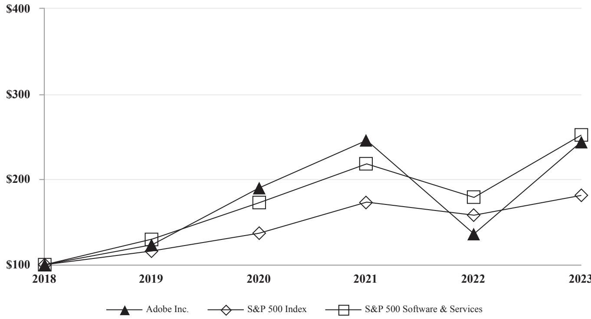

# FORM10-K

(Mark One)

# ANNUAL REPORT PURSUANT TO SECTION 13 OR 15(d)OF THE SECURITIES EXCHANGE ACT OF 1934

For the fiscal year ended December 1, 2023

or

]TRANSITION REPORT PURSUANT TO SECTION 13 OR 15(d)OF THE SECURITIES EXCHANGE ACT OF 1934

For the transition period from to Commission File Number: 0-15175 ADOBE INC.

(Exact name of registrant as specified in its charter)

# Delaware

# 77-0019522

(State or other jurisdiction of incorporation or organization)

(I.R.S. Employer Identification No.)

# 345 Park Avenue, San Jose, California 95110-2704

(Address of principal executive offices) (408) 536-6000 (Registrant's telephone number,including area code)

Securities registered pursuant to Section 12(b) of the Act:

# Trading Symbol

Common Stock, \$0.oool par value per share ADBE

NASDAQ

Securities registered pursuant to Section 12(g) of the Act: None

Indicatebycheckmark iftheregistrantisawell-knownseasoned isuer,asdefiedinRule405oftheecuritiesAct.YesNo

Indicate bycheck markiftheregistrantisotrequiredtofilereportspursuanttoSection13orSection5(d)oftheAct.YesNo

Indicateycckmarkethertheregistrant()filedallreportsreqedtofiledbSectio3o5(d)ofteSuritsExcangeAct f1934duringtepregtsforteodatsdtfpors)dsth iling requirements for the past 90 days.Yes 区 No□

IndicatebycheckarkwhetrthgisranthassubmitedetroicalleveryInteractiveDataFileequedtobesbmiedpursanttule 405fRegulatioS2ftisaeigeprecedgotsfouchorterpdatistratseqdtoubi such files).Yes  No

Indicatebycrkttgistrantisgeeleratedfleleatedfil,aceleratedleing companyoameinggotaySehefiiosofaeaeleatedi”“aeleafe”“saleportigpayad “emerging growth company” in Rule 12b-2 of the Exchange Act.

LargeaceleratedfilerAcceleratedfilerNon-aceleratedfilerSmallereportigcompanyEmergingrowthcompay

Ifanemerginggrothompaydicatebyhckmarkifteegistranthaseetedottousteeteedtrasiioperodfooling iny new or revised financial accounting standards provided pursuant to Section 13(a)of the Exchange Act.

Indicatebyceckmarketertheegstrathasfiedaeportonndatestatiotoitsaagementsementofteectivesofits nteralcontrercialreportinguderScti4ofthbaOxyct(UC6b)yegisteedpubot hat prepared or issued its audit report.区

Ifsecuritisdpusanttcti(ofctateyckarkethraaltatemetsofgisntded in the filing reflect the correction of an error to previously issued financial statements.

Indicatebyhckarkaofoeoortosatmtstatdoeyalsofcebdoa eceived by any of the registrant's executive officers during the relevant recovery period pursuant to $\ S 2 4 0 . 1 0 \mathrm { D } \cdot 1$ (b).□

ndicate by check mark whether the registrant is a shellcompany (as defined in Rule 12b-2of the Act).Yes No[

The aggregate market value of the registrant’s common stock, $\$ 0.0001$ par value per share,held by non-affiliates of the registrant on June 2, 2023,the last business day of the registrant's most recently completed second fiscal quarter, was $\$ 165.53$ billion (based on the closing sales price of the registrant'scommonstockonthatdate)Saresoftheregisrantsommonstockeldbyeachoficerandirectorandeachpersonwoows $5 \%$ or moreoftheoutstandingcommockofteregistratavebeecudediatsuhpersosayeeemedtoeflates.hiseteatif afflatetasl stock, $\$ 0.0001$ par value per share, were issed and outstanding.

# DOCUMENTSINCORPORATEDBYREFERENCE

PortionsoftheProyStatemntforegisrts2AualMeetigofStohoders(eProyStatement,tfilediinaof theedfteldeerteftict incorporated byreference in this Form 10-K,the Proxy Statement is not deemed to be filed as part hereof.

# ADOBE INC. FORM10-K

# TABLE OF CONTENTS

PART I

Item 1. Business. 3   
Item 1A. Risk Factors. 22   
Item 1B. Unresolved Staff Comments. \*\*\*\*\*\*\*\*\* 34   
Item 1C. Cybersecurity. 34   
Item 2. Properties.... 34   
Item 3. Legal Proceedings . 34   
Item 4. Mine Safety Disclosures. 34

PART II

Item 5. Market for Registrant's Common Equity, Related Stockholder Matters and Issuer Purchases of   
Equity Securities. 35   
Item 6 [Reserved].. 35   
Item 7. Management's Discussion and Analysis of Financial Condition and Results of Operations 36   
Item 7A. Quantitative and Qualitative Disclosures About Market Risk 49   
Item 8. Financial Statements and Supplementary Data 51   
Item 9. Changes in and Disagreements with Accountants on Accounting and Financial Disclosure 92   
Item 9A. Controls and Procedures. 92   
Item 9B.Other Information. 92   
Item 9C.Disclosure Regarding Foreign Jurisdictions That Prevent Inspections. 92

# PART III

Item 10. Directors, Executive Officers and Corporate Governance. 93   
Item 11. Executive Compensation 93   
Item 12. Security Ownership of Certain Beneficial Owners and Management and Related Stockholder   
Matters. 93   
Item 13. Certain Relationships and Related Transactions,and Director Independence 93   
Item 14. Principal Accountant Fees and Services. 93

# PART IV

Item 15. Exhibits,Financial Statement Schedules 94   
Item 16. Form 10-K Summary. 96   
Signatures.. 97   
Summary of Trademarks. 99

# Forward-Looking Statements

In adition to historical information,this Annual Report on Form I0-Kcontains “forward-loking statements,”within the meaning of applicable securities laws,including statements related to product development plans and new or enhanced offerings;ourbusines,rtifical intellgenceandinnovationmomentm;ourvisionforthdigialorldinnovatiandA; our market opportunityand future growth,market and AItrends,strategic investments;revenue,operating marginoperating efciencies andannualizedrecurringrevenue;industrypositioning;andcustomeracqusitionandretention.Inaditionwhen usedinthisreport,the words“will”"expects,”"could,”"would,”"may,”"anticipates,”"intends,”"plans,”"believes,” "seeks,”"targets,”"estimates,”"oksfor,”"loksto,”"continues”andsimilarexpressions,swellasstatementsrgarding ourfocusforthefuturearegenerally intendedtoidentifyforward-looingstatements.Eachoftheforward-lookingstatements we makein this report are based on information available tousas of thedateofthisreportand involves risks,uncertainties andassumptions basedoninformationavailable tousasofthedateofthisreport.Suchrisksanduncertainties,manyofwhich relate to maters beyondourontrol,couldcauseactualresultstodifermateriallandadverselyfromtheseforward-looking statementsFactors that might causeor contribute to such diferences include,but are not limitedto,thosediscused in the sectiontitled“RiskFactors"inPartI,ItemlAoftisreportandelsewhereherein.TherisksdescribedhereinandinAdobe's otherflings with the U.S.Securities and Exchange Commission (the“SEC"),including our Quarterly ReportsonForm0-Q to befiledinfscal 2O24,shouldbecarefullreviewed.Unduerelianceshouldnotbeplacedonthefnancial informationset forthinthisreport,whichreflects estimatesbasedoninformationavailableatthistime.Adobeassumes noobligationtoand does not currently intend to, update these forward-looking statements.

# PART I

# ITEM1.BUSINESS

# OVERVIEW

Adobe is aglobal technology company with a misson to change the world through personalized digital experiences.For overfourdecades,Adobe'sinnovations havetransformed howindividuals,teams,businesses,enterprises,institutions,nd governments engage and interact acrossalltypes of media. Our products,services and solutions are used around the world to imagine,create,manage,deliver,measure,optimizeand engage with content across surfacesand fuel digital experiences.We havea diverseuser base that includesconsumers，communicators,creative professionals，developers,students，smalland medium businesses and enterprises.We are also empoweringcreators byputing the power of artificial intellgence (Al) in their hands,and doing so inways we believeareresponsible.Our productsand serviceshelpunleash creativity,accelerate document productivity and power businesses in a digital world.

# OFFERINGS

We deliver a wide range of products,services and solutions to empower our customers and users to imagine and express deas,create content and bring any digital experience to life.We focus our strategic investments intwo areas of growth:

Digital Media.We provide products,services andsolutions that enable individuals,teams,businessesand enterprises to create,publishand promote theircontentanywhere,andaccelerate their productivitybytransforming howtheyview,hare, engage withandcolaborateon documents andcontent creation.OurDigital Mediasegmentiscentered around Adobe Creative CloudandAdobeDocumentCloud,hchicludeAdobeExpres,AdobeFirefly,hotosop,Iustrator,ightroo,riee Pro,Acrobat,AcrobatSignandmanymore products,offering avarietyoftoolsforcreativeprofessonals likephotographers, video editors and game developers),communicatorsand other consumers.This is thecore of what we have delivered to customers and users for decades,and we havecontinually evolvedand expandedour Digital Media businessmodel to provide our customers and users with a range of flexible solutions to help them reach their fullcreative potential.

Digital Experience.We provide an integrated platform and st of products,services and solutions through Adobe Experience Cloud that enable businesss to create,manage,execute,measure,monetizeandoptimizecustomer experiences spanningfromanalyticstocommerce.Ourcustomersinclude marketers，advertisers，agencies,publishers,merchandisers, merchants,webanalysts,data scientists,developersand executives acrossthe C-suite.The foundationofouroferingis Adobe Experience Platform,which provides businessesand brands with an open and extensiblesystem forcustomer experience management that transforms customerdataintorobustcustomer profiles thatupdate inrealtime and uses insightsto deliver personalized digital experiences across various channels.

Weofer a comprehensive suite of products,services and solutions to our customers and users in our Digital Media businessand Digital Experiencebusines.Inaddition,ourAdobeGenStudio solutionbundles togethercertainDigitalMedia and Digital Experience productsacrossCreative Cloudand Adobe Experience Cloud,alowing businesss tosimplify their content supply chain process with generative AI capabilities and intelligent automation.We believe we are positioned to compete wellinboththeDigital Mediaand Digital Experiencestrategic areas whereour misiontochange the worldthrough personalized digital experiences has never been more relevant aspeopleseek new ways to create,colaborate and communicate and businesses continue to invest in digital transformation.

# SEGMENTS

Our business is organized into three reportable segments:

Digital Media; Digital Experience; and Publishing and Advertising.

These segments provide Adobe's senior management with a comprehensive financial view of our key businesses.Our segmentsarealignedaroundour twostrategic growthopportunities furtherdescribedbelow,andourlegacyproducts,services and solutions are contained within the third segment,Publishing and Advertising.

# MARKETOVERVIEW

This overview provides an explanation of our markets and a discusson of strategic opportunities in fiscal 2024 and beyond for each ofoursegments.See the section titled “ResultsofOperations”in Part Il,Item 7titled“Management's Discussionand AnalysisofFinancialConditionand ResultsofOperations”andNote2ofour NotestoConsolidatedFinancial Statements of this report for further segment information.

# Digital Media

# Opportunity

In today's digital world,content and digital documentsare fueling the global economy,and productivity，designand creativity have never been more relevant,providing a significant market opportunityfor Adobe indigital media.Everyone has a storyto tell and neds products and services attheirfingertips totelltose stories onan ever-increasing numberofcanvases. AI- and generativeAI-powered technologies are increasing thisopportunityby growing the demand forand production of content.This shiftischanging howcreative profesionals work byaccelerating their processes,increasing their productivity, andallwing them to exploreand create in new felds,whileempowering new creators by dramatically lowering bariers to creativity.Atthesame time,creativityis increasingly a teamsportthat isredefining productivity,makingquick and easy collaboration evenmorecritical toeverycompanyssuccess.Adobeisdriving theinovationtoshapethesetrends,democratize creativity,empower individuals tocreate wherever inspirationstrikesand enable more efectivecollborationbetweencreators and stakeholders.

The flagshipofourDigital Media busines is Adobe Creative Cloud,asubscription service that allows subscribers to use ourcreative products integrated with cloud-delivered services acrossvarious surfaces and platforms.We believe in creativity for allandCreativeCloudaddressestheneedsofallontentcreators,fromcreativeprofessionals,suchasartists,desigers, developers，students，andadministrators，to knowledge workers，marketers，educators，enthusiasts，communicators，and consumers.Ourcustomers relyonour products forcontent creation,photo editing,design,videoand animationproduction, mobile application(app")and gaming development,and more. Customers can choose between the speed and ease of Adobe Expres,ourAI-and template-first,task-based webandmobile app,orthe greaterpowerand precisionofourflagshipCreative Cloud apps.We believe we have significant opportunities to growour Digital Media businessby advancing every creative categoryacrosallsurfaces; expandingcontent-fsttask-basedcreativitywithAdobeExpress enabingseamlesscollation across allstakeholders; inspiringthecreativecommunitythrough sharing and monetization;and expanding the userbaseofour tools through theinfusionof AI intoour products,services and solutions toenableusersof anyskillevel toeasilyand efficiently createcontent using tols like Adobe Express while alsoenhancing the power and AIcapabilies ofour flagship apps for creative professionals.

Our Digital Media segment includes our Adobe Document Cloud business,a unified,cloud-based document services platformthatintegrates Adobe's pioneringPDFtechnology withour Acrobat and Acrobat Sign apps todeliver fullydigital document workflows acrossallsurfaces.We have theopportunity tocontinue toaccelerate document productivity with Adobe Document Cloudand transform how people view,share,collaborate,and engage with documents.TrilionsofPDFdocuments arecreated every year,reflecting the important rolePDF plays globally.There are hundreds ofmillionsof users who engage with PDFfilesonadailybasis in industriessuch aslegal,financial services,and publishing,aswellasabroadarrayof communicators and Acrobat Reader customers who use the expanded capabilities provided by our Acrobat apps and the document services platform in Document Cloud.

# Strategy

Our goal forour Digital Media businessis tobe aleading platform for creativityand digital documentsolutions,where weoferarange of products andservices that allow anyone to design and delivercontent seamlessy.We aimto achieve this goal byusing data-drivencustomer engagement,driving product-led growth toalowourcustomers to createcontentand interact withdocuments inwaysthatare more frictioless,fficientandaccessiblendmeetingcustomereeds holsticallt increase the value they derive from our services.

We areredefining the creative processwith Creative Cloud to unleash everyone's abilityto imagine and express ideas. We are empowering anyone,including novicecontent creators，communicators and creative profesionals,to create,edit, schedule andshare content quickly and easilyusing Adobe Express,which employs capabilities from products like Photoshop, Premiere Proand Acrobattodeliver the bestofAdobe tocustomers atany level.Wecontinue to integratecollboration capabilities intoour appsand workflowssuch asour native integration ofFrame.io’sreviewandapprovalcapabilities into PremierePro,AfterEffects,Adobe IlustratorandAdobe InDesign.We are expanding thecapabilitiesofCreative Cloud on the web with the launchof Adobe Fireflyand Photoshop on the web.We are alsoinfusing AI into our creative apps asaco-pilot to helpourcustomers and users workfasterand smarter,with new models forimages and vector graphics,and AI-powered video features natively integrated intoourflagshipproducts likePhotoshop,Iustrator,andPremierePro.Wearebuildingourown foundation models in areas where we have domain expertiseand which we believe are most relevant toour customers. Developingourown foundation models enables us todesign Fireflytobecommerciallysafeand in line withourAIEthics principles of accountability,responsibilityand transparency.In fiscal 2O23,we introducedother innovations,suchas new Adobe Fireflymodels,Text-BasedEditing inPremierePro,GenerativeFilland GenerativeExpand inPhotoshop,Generative Recolor in Ilustrator and Text to Image and Text Efects in Adobe Express.

We are pursuing new ways to inspire, empower and connect the creative community,such as through our Create Change series,ourcrativeresidencyprogram,ndupporting live,interactivetutorialswithreatorsonBehance.Wealsoofraange ofother creative productsand services,including librariesofcreative assets,suchasAdobe StockandAdobeFonts,mobilefirstapps,suchas Lightroom Mobile,and Creative Cloud Libraries,acentral place forusers to store theirasets.Further descriptions ofour Digital Media products are included below under“Principal Products,Services and Solutions.”

Inour Creative Cloud business,we employour product-led growth strategy to minimize the friction of customer interactionsand drivepositive product experiences，which resultsin increasing customer adoption，usage，conversion, expansionandloyalty.Wealsocontinue toemployapricingstrategy,asappropriate,to migrateourcustomers tohigher-value oferingsas wellas atract pastcustomers and potential users totryout our products and ultimatelysubscribe.We use adatadriven operating modelandour AdobeExperience Cloud solutions to drive and optimize customer awareness,engagement and licensingof our creative products and services at every stop of the customer journey through our websiteand across other channels.Adobe.com is thecentral destination where we engage individual and small businesscustomers to signupforand renew Creative Cloud subscriptions.Our customers have the flexibilityto subscribe toover twentyof our Creative Cloud products throughasingle subscriptionor,for manyofourapps,throughvariouscollctions ofourindividual subscriptions to point products.Tobeterserveourcurrent users and potentialusers,weofer fre and premium levels forcertainapps,such as Adobe Firefly and Adobe Express,and targeted packages and suites，such asour Photography Planand Substance 3D Collection. Our generative AI capabiliesare increasing the valueofour existing subscription products，expanding our potential customer base and increasing engagementand retention through Generative Credits—credits that provide users and subscribers theabilitytogeneratecontent with Firefly.Thecolaboration features across manyofour products,suchas in Photoshop on the webandFrame.io,helpus tofurther expandouruniverseofcustomersbeyondcreative professionals toother stakeholders whouseour products forreviewand approval,copywriting，social media marketing orother social content creation.Weuize channel partners to target mid-size creative customers with our Creative Cloud for Teams offering.Our direct sales force is focusedonbuilding relationships with ourlargestcustomersand driving adoption ofour Creative Cloud for Enterprise ofering.Overall，our strategy with Creative Cloud is designed toenableus to increase ourrevenue with existing customers,attract new customers and grow a recurring and predictable revenue stream that is recognized ratably.

In our Adobe Document Cloud business, we expect to drive sustained long-term revenue growth through an expansion of ourcustomer base bycontinuing toemployour product-led growth strategy,deliver thebest PDFexperience onand across every platform,improve Acrobat web's functionalityand easeof use,and expand the number of digital document and workflow-based actions in Acrobat.We aredriving innovation with AdobeSensei,ourcros-platform AIand machine learning technology,to make documents more inteligent and responsive.We are unlocking business workflows through PDF and Acrobat Sign Application Programming Interfaces (APIs"),accelerating Document Cloud adoption throughdigitalanddirect sales,anddeployingdiversifiedgo-to-marketmotions toreachallindustriesandbusinesesofallsizes.Withover50milion online searches forPDF-related actions per month,we intend to harnessthatdemandand atractnewusers andcustomers toour Document Cloudervices through Acrobat web,whichallowsanyone toquicklyaccesstools tocreate,edit,convert,signand compress PDFs through their web browser.As with our Creative Cloud strategy,we utilizea data-driven operating model to marketour Document Cloud solutions andoptimizeoursubscription-based pricing forindividuals as well assmalland medium businesses,large enterprises,and government institutionsaround the world.We utilizeour corporate and volume licensing programs to increaseour reach inour key markets andare continuing to focus on marketing and licensing Acrobat in targeted vertical marketssuchas education,financial services,telecommuncationsand government,andon expanding intoemerging markets.We will continue to engage in strategic partnerships tohelp expandour distributionreach and drive theenterprise business.

As our Document Cloud customers increasingly expect business processes to be seamless acrossurfaces and the web, we areexpanding ourDocument Cloudcapabilities to meet this need.Acrobat Reader is available onmobile,and features AI-powered“Liquid Mode”to automatically reformat PDFs for quick navigationand easier consumption on smaler screens. Acrobat is availableon the web,deliveringquick results for common PDFactions with asingle click.Adobe Scan powers mobile devices with scanning capabilities,transforming paper documents into ful-featured DFs.Acrobat Sign also provides a grenalternative tocostlypaper-based solutionsandofersaconvenientsolution forcustomers todigitallymanage their documents,automate processes and contract workflows,and is integrated into Acrobat acrossallsurfaces.Byusing Adobe Sensei to enhance customer experiences and adding new capabilities to Acrobat,Adobe Scanand Acrobat Sign,we helpour customers and users continue to migrateaway from paper-based processes andadoptour solutions for personalized,digital document experiences, growing our revenue with this business in the process.

# Digital Experience

# Opportunity

Consumers today buy experiences,not just products,and they demand personalized digital experiences that arerelevant, engaging,seamlessandsecure across an ever-expandingrange of channelsand surfaces.Businesscustomers increasingly have thesameexpectations,drivingbusiness-to-business (B2B")companies todeliver equallyengagingandseamlessexperiences as business-to-consumer(B2C"） companies.With AI-powered automationandpersonalization，peopleand brandswill increasinglystandoutthroughuniquecreativeexpression,andthefutureofexperiencesacross industriesandeverydaylife wil become increasingly personalized.Delivering the best,personalized experience to aconsumerat a given momentrequires the right combination of data,insightsand content across multiplechannels inreal time and at scale.We have a strategic opportunityto provide solutions that enablereal-time personalization at scaleandaccelerate our customers’content supply chain，with astreamlinedandcoordinated process from content ideation through deploymentand measurement and optimization.Marketingisalsoincreasinglyevolving fromacentralizeddisciplinetoamulti-practitioner,cros-functional, collborativefield,andmarketingandITteamsarelookingforareturnon investment todemonstrate the businessimpactof their transformation initiatives.

Adobe Experience Cloud is powering digital businesses by helping them provide exceptional personalized experiences to their customers viaa comprehensive suite of solutions.Addresing the challenges of customer experience management is a largeandgrowingopportunityand weare in position tohelp businesses and enterprises invest insolutions thataidtheirgoals to transform how they engage with their customers and constituents digitally.

# Strategy

Ourgoal is tobea leading providerof cloud-based solutions for delivering digital experiencesand enabling digital transformation.The Adobe ExperienceCloud apps andservices are designed tomanage customer journeys,enable personalized experiences at scale and deliverinteligenceforbusinesses ofany sizeinany industry.The Adobe ExperiencePlatform further strengthens ourdiferentiation byofering a wayto connectour comprehensive setof solutions.Further descriptions of our Digital Experience products are included below under “Principal Products, Services and Solutions."

Adobe Experience Cloud delivers solutions for our customers across the following strategic growth pillars:

Data insights and audiences. Our products,including Adobe Analytics,Customer Journey Analytics,Adobe Product Analytics,andour Real-timeCustomer Data Platform,deliver actionable data inreal time to provide highlytailored and adaptive experiences across platforms.   
Content and commerce. Our products help customers manage, deliver, monetize,and optimize content delivery through Adobe Experience Manager and build multi-channel commerce experiences for B2B and B2Ccustomers on a single platform with Adobe Commerce. Customer journeys. Our products help businesses manage,test, target and personalize customer journeys delivered as campaigns across B2B and B2Cuse cases,including through Adobe Marketo Engage,Adobe Campaign,Adobe Target and Adobe Journey Optimizer.   
Marketing planning and workflow. Our products help businesss intellgently measure, optimize, and plan marketing investments through the Adobe Mix Modeler,and allow businesses to strategicallyplan,manage,colaborate,and execute on workflows for marketing campaigns and other projects at speed and scale with our enterprise work management app, Adobe Workfront.

Our goalis todeployourcapabilities tohelpenterprises generate highlyengaging experiences,enablecontentcreators to enhancecreativityand scalecontent production,and provide marketingstrategists with recommendations to improve marketing strategy and enhance the delivery of personalizedcustomer journeys.We believe innovations like Adobe Sensei and Adobe Sensei GenAI—our collection of natively embedded AIservices in Adobe Experience Cloud that enable the delivery of more relevantand personalizedcustomer journeys—enhance the deliveryand personalization of digital experiences.Adobe Experience Cloud ofers domain-specific AI services in areassuch as atribution and automated insights,customer journey management,leadmanagement,sentimentanalysis,one-clickpersonalization,enhancedanomalydetectionand morethat work with Adobe Experience Platform toaugment our Experience Cloud product oferings.We are alsobuilding generative AI into our Adobe Experience Cloud product oferings,such as the updated Adobe Experience Manager.Bybuilding on these features and capabilities, we increase the value we provide our customers and create a competitive diferentiation in the market.

Adobe Experience Cloud ofers an open platform and ecosystem through the Adobe Experience Platform.Adobe Experience Platform'sopen system transforms userdata fromacrossAdobe solutions and third-party software into robust customerprofiles.Adobecustomer profiles areupdated inreal timeand include AI-driven insights,alowingabrand to deliver therightcustomer experiences across channels.This open architecture ofers scalability with a wide varietyof supporting products and services empowers users to quickly develop innovative apps to interact with customers and enables abroad industry ecosystem.

To drive growth of Adobe Experience Cloud, we focus on delivering customer engagement， growth within existing customer accounts,product diferentiation and the best customer experience management solutions for B2B and B2C buyers across enterprise and mid-market segments.Within our established baseofcustomers,we intend to pursue growth through a scaled go-to-market approach focusedon C-suitepartnerships,transformational accounts,continuedcustomer acquisition, customer valuerealization and solution expansion.We utilize a direct sales force to market andlicense our Experience Cloud solutions,as wellasan extensiveecosystemofparters,including marketingagencies,systems integratorsandindependent software vendors that help license and deployoursolutions to theircustomers.We also maintain several strategic partnerships with other technologycompanies that alowus to increaseour marketreach.Wehave made significant investments to broaden the scale and sizeof allthese routes to marketand believethese investments willresult incontinued growth inrevenue inour Digital Experience segment in fiscal 2024 and beyond.

# Publishing and Advertising

Our Publishing and Advertising segment contains legacy products and services that addressdiverse market opportunities including eLearning solutions,technical document publishing,webconferencing，document and forms platform,webapp development,high-end printingandourAdobeAdvertisingoferings.Graphicsprofessionalsand professional publishers continue torequirequalityreliabilityandeficiencyinproductionprinting,andourAdobePostScriptandAdobePDFprinting technologies provide advanced functionality to met the sophisticated requirements of this marketplace.As high-end printing systemsevolveandtransitiontofullydigital,composite workflows,webelieve weare wellpositioned tobeasuplierof software and technology based on the Adobe PostScript and Adobe PDF standards for this industry.

Adobe Advertisingdelivers anend-to-end,demand-side platform for managing advertising across digital formats and simplifies the delivery of video,display and search advertising across channels and screens.

We generate revenue inour legacy Publishing products and services by licensing our technology to original equipment manufacturers that manufacture workflow software,printers and other output devices,and we generally generate revenue in Advertising through usage-based offerings.

# COMPETITION

# Overview

Weparticipate in arapidly evolving,highlycompetitive global environment, whereour competitorsvary by industries andrange from large multinational enterprises to smaler entities with specialized and focused product offerings.Across our business,werecognizehundreds ofcompetitors worldwide.The markets forourproductsandservices arecharacterizedbynew industrystandards,evolvingdistributionmodels,apidtechnologyinovation,frequentproductintroductionsandshortproduct life cycles.Our future successwilldependonour abilitytoenhanceour existing products,servicesand solutions and introduce newones on atimelyand cost-effective basis,accurately predict and met changing customer needs,provide best-in-class informationsecuritytobuildcustomerconfidence andcombat cyber-atacks,extendourcore technologies into newapps and anticipate emerging standards, business models,software delivery methods and other technological changes.

A summaryof the competitive environment for each of our businesssegments is included below.See the section titled RiskFactors”containedinPartl,ItemlAofthis reportforadditionalinformationregardingrisks related tocompetition.

# Digital Media

Our Digital Media segment faces competition from large,established companies as well as a variety of point offerings, free products,websites,downloadable apps and other products and oferings.Wecompete in arapidly evolving and growing market and face significant direct or indirect competition from:

·software companies and AI companies; device,hardware and camera manufacturers,including those that integrate software for digital media,such as photo and video; proprietary and open-source web-authoring tools; mobile-first apps; web native tools and platforms; social media platforms that provide digital media oferings,including editing capabilities; providers of stock content; digital document creation, storage, collaboration and signing providers; and operating system developers that integrate digital media document viewers and markup features with their operating systems.

We believe competitive factors in our markets include:

·brand, product features and functionalities; integration with related tools, third-party apps and workflows; the intuitiveness and visual appeal of user interfaces; demonstrable cost-effective benefits to customers; pricing; the flexibility of services to match changing business demands; usability and accessibility across surfaces and platforms; success in educating customers in how to utilize services effectively; the ability to create and use AI models and integrate AIcapabilities for digital media generation and editing; and responsible and secure data handling and storage protocols.

Weatract customers in this segment through our broad and comprehensive array of products and services, which are powerful,standalonetolsthatalsowork welltogetherandcomplement oneanotheraspartof CreativeCloudor Document Cloud. With Creative Cloud,we believe wecompete wellwithourfeaturesand functionality,AImodels,easeofuse,product reliability,valueandperformancecharacteristics.WithAdobeFirefly,webelievewecompetewellbyoferinggenerativeAI capabilities that are natively integrated intoour productsand designed tobesafeforcommercial use.WithAdobeExpress,we believe wecompete wellbymakingourcreative technologiesacesibletoawideaudienceand enablingeasy-to-useeficient content creation,collaborationandsharing forquickprojects.With Document Cloud,webelieve wecompete wellthroughour PDFofferings,features and functionalities thatare critical tools formillions ofbusiness communicators,andour brand.

# Digital Experience

Our Digital Experience segmentcompetes in markets that are growing and evolving rapidly and characterized byintense competition. Our Adobe Experience Cloud solutions face competition from:

large, established companies,including large enterprise software,internet and database management companies; point product solutions and focused companies;   
new companies constantly entering the digital experience markets;   
companies that provide Software-as-a-Service ("SaaS"） solutions to customers,generally through the web and software that is installed by customers directly on their servers; and   
customers' or potential customers’ internally-developed apps.

We believe competitive factors in our markets include:

the proven performance,security,scalability,flexibility and reliability of services; the strategic relationships and integration with third-party apps; the intuitiveness and visual appeal of user interfaces;   
. demonstrable cost-effective benefits to customers;   
. pricing; the flexibility of services to match changing business demands; enterprise-level customer service and training;   
. brand; data governance features and functionality; the usability of services;   
. real-time data and reporting; independence from portals and search engines; the ability to deploy the services globally; success in educating customers in how to utilize services effectively; and   
·the integration and customization of high-quality AImodels and the ability to customize anduse such AI models.

We believe we compete well with our enterprise and low-cost alternatives based on many of these competitive factor: including:

·our strong feature set; the breadth of our oferings,which work welltogether and complement one another as part of Adobe Experience Cloud;

our focus on global, multi-brand companies; provision of AI through Adobe Sensei AI services; our intuitive user experience; tools for building multi-screen; tools for managing data across apps and geographies; · cross-channel apps; standards-based architecture; scalability; . connecting content creation with digital experience delivery, personalization and optimization; and performance.

# Publishing and Advertising

Our Publishing and Advertising segment faces competition from large-scale publishing systems and Extensible Markup Language-based publishing companies andsmaller desktop-publishing products.Our web conferencing product faces competition from anumber of established products from other large software companies.Competition involves anumber of factors,includingproductfeatures,ease-of-use,thelevelofcustomizationand integrationsupported,thenumberofhardware platforms supported,service and price.We believe wecansuccessfullycompete based upon thequalityand features of our products,theircomplementarity withour CreativeCloud,Document Cloudand Digital Experience productsandourstrong brand among users.

# PRINCIPAL PRODUCTS, SERVICES AND SOLUTIONS

# Digital Media Offerings

# Creative Cloud

Adobe Creative Cloud is a cloud-based subscription to a colection of apps that enables creative professionals and enthusiastsaliketoxpressthemselvesandcolaboratewithappsandsericesforphotogaphydesign,ideo,ocialdad more thatconnectacrosssurfaces,platforms and geograpies.Subscribershave acesstocloud storage toeasilysyncaccess, collaborate and share their work, files and assets.

Creative Cloud paid plans include the Adobe Firefly web app,the premium version of Adobe Express,and AI-powered features natively integrated throughoutPhotoshop,Ilustratorand PremierePro.CreativeCloud,AdobeFirefly,and Adobe Express paid plans includea monthlyalocation of Generative Credits,which are tokens that enable subscribers to use our generative AIfeatures to generate content using text-based prompts.Allapps isted belowand many more are available through subscriptions to Creative Cloud (except Substance 3D apps，which are sold separately through the Adobe Substance 3D Collctin plan).The CreativeCloud All Apps subscription offering includes Adobe Acrobat for creating,converting and editing PDFs,which is also available as astandalone product on Adobe.com.Manyofour apps are also available as a point product subscription.

# Adobe Photoshop and Adobe Lightroom

Adobe Photoshop is the world's most advanced digital imaging and designapp,with powerful editing andefects tools to transformphotos.It isavailableondesktop,iPadand througha webversion.Features introduced in fiscal2023include Generative FillandGenerativeExpand,whichalowcustomers touse textprompts toquicklycreate,adtoemove,rplace images,or expand the borders of an existing image with AI-generated content without leaving Adobe Photoshop.Adobe Lightroom isour cloud-based photo service that alows subscribers to edit,organize,storeand share photosacrossdesktop, tablet,mobiledevicesandtheweb.Featuresintroduced in fiscal 2O23includeLens Blurtoblurthe backgroundorforeground by making a depth map of the photo using Adobe Sensei, the Denoise feature to remove noise in RAW photos and People Masking features to automaticallyselectandedit facial hairand clothing.In adition toindividual subscriptions toPhotoshop andLightroom,weoferaPhotographyPlan,whichisamore limitedcloud-basedoferingthanCreative Cloud,targetedat photographers and photo enthusiasts and includes Photoshop,Lightroom and Lightroom Classic.

# Adobe Illustrator and Adobe Fresco

Adobe Ilstrator is our industry-standard vector graphicsapp for desktopand iPad used worldwide bydesigners ofal types who wanttocreatedigital graphicsandillustrations forallkindsofmediaprint,web,interactive,videoandmobile from weband mobile graphics toproduct packaging to book illustrationsand bilboards.Features introduced in fiscal 2023 include GenerativeRecolor,which enablesusers to generate diferentcolorpaletesusing text promptsandapplythem to their ilustrations.AdobeFresco isourillustrationapp,availableasafreeor premiumversiononvarioussurfaces,that brings together the world'slargestcollection of vectorandraster brushes and Live Brushes,powered byAdobe Sensei,todelivera natural painting and drawing experience.

# Adobe Premiere Pro

Adobe Premiere Pro is a nonlinear video editing app used by filmmakers,TV editors,YouTubers and videographers. Customers can importandcombine various types ofmedia,fromvideo shotonamobile device to 8Kto virtualreality,andthen edit nits native format withoutranscoding.Automatedtoolsand workflows forcolor,graphics,audioand immersive 360/VR make theediting process more eficient.Premiere Proofers Text-Based Editing,which alows users toreview transcripts or search for keywords to find and edit the right content faster.

# Adobe After Effects

Adobe After Effects is our industry-standard motion graphics and visual effects app used by a wide variety of animators, designers and compositors to create cinematic movie titles,add efects and create animations.With an AI-enhanced Roto Brush,userscan cut out objects from footage fasterand moreaccuratelythan ever.After Effects works together seamlessly with other Adobe apps such asPremierePro,Photoshop,Ilustratorand Adobe Audition,as wellas thirdpartysoftwareand hardware partners.

# Adobe InDesign

Adobe InDesign is a design and layout app for print and digital media.Our customers use it to create,preflight and publishabroadrangeofcontentincluding books,eBooks,digital magazines,postersand interactivePDFsforprint,onlieand tabletappdeliveryightintegrationwithothrAdobeofferingssuchashotoshop,Iustrator,Acrobat,Adobe StockAdobe InCopyand AdobeExperience Manager expands InDesign'scapabilities andallows customers tocollaborate and sharecontent, fonts and graphics across projects.Customers can also access Adobe's digital publishing capabilies from within InDesign to create and publish engaging apps for a broad range of surfaces.

# Adobe Express

Adobe Expressisour all-in-one creativity app with an arrayof AI-first capabilities directed towards first-time creators andcommunicators that enables easy-to-use video,marketing,andsocialcontentcreation.Users caneasilydesign high-impact design elements,engaging videosand images,esumes,PDFs,animationandcontentreadyforInstagram,TikTokandother Social channelsand platforms.Theapp featuresguided tools,one-click solutions for quick projects,simpledrag and drop functions,collboration tols,tousandsoftemplatesandaccesstomore than2Oo fontsand theentire Adobe Stock photo collection,andalowsusers toeasilyplan,schedule,preview,and publishcontent allfromoneplace.Fireflyintegrated into Adobe Expressmakes it posible to quickly generate custom images and text effects from text prompts in over 100 languages and is designed tobe commerciallysafe.Adobe Express includes both free and premium features.With Adobe Express, Premium Creative Cloud subscribers caneasilyaccessedit and work with creative assts fromPhotoshopand AdobeIlustrator directly, or add linked files into Adobe Express that always stay in sync acros apps.

# Adobe Firefly

Adobe Firefly is our familyofcreative generative AImodels and standalone webappfor exploring AI-asisted creative expresion.Fieflysfoundationgeneratiemodelsallousers toenerateimages,textectsesigntemplatesdtor graphicsusingatext description.FireflyAImodelsincludeaversionof theFireflyImage Model,aFirefly VectorModelthat generates fulyeditable vector graphics from text prompts,andaFirefly Design Model that generates fullyeditabledesign templates.AdobeFireflysupportstext prompts in morethan100languages.Inaddition,with AdobeFireflyfor Enterprise, certainbusinesesare eligible toobtainanintelectual property indemnification forAI-generatedcontent generatedbymost Firefly-powered workflows.Adobe Firefly-powered generativeAI featuresarealsoavailable in AdobePhotoshop,Adobe Illustratr,AdobeExpress and Adobe Stock.AdobeFireflyisavailableforfreewithalmited numberofGenerative Credits per month.Once that limit is reached,usersand subscribers can buyadditional Generative Credits through a Firefly paid subscription plan.

Thecontent that Adobe Firefly generates is designed to be commercially safe because the Adobe Firefly generative AI model is trainedon licensedcontent,suchas Adobe Stock,and publicdomaincontent forwhichcopyright has expired.Every assetcreatedusingAdobeFireflyincludes Content Credentialstoindicatethat generativeAIwas used,bringing moretrustand transparencytodigitalcontent.Content Credentialsareverifiabledetails thatserveasadigital“nutrition label"andcanshow information including an asset's name, creation date, tools used for creation and any edits made.

Adobe Stock

Adobe Stock provides designers and busineses with access to milionsof high-quality,curated,royalty-free photos, vectors,illustrations,videos,templates,audioand3Dassets,forall theircreative projects.AdobeStock isbuiltintoour Creative Cloudapps,icluding Photoshop,Ilustrator,InDesignandAdobeExpres,enablingusers tosearch,browseadadd assets to their Creative CloudLibrariesand instantlyaccess them acrossallconnectedsurfaces.Adobe Stock assets include free and paidcolectionsandmaybe licensed directly within Adobe's apps，through stock.adobe.com orasa multi-asset subscription.

Frame.io

Frame.io is our cloud-native creative collboration platform that streamlines the production of creative assets by enabling creative professionalsandkeyprojectstakeholders tocollaboratewithreal-timeupload,eviewandapproval,frameaccurate commenting,annotationsandmore—nowwithsupportforstillimages,design filesandPDFs.Frame.ioisdirectlyintegrated with Premiere Proand After Efects to allw video creators to request and receive streamlined frame-specific comments directly inthoseapps.Frame.io'sCamera toCloud functionalityallowscreatorsautomatically toupload fotage fromcameras andotherrecordingdevicesonsetdirectly intoFrame.ioforreview,with integrations withstllimagecamerasthatcanconnect natively to the platform.

Substance 3D Collection

Substance 3D is an ecosystem of desktopapps,including Substance 3D Stager,Substance 3D Painter,Substance 3D Sampler,Substance 3D Designer and Substance 3D Modeler.Customers can build and assemble 3D scenes with Stager,use tools inPaintertotexture3Dasets,fromadvancedbrushes to Smart Materials that automaticalladapt toyour modelanduse Sampler to digitize and enrich assets.Substance 3DAssets isa3Dmaterials libraryfrom which users canimport professional quality 3D textures intotheir projects and generate infinite texture variations.Substance 3DModeler,whichisavailableon desktopand Meta QuestVRheadsets,nterprets spatial input from thephysical world,alowing theuser tosulptamodelasif in arealworkshop,usingnatural,fluidgesturesoftheartisticflow,andswitchbetween VRanddesktop,ateveryprojectstage.

# Behance

Behance is a social community for creators to showcase and discover creative work online and live-stream their skills and creations from Creative Cloud apps.Adobe Portfolioallowsusers toquicklyandsimply build a fullycustomizable and hosted website that seamlessly syncs with Behance.

# Adobe Document Cloud

Adobe Document Cloud isacloud-based subscription offering that enables complete,reliableandautomated digital document and signature workflows acrossdesktop,mobile,weband third-party enterprise apps to drive business productivity for individuals,teams,small businesesandenterprises.With Document Cloud,userscancreate,review,approve,signand track documentsand store them in the cloud foreasy acessand sharing across surfaces.Document Cloud includes Adobe Acrobat,Acrobat Sign,Adobe Scan and otherapps and API services that work standalone or integrate with users’existing productivity apps, processes and systems.

All the apps listed below are available through asubscription to Adobe Acrobat.With the Acrobat Standard plan, subscriberscanconvert,edit,requestsignatures,andprotectDFs.WiththeAcrobatProplan,subscribershavefuloertnd edit capabilities,advanced e-signature features includingbulk sendandcustom branding,advanced protection,andadditional PDFfeatures.We alsooffer Adobe Acrobat subscription plans forteams and enterprises.Acrobat Sign is included in Adobe Acrobat subscriptions forindividualsand teams.Document Cloud for enterprise includes Acrobat,Acrobat Sign,and APIs including third-party partner integrations.Adobe Acrobat Reader and Adobe Scanare also separately available as free downloads.

# Adobe Acrobat

Atthe heart of Adobe Document Cloud is Adobe Acrobat,ourcomprehensive PDF solution with a fullsetof tools to convert,edit,shareandsignPFsacross varioussurfacesandplatforms.Acrobat enablesautomated,collborativeworkflows witharich setofcommenting,editingand sharing tools and direct integration with Acrobat Sign.Acrobat’sunified Share butoncombines sharingalink,sendingthefile byemail,andsharingafile withothers intoone streamlined action,simplifying thesharingand review experience.Our Acrobat Chrome and Edge extensions allow users toaccess our Acrobattools without leavingthe web browser. Acrobatis oferedona standalone basis and in our Creative Cloud AllApps subscription offering.

# Adobe Acrobat Reader

Adobe Acrobat Reader,our free software for reliable viewing,annotating and printing ofPDFdocuments ona variety of surfaces andplatforms,offersfeatures tocreateedit,export,combine,shareandcolaborateonPDFdocuments,includingthe “Liquid Mode” feature powered by Adobe Sensei that automaticall reformats PDFs for quick navigation and consumption on mobile devices.Users ofboth Acrobat and Acrobat Readercan alsoaccess,edit andsave changes to theirPDF filesstored in the Adobe Document Cloud,or other third-party cloud storage services.

Adobe Scan

Adobe Scan can be used for free on mobile devices to provide scanning capabilities in the pocket of every person.It captures paper documents as images and transforms them into ful-featuredand versatile PDFs via Adobe Document Cloud services forinstant sharing with others.Opticalcharacterrecognitionalows users toconvertscanned documents into editable, searchable PDF files instantly.

# Acrobat Sign

Our cloud-based e-signature service，Acrobat Sign,allows users securely to send any document electronically for signature across surfaces.Through weband mobileapps,Acrobat Sign enables users to -sign documents andforms,send them forsignature,trackresponses inreal imeandobtaininstantsignatures with in-personsigning.AcrobatSignalsointegrates with users’enterprisesystems through acomprehensive setof APIsand Adobe Experience Manager Forms and Advanced Workflows for Acrobat Sign,to create forms and provide seamles experiences to customers across web and mobile sites.

# Digital Experience Offerings

Adobe Experience Cloud is acomprehensive collection of best-in-class products,services and solutions to manage the customer experience,allintegrated ontoacloud platform,along with service,support andanopen ecosystem.Adobe Sensei uses AI and machine learing technology to analyze large amounts of data and make intellgent in-apprecommendations, automaterepetitive tasks,anddrivereal-time decisions within our products.Adobe Sensei GenAI alows customer experience and marketing teams to use natively embedded generative AI to deliver more accurate and personal customer journeys.

Experience Cloud is comprised of the following sets of solutions for our customers: Adobe Experience Platform,Data Insights and Audiences,Content and Commerce,Customer Journeys and Marketing Planingand Workflow,which are each described below.

# Adobe Experience Platform

Adobe Experience Platform is a purpose-built platform for customer experience management that helps users colect, connect andactivate known andunknown customerdata from every interaction acrossourcesand channels inreal time to create robust,unifiedcustomer profiles.Adobe Experience Platform standardizes data forinteligenceand profilecreationand providesanopenandextensible cloud infrastructure，real-timeupdates，andAI-driven insightsand scalability.Adobe Experience Platformalso ofers Query Service and Data Science Workspace,which enable users to gain deper insights from stored datasetsandcustomer journey intellgence.These tools leverage predefined data-driven operational bestpractices,AI andbusiness intellgence tonableandoptimizereal-timedecisions,actionsandbusiness processes.Userscanleverage Adobe Experience Platform to activate AI-driven insights across all Adobe Experience Cloud apps in near real time.

# Data Insights and Audiences

Our Data Insights and Audiences solutions enable users to stitch together data from acrossthe consumer jourmey into a single view to provide insights basedon every interaction inreal time,easily share dataandanalysesacrossteams and organizations anduse AIand machinelearning tooptimizepersonalization.The folowing isabriefdescription ofour products for Data Insights and Audiences.

# Adobe Analytics

Adobe Analytics helps our customers create a holistic view of their business by turning customer interactions into actionable insights.Driven byAIand machine learing,Adobe Analyticscolects,organizesand structures vast streams ofdata fromvirtuallnyael,icludingstreaingebdata,todelverreateisightstatareasyforerstorocsale and shareto quickly identify problemsandopportunities and to drive conversion and relevant customer experiences.Our customerscan use these analytics tocontinuouslyimprove marketing activities and better direct their marketing spend.Our Analysis Workspacefeaturesadrag-and-drop interfacethatalows customers tocraft ananalysis,addvisualizations sotheycan bring data to life,curate a dataset and shareand schedule projects across their organization,among other features.

# Adobe Product Analytics

Adobe Product Analytics enables product teams to self-serve dataand insights about their product experience through guidednalysis workflowsbuiltoncross-channeldata from Customer Jourey Analytics.Thiscros-functional analytics suite allows product teams topartnercloselywith theirmarketingand customer experiencecounterparts tocoordinateand deliver morepersonalizedcustomer experiencesacross allchannels usingasingle sourceofdata,audience,andmetrics.AdobeProduct Analytics has native integrationsacrossAdobeExperience Platform,including integrations withAdobeJoureyOptimizerand Real-Time Customer Data Platform that alow productowners toact immediately by publishing real-timeaudiences for activation.

# Customer Journey Analytics

Our Customer JourneyAnalytics service,built on AdobeExperience Platform,brings apowerful setof analytics tools thatallwbrands tointeractivelyexploreandvisualize theend-to-endcustomerjoureyacrossmultiplechanelsandutilize Apoweredinsights,while makingsuch analytics more acesible acrosstheirorganization,to ensure that customer joumeys flow seamlessly regardless of channel.

# Real-Time Customer Data Platform

Adobe's Real-Time Customer Data Platform is an app service thatdelivers real-time personalization at scale to enable our enterprisecustomers tobingtogether theirinteralandexteral,knownandunknowncustomerdatatoactivatereal-time customer andaccount profiles that allowforB2CandB2B marketers todeliver timely,relevant experiences acrosschaels.It does so byactivating AdobeExperience Platform'sunified customer profiles across channels to leverage intellgent decision makingthroughout thecustomer journeyand deliver hyper-personalized experiences across allknownchannels and surfaces. The Real-Time Customer Data Platform utilizes an open and extensible architecture that alows integration with a variety of data sources and activation touchpointsand provides continuous data refreshes to kepcustomer profiles updated in nearreal time.

# Content and Commerce

Our Content and Commerce solutions helpour customers manage,deliver, personalize and optimize content across web, mobile and app interfaces,as wellas enable shopping experiences that scale from mid-market to enterprise businesses,across surfaces and channels. The following is a brief description of our products for Content and Commerce.

Adobe Experience Manager

Adobe Experience Manager combines digital aset management with a content management system and an end-to-end digital document solution.Adobe Experience Manager Sites provides a marketer and developer-friendlycontent management systembuiltonascalable,cloud-native foundationtocreate anddeploy personalized experiences acrosseverychanel.Adobe Experience Manager Asets ofers clou-nativedigitalasset management tocreate,manage,deliverandoptimize prsonalized experiences at scale.Adobe Experience ManagerForms provides acloud-nativeand scalable solution forpersonalized end-toenddigitalcustomeronboardingand enrollment,enablingusers tocreate,manage,publishandaprove forms anddocuments.

Adobe Experience Manager Screens alows customers to connect online and in-venue experiences through digital signage,and Adobe Developer App Builder,which provides asetof tolsand services to developers to extend Experience Managerto customers’existing infrastructure and apply unique parameters to make the UI look and felunique for their organizations.

# Adobe Commerce

Adobe Commerce ofers a highly customizable, end-to-end e-commerce platform to manage, personalize and optimize thecommerce experience forphysicalanddigital goodsacrossevery touchpointbybringing together digitalcommerce,order management and predictive inteligence toenable engaging shoppng experiences acrossB2C,B2Banddirect-to-consumer. Basedonan open-source ecosystem with thousandsof third-party extensions,Adobe Commerce extends beyond the online shoppingcart toshoppable experiences,withactionabledataanalysisandautomated back-end workflows,native integrations with other Adobeproducts,suchasAnalytics,Target,ExperienceManagerand CreativeCloudandthecapabilitytobescalable and extensible.

# Customer Journeys

Our Customer Journeys solutions enable our customers to manage and orchestrate individual crosschannel campaigns thatencourage meaningful customer experiences，personalize content anddeliveroptimized experiences at scale that are important toeachoftheircustomers and plan,orchestrateand measure engagement with theirprospects andconsumers at every stage of the customer journey. The following is a brief description of our products for Customer Journeys.

# Adobe Marketo Engage

Adobe Marketo Engage is a customer experience management solution optimized for B2B,crosschannel campaigns by bringing together planning，engagementand measurementcapabilities intoan integrated marketing platform.Capabities includelead nurturing and management,predictiveaccount profiling forcreatingaccount-based experiences,integratedsales appand integrations with third-party marketing apps and Adobe Experience Cloud.Adobe Marketo Engage simplifies how companies planorchestrateand measure engagementateachstageofthecustomer experience,andalowscompaniestobetter align marketing and sales to engage high priority accounts.

# Adobe Campaign

Adobe Campaign is optimized for managing B2C cross-channel marketing campaigns.Adobe Campaign enables marketers toorchestrate the entireconsumer journey and use consumer data to create，coordinate and deliver dynamic, personalized experiences that aresynchronizedacrosschannels,includingemail,mobileandofline,anddeterminedbytheir consumers’behaviorsandpreferences.Adobe Campaign's featuresalso include AI-poweredemail management, multidimensional targeting, in-app messaging and dynamic, customizable reports to analyze success.

# Adobe Target

Adobe Target isan AI-and machine learning-driven personalizationengine that lets our customers test,target and optimizecontentacrosschannels.With Adobe Target，our customers have the tools they need tocreateomnichannel personalized experiences and createA/Bandmultivariate tests,doneat scale through AI-poweredautomation so theycan quickly discover the best consumer experience and deliver that experience across all touchpoints.

Adobe Journey Optimizer

Adobe Journey Optimizer is ascalable app built on the Adobe Experience Platform that allows brands to orchestrate and deliver persoalized,coetedutomerjouysacrossapface,renorhael.Withhissutio,sa manage inbound customer engagement with outbound omnichannel campaigns and offer personalized content based on realtime profiles，data-driven insights，cloud-nativescalabilityandAPI extensibilityallwithinasingleapp.Ourenterprise customers can trigger individualconsumer journeysandusereal-timeisights topersonalizethat journey,s wellas visually mapindividual journeys across systems inan intuitive,workflow-based interface.Adobe Journey Optimizer also allows businesses totrackdetailed performanceof executed journeysand how individualsare progresing inreal time，with data automatically sent to Adobe Experience Platform to allow full-funnel analysis.

# Marketing Planning and Workflow

# Adobe Workfront

Adobe Workfront provides aunified work management app to enable teams to work more eficiently，with tools to strategize,plan,execute,reviewanddeliveroncomplex workflows.Integrations with CreativeCloudand Adobe Experience Manager Assets allow our enterprise customers to scale content production with greater speed and efficiency.

# Adobe Mix Modeler

Adobe Mix Modeler is a self-serve solution powered by Adobe Sensei that helps organizations measure,optimize,and plan marketing investments.Adobe Mix Modeler aplies machine learning models that provide insights via cros-chanel, summary datasets in Adobe Experience Platform on the historic and future impact of marketing investmentson key business

goals.This holistic understandingof the top-to-botom impactofcampaigns enables marketers to measure,plan,monitor,and adjust all marketing campaigns in a single app.

# Other Products, Services and Solutions

Wealso ofera broad range of other enterprise and digital media products,services and solutions.Information about other products,services and solutions not referenced here can be found on our corporate website,adobe.com.

# OPERATIONS

# Marketing and Sales

We market our products,services and solutions directly to enterprise customers through our sales forceand local field offices and directlytoconsumers.We license our products to end users through app storesandourown website atadobe.com. Weoffer manyofour products viaaSaaS modelora managed services model(bothof whicharereferredtoas hostedorcloudbased)as wellas through term subscription and pay-per-use models.Beginning in late 2023,we offer subscriptions with Generative Credits for generative AIcreation with Firefly.Wealsomarket anddistributeour products through sales chanels, whichincludedistributors,retailers,softwareevelopers,mobileappstores,systemsintegrators,dependentsoftwaredors and value-added resellers,as well as through original equipment manufacturer and hardware manufacturer customers.

Our local field ofices include locations in Armenia,Australia,Belgium,Brazil, Canada,China,Denmark,France, Germany，HongKong,India，Ireland,Italy，Japan，Mexico，Republicof Moldova,the Netherlands，Poland,Romania, Singapore,SouthAfrica,South Korea,Spain,Sweden,Switzerland,aiwan,Thailand,theUnitedKingdomandtheUited States.

We sell most of our products through a software subscription model where our customers purchase accessto a product foraspecific period during which they always have rights touse the most recent version of that product.We also license perpetual versions ofcertain products with maintenanceandsupport,which includes rights toupgrades,whenand ifavailable, support, updates and enhancements.

# Services and Support

We provide expert consulting,customer success management, technical support and learning services across al our customer segments,，which include enterprises,smalland medium businesses,creative profesionals and consumers.With a focus on ensuring sustained customer success and realized vaue,this comprehensive portfolioof services is designed to help customers and partners maximize the return on their investments in our cloud solutions and licensed products.

# Consulting Services

Wehave a global professional services team dedicated to designing and implementing solutions forour largest customers. Our profesional services team uses a comprehensive,customer-focused methodology that has been refined over yearsof capturing and analyzing best practices fromnumerous customer engagements acrossa diversemix of solutions, industriesandcustomersegments.Ourcustomerscontinuallyseek to integrate across Adobe's productsandcloudsolutions and engageour profesionalservicesteams fortheirexpertiseinleadingcustomers’digitalstrategies,multi-solution integrations and inruning customer platforms. Using our methodology,our professional services teams can accelerate customers’time to value and maximize customers'return on their investment in Adobe solutions.

Another keycomponent of Adobe's strategy is developing alarge partner ecosystem to expand the availability of Adobe solutions in theglobal marketplace.Toasist partners inbuilding theirrespective digital practices,Adobe Global Services provides acomprehensive setofdeliverables through Adobe's Solution Partner Program.The breadth ofservices ofered in the program providessystems integrators，agenciesandregional partners the toolsrequired todevelopcorecapabilities for positioning and building with Adobe technology,as wellas implementingand running customer platforms.We believe that through these programmaticservices and support，our joint customers benefit greatly from the combination of Adobe technology and the deep customer context that our partners represent.

# Customer Success Account Management

Adobe Customer Solutions provides Customer Success Managers, who work with enterprise and commercial customers onan ongoing basis tounderstand their curent and future business needs,promote faster solution adoptionand align product capabilities to customers’businessobjectives to maximize the return on their investment in Adobe's oferings.We engage customers toshare innovativebestpractices,relevant industryand vertical knowledgeand proven succestrategies basedon our extensiveengagements with leading marketersand brands.The performanceof these teams is directly associated with customer-focused outcomes.

# Technical Support

Adobe provides enterprise maintenance and support services to customers of subscription products as part of the subscription entitlementand to perpetual license customers via annual fe-based maintenance and support programs.These offerings provide customers with:

·technical support on the products customers have purchased from Adobe; “how to” help in using our products; and product upgrades and enhancements during the term of the maintenance and support or subscription period, which is typically one to three years.

We provide product support through our support organization that includes several regional and global support centers, supplemented with outsourced vendors for specific services.Customers can seek help through multiple channels including phone,chat,web,social mediaandemail,allowingquick andeasy accsstothe information they need.These teams are responsible for providing timely, high-quality technical expertise on all our products.

Certain consumersare eligible to eceive Getting Started support,to assist with easyadoption oftheir products.Support for some products and in some countries mayvary.For enterprisecustomers with greater support needs,we offer personalized serviceoptions through Premium Services options,deliveredbyglobalsupportcentersandtechnicalaccount managers whocan also provide proactiverisk mitigationservices andon-site support services forthose with business-critical deployments.

Wealso offer delivery assrance,technical support and enablement services to partners and developer organizations. We provide developers with high-quality tools, software development kits,information and services.

# Digital Learning Services

Adobe Customer Solutions offers a comprehensive portfolio of learning and enablement services to assist our customer and partner teams in theuseof our products,including those within Digital Experience,Digital Mediaand other legacy products,services and solutions.Our training portfolio includes alarge numberoffree online self-service learningoptions on learning.adobecom. Adobe Digital Learning Services also has an extensiveportfoliooffe-based learming programs including a widerangeoftraditionalclasroom,virtualandon-demand trainingandcertifications delivered byourteamof training professionals and partners across the globe.

These core oferings are complemented by our custom learning services, which support our largest enterprise customers and theiruniquerequirements.Solution-specificskilsassessments helpourenterprise customersobjectively assess the knowledge and competencies within their marketing teams and tailor their learning priorities accordingly.

# Investments

From time to time,we make direct investments in privately held companies.We enter into these investments with the intentof securing financial returnsas wellasforstrategic purposes,as theyoften increaseourknowledgeof technological developments in the industry and expand our opportunities to provide Adobe products,services,and solutions.

# RESEARCH&DEVELOPMENT

With the speed ofinnovationand technological change that characterizes the software industry,a continuous high level of investment isrequiredfortheresearchanddevelopmentofthecuttng-edge technologies thatlead tothedevelopmentof new products，services andsolutions and the continual enhancement of existing products，servicesandsolutions.Our Adobe Research team ofresearch scientists,engineers and designers help turn ideas into technologies thatpower the future of our products,servicesandsolutions.Weareinvesting,and intendtocontinueto invest,inresearchanddevelopmentostrengthen our existing products，servicesand solutions,and toexpandour oferingsacrossour Creative Cloud,Dcument Cloud, Experience Cloudand thenext generation of AI,machine learningand deep learning-driven tols and features to solve problems in areas such as content understanding and generation,recommendations,personalization and more.

In adition to our own research and development, we acquire products or technology developed by others by purchasing the stock or assets of the business entitythat owns the technology.In other instances,we have licensed or purchased the intellctual propertyownershiprights ofprograms developed byothers withlicense ortechnology transfer agreements that may obligateus topaya flat license feeorroyalties,typically basedona dolaramount per unit orapercentageof the revenu generated by those programs.

# PROTECTING ANDLICENSING OUR PRODUCTS

Weprotect our intelectual property through a combinationof patents,copyrights, trademarks and trade secrets,foreign intelectual propertylaws,confidentialityproceduresandcontractual provisions.WehaveU.S.and international patentsand pending applications that relate to various aspects ofour products and technology.Although ourpatents have value,no single patent is esentialtoanyofourprincipalbusinesses.Wehavealsoregistered,andappliedfortheregistrationof,U.S.and international trademarks, service marks, domain names and copyrights.

We license our desktop software and mobile apps to users under click through'or signed license agreements containing restrictionsonduplication,disclosureand transfer.Similarly,cloud productsandservicesareprovided tousers under‘click through’or signed agreements containing restrictions on accessanduse.Our enterprisecustomers licenseour hostedferings as SaaS or Managed Services via agreements based on our enterprise licensing terms.

Despiteour efforts to protect our proprietary technologyand our intelectual property rights,unauthorized parties may attempt to copy or obtain anduseour technology to develop apps with thesame functionality asour apps.Policing unauthorizeduseofour technologyandintelectual propertyrights is difcult.We believethatoursubscription-based business model combined with theincreased focus oncloud-based computing has andmaycontinue to improve our efforts tocombatthe pirating of our products.

# HUMAN CAPITAL

Our culture is built on the foundation thatour people and the way we treat one another promote creativity,inovation and performance,which spur our suces.We arecontinually investing inour global workforce tofurther drivediversityand inclusion,provide fairand market-competitivepayandbenefits tosupportouremployees’welbeing,and fostertheirgrowth and development. As of December 1,2023, we employed 29,945 people,of which $50 \%$ were in the United States and $50 \%$ were in our international locations. During fiscal 2023,our total atrition rate was $7 . 4 \%$ . We have not experienced work stoppages and believe our employee relations are good. Our employe listening program helps us understand employee sentiment on a widerange oftopicsthroughout theemploye lifecycle,providing insights that informourdecisions about employee programs, talent risks, management opportunities,employee networks and more. In fiscal 2023, $80 \%$ of our employees participated in our most recent engagement survey.

Digital transformation and the COVID-19 pandemic have fundamentally changed how people work,and we are leaning intodigital-first workflows,toolsandresources toenableus tobe productive,whereverweare.Wealsobelieve inthevalueof peoplebeing together—fostering trust,relationshipsandcollaborationandinnovation.Wehave evolvedintoahybrid model,in which employees who are assiged toanoficecan divide their work between theofice and home about half the time.We continue to pilot, test and iterate our approach to support new ways of working and evolving the employee experience.

We encourage you to visit our website for more detailed information regarding our Human Capital programs and initiatives.

# Compensation, Benefits and Wellbeing

We offr fair，competitive compensation and benefits that support our employees’overall welbeing.To ensure alignment withourshort-andlong-termobjectives,ourcompensationprograms forallemployees includebasepay,short-term incentives andopportunities forlong-termincentives.Webelievethisalignment,whether through equityawardsissuedby Adobe or employee participation in our employee stock purchase plan,provides employee shareholders with meaningfully deper connections tous and contributes toour long-term success.Our welbeing and benefit programs focus on four key pilars: physicalemotional,financialandcommunity.Weoferawideaayofbenefitsincludingcomprehensivealthnd welfare insurance,generous time-offandleave,includingcompany-wide global welbeingdays foremployees totakeabreak from work and take careof themselves,and retirement and financial support.We provide emotional and mental wellbeing services through our Employee Assistance Program and a variety of interactive apps. Our wellnessreimbursement of up to $\$ 600$ per year for each eligible employee,lifestyle coaching,global wellbeing speaker series and ergonomic programs help to supportemployes’physicalandemotionalwellbeing.Inadition,ourfinancial educationand financial welnescoaceoffer employestolsandresources toreach their personalfinancial goals.Tobuildcommunity,webring togetherouremployes through nsite events,discusion groups, messaging forums andour Employee Networks to share stories and engage with one another.

# Growth and Development

Our employees are given the opportunity to drive their own caree development. The Global Talent Development team creates programs to support leaders,managers and employees intheircarer growth and personal development.Inaditionto thecontent createdinhouse,employees alsohave acesstoon-demand content viaseveral industry-leading learing platforms. Through Adobe's Learning Fund, employees are eligible to receive up to $\$ 11,000$ per year toward university and short-term learning opportunities.

We are committed to enabling aculture thatcelebrates talent sharing,career development and agilityacross Adobe. We post allroles internallyfirst before sharing themexternallyand provide resources tomake the interal jobsearch easier for employes.Wealso provide forums for managers and employees to haveregularconversations about their career and contributions throughout the year.

# Diversity and Inclusion

Adobe forAllisour vision toadvance diversity,equityand inclusion acrossAdobe.We recognize that when people feel respected and included,theycanbe morecreative,innovativeand sucesful.Asof December1,2023,womenrepresented $3 5 . 3 \%$ of our global employees,and underepresented minorities ("URMs,”defined as those who identify as Black/African American, Hispanic/Latinx,Native American,Pacific Islander and/or two or more races）represented $1 1 . 6 \%$ of our U.S. employees.

Wehave a three-pillar strategy to grow the diversity of our workforce over time,on which we have continued to drive orogress during fiscal 2023:

Workforce: We take actions to improve the hiring,retention and promotion of a more diverse workforce. In fiscal 2023,we invested in partnerships and events to engage candidates across underrepresented communities. We have continued to develop and invest in our partnerships with Historically Black Colleges and Universities and Hispanic-Serving Institutions.We aim to give individuals from nontraditional backgrounds in the United States new opportunities to enter technology and design careers,such as through Adobe Digital Academy,in partnership with our educational partner, General Assembly.   
Workplace: We advance our vision of Adobe for Allby building an inclusive environment that inspires a sense of belonging. Our annual Adobe for Allevent provides a unifying moment for employees to celebrate progress be inspired by employee and guest speakers’stories,and commit to making meaningful change.We expanded our family-friendly benefits,continued to support our employee resource groups to create community for employees from underrepresented groups and ofered employees a learning environment to continue their allyship development with our Action Circles program.   
Ecosystem: We actively align our diversity,equity and inclusion commitments to our products,partnerships,and suppliers to amplify our reach and impact. Wecollaborate with industry pees to advance diversity across multiple dimensions,including through our participation in the CEO Action for Diversity & Inclusion,The Valuable 500, the Ascend 5-Point Action Agenda and ParityPledge. In fiscal 2023,we expanded our Equity and Advancement Initiative,a multi-faceted grantmaking program to support non-profit organizations,and we continued to invest in our Supplier Diversity Program to help ensure that Adobe's purchasing strategy includes businesses that arecertified as majority-owned and operated by entrepreneurs from underrepresented groups.

Aditional information on our diversityand inclusion strategy,diversity metrics and programs can be found on our website at adobe.com/diversity.

# AVAILABLEINFORMATION

Our website address is adobe.com. Our Annual Report on Form 10-K, Quarterly Reports on Form 10-Q, Current Reports on $\mathrm { F o r m ~ } 8 – \mathrm { K }$ and all amendments to those reports filed or furnished pursuant to Sections l3(a)and 15(d) of the Securities Exchange Actof1934,asamended,are available freeofchargeonour Investor Relations websiteat www.adobe.com/adbe as soonasreasonably practicable afterweelectronicallyfile suchmaterial with,orfurnishitto,theSEC.The information posted to our website and contents ofthe websites referredto above are notincorporated into this Annual Report onForm10-K.

Investors and others should note that we announce material financial information toour investors using our investor relations website(www.adobe.com/adbe)，SECfilings,press releases,publicconferencecalsand webcasts.Weuse these chanels,including our website and social media,to communicate with our investorsand the general public about us,our products，services and solutions and other isses,and tocomply withour disclosure obligations under RegulationFD.It is possible thatthe informationthat we makeavailableonour websiteor social mediacould be demed to bematerial information.Therefore,weencourage investors andothers interestedin Adobe toreviewthe information we makeavailableon our website and the social media channels listed on our website.

# INFORMATION ABOUT OUR EXECUTIVE OFFICERS

Adobe's executive officers as of January 16,2024 are as follows:

<table><tr><td>Name</td><td>Age</td><td>Positions</td></tr><tr><td rowspan="2">Shantanu Narayen</td><td>60</td><td>Chair and Chief Executive Officer Mr.Narayen currently serves as our Chief Executive Officer and Chair of the Board.He joined</td></tr><tr><td></td><td>Adobe in January 1998 as Vice President and General Manager of our engineering technology group.In January 1999, he was promoted to Senior Vice President,Worldwide Products,and in March 2001, he was promoted to Executive Vice President, Worldwide Product Marketing and Development. In January 2005,Mr._Narayen was promoted to President and Chief Operating Officer, and effective December 2007, he was appointed our Chief Executive Oficer and joined our Board. In January 2O17,he was named our Chair of the Board.Mr.Narayen holds a B.S. in Electronics Engineering from Osmania University in India,a M.S. in Computer Science from Bowling Green State University and an M.B.A. from the Haas School of Business, University of</td></tr></table>

Daniel Durn 57 Chief Financial Oficer and Executive Vice President, Finance， Technology Services anc Operations

Mr. Durn currently serves as Chief Financial Officer and Executive Vice President, Finance, Technology Services and Operations.Mr.Durn joined Adobe in October 2021 as Executive Vice President and Chief Financial Oficer. Mr. Durn most recently served as a Senior Vice President and Chief Financial Officer of Applied Materials, Inc., a semiconductor equipment company, from August 2017 to October 2021. Previously,he was Executive Vice President and Chief Financial Officer at NXP Semiconductors N.V. from December 2015 to August 2017 following its merger with Freescale Semiconductor Inc.("Freescale").Before Freescale, he was Chief Financial Oficer and Executive Vice President of Finance and Administrationat GlobalFoundries, a multinational semiconductor company,and he served as Managing Director and Head of Mergers and Acquisitions and Strategy at Mubadala Technology Fund, a private equity fund.Prior to that, Mr.Durn was a Vice President of Mergers and Acquisitions in the technology practice at Goldman Sachs & Company,a global investment banking firm. Mr. Durn received his MBA in Finance from Columbia Business School and graduated from the U.S. Naval Academy with a B.S.in Control Systems Engineering.He served in the Navy for six years, reaching the rank of lieutenant.

# Anil Chakravarthy 56President,Digital Experience

Mr. Chakravarthy currently_serves as President of Adobe's Digital Experience business. Mr. Chakravarthy joined Adobe in January 2020 as Executive Vice President and General Manager, Digital Experience and was given responsibility over Worldwide Field Operations in July 2020, when he was appointed Executive Vice President and General Manager,Digital Experience Business and Worldwide Field Operations. Prior to joining Adobe, he served as Chief Executive Officer of Informatica LLC("Informatica"),a software company,from August 2015 to January 2020 and Executive Vice President and Chief Product Oficer from September 2013 to August 2015.Prior to joining Informatica,for over nine years,Mr. Chakravarthy held multiple leadership roles at Symantec Corporation ("Symantec"),a cybersecurity software and services company, most recently_serving as its Executive Vice President, Information Security from February 2013 to September 2013.Prior to Symantec,he was a Director of Product Management for enterprise security services at VeriSign Inc.，a network infrastructure company. Mr. Chakravarthy began his career as an engagement manager at McKinsey & Company, a global management consulting firm.He currently serves on the board of Ansys, Inc. and also served on the board of the Silicon Valley Leadership Group until December 2021.Mr. Chakravarthy holds a Bachelor of Technology in Computer Science and Engineering from the Institute of Technology, Varanasi, India and M.S. and Ph.D.degrees from the Massachusetts Institute of Technology.

Mr.Wadhwani currently serves as President of Adobe's Digital Media business.Mr. Wadhwani rejoined Adobe in June 2021 to lead Adobe's global Digital Media business across Adobe Creative Cloud and Adobe Document Cloud as Chief Business Officer and Executive Vice President, Digital Media.Prior to joining Adobe,he was a Venture Partner at Greylock Partners, a venture capital firm,since October 2019.From September 2015 to October 2019,he was President and CEO of AppDynamics,a software company. Before that, Mr. Wadhwani previously worked at Adobe as Senior Vice President and General Manager of Adobe's Digital Media business，having joined Adobe in 2O05 through the_ Company's acquisition of Macromedia, Inc.,a software company，where he had been Vice President of Developer Products. Mr. Wadhwani holds a bachelor's degree in computer science from Brown University and serves on the Brown computer science department advisory board.Mr. Wadhwani also advises early stage and growth companies and is on the board of directors of Gem Software, Inc. and on the board of trustees for StoryCorps and the Fine Arts Museums of San Francisco.

Scott Belsky

43Chief Strategy Oficer and Executive Vice President, Design & Emerging Products

Mr. Belsky currently serves as Chief Strategy Officer and EVP,Design & Emerging Products. From December 2017 to March 2023, he served as Chief Product Officer and Executive Vice President, Creative Cloud. Prior to joining Adobe in December 2017, Mr.Belsky was a venture investor at Benchmark, a venture capital firm, from February_2016 to December 2017. Prior to Benchmark,Mr.Belsky led Adobe's mobile strategy for Creative Cloud from December 2012 to January 2oi6, having joined the Company through the acquisition of Behance, a social media platform for creative work.Mr.Belsky co-founded Behance in 2O06 and served as its Chief Executive Officer for over 6 years.He was an early advisor and investor to Pinterest, Inc., a software company,Uber Technologies, Inc., a multinational ride-sharing company, and Warby Parker Inc.,an online retailer,and other early-stage companies,and serves on the board of Globality, Inc.,an enterprise procurement company.Mr. Belsky also serves on the advisory board of Cornell University's Entrepreneurship Program and on the board of trustees of the Smithsonian CooperHewitt National Design Museum.Mr.Belsky holdsa bachelor's degree from Cornell University and an MBA from Harvard Business School.

Gloria Chen

# 59Chief People Ofcer and Executive Vice President, Employee Experience

Ms.Chen joined Adobe in 1997 and currently serves as Chief People Officer and Executive Vice President, Employee Experience.In her more than 20 years at Adobe,she has held senior leadership positions in worldwide sales operations, customer service and support,and strategic planning. In October 2009,Ms. Chen was appointed Vice President and Chief of Staf to the Chief Executive Officer. In March 2018, she was promoted to Senior Vice President,Strategy and Growth, in November 2019,she was elevated to Executive Vice President, Strategy_and Growth and in January 2020,she was promoted to Chief People Officer and Executive Vice President, Employee Experience. Prior to joining Adobe, Ms. Chen was an engagement manager at McKinsey & Company, a global management consulting firm. Ms. Chen holds a BS in electrical engineering from the University of Washington, an M.S. in electrical and computer engineering from Carnegie Mellon University and an MBA from Harvard Business School.

Dana Rao

54Executive Vice President, General Counsel & Chief Trust Officer and Corporate Secretary

Mr.Rao currently serves as our Executive Vice President,General Counsel & Chief Trust Officer and Corporate Secretary. He joined Adobe in April 2012 and served as our Vice President， Intellectual Property and Litigation where he spearheaded strategic initiatives including the Company's litigation efforts,and its patent, trademark and copyright portfolio strategies until June 2018.Prior to joining Adobe,Mr.Rao was with Microsoft Corporation, a multinational technology company, for 1 years,serving in a variety of roles including Associate General Counsel of Intellectual Property and Licensing.From 1997 until March 2001, he served as a patent atorney at Fenwick & West, a law firm. He holds a B.S. in Electrical Engineering from Villanova University and a JD from George Washington University.

# 53Senior Vice President and Chief Accounting Officer

Mr. Garfield currently serves as our Senior Vice President and Chief Accounting Officer.Prior to joining Adobe in December 2018,Mr.Garfield served as the Vice President of Finance of Cloudflare, Inc., a cloud services provider， since November 2017.He served as Senior Vice President and Chief Accounting Officer at Symantec Corporation ("Symantec"), a cybersecurity software and services company, from March 2014 to October 2017.Prior to joining Symantec, he was at Brightstar Corporation,a global wireless device services company,where he served primarily as Senior Vice President and Chief Accounting Officer from January 2013 to February 2014.Mr. Garfield served as Director of Finance at Advanced Micro Devices, a semiconductor company, from August 2010 to December 2012.Prior to Advanced Micro Devices,Mr. Garfield also served in senior level finance roles at LoudCloud, a software company,and Ernst and Young,a public accounting firm. Mr. Garfield is a board member of the Adobe Foundation. Mr. Garfield holds a B.A. in Business Economics from the University of California, Santa Barbara.

# ITEM1A.RISKFACTORS

As previously discussed,our actual results could differ materially from our forward-looking statements.Below we discuss Some of the factors thatcould cause these diferences.Theoccurrenceof these and many other factors described in this report,andfactors that wedonot presetlyknoworthat wecurrentlybelievetobeimmaterial,couldmateriallyandadversely fect our operations,performance andfinancialcondition.Many factors affectmore thanonecategoryand thefactors are not in order of significance or probability of occurrence because they have been grouped by categories.

# Risks Related to Our Ability to Grow Our Business

# We may beunsuccessulat innovating inresponse torapid technological changes to meetcustomer needs,which could cause our operating results to suffer.

We operate in rapidly evolving markets and expect the pace of innovation to continue to accelerate. We must continually introducenew，and enhance existing，products，servicesand solutions to retain customersand atract new customers. Developing new products is complex and maynotbe profitable,andour investments innew technologiesare speculative and maynot yield theexpectedbusiness orfinancial benefits.Thecommercial sucessofneworenhanced products,srvices and solutions dependsonanumberoffactors,including timelyandsuccessful development;efective distributionand marketing; market acceptance; compatibilitywith existing andemerging standards,platforms,software delivery methods and technologies; accurately predictingand anticipating customer needs and expectations andthe direction of technological change;identifying andinovatingintherighttechnologies;anddifferentiationfromotherproducts,servicesandsolutions.Ifwefail toanticipate or identifytechnological trendsorfailtodevote appropriateresources toadapt tosuch trends,ourbusiness couldbeharmed. For example，generative artificial intellgence technologies provide new waysof marketing,creatingcontent and interacting with documents thatcould disruptindustries in which we operate,andourbusiness maybeharmed ifwefail to investordapt. While we havereleasednewgenerative artificialintelligenceproducts,suchasAdobeFirefly,andarefcusedonenhancing the artificial intellgence(AI")capabilitiesofsuch productsand incorporatingAIintoexistingproducts,srvices andsolutions, therecanbeno assurance thatour products willbe successfulor that we willinnovate efectivelytokep pace with the apid evolutionofacros ourCeative Cloud,Document CloudandExperience Cloud.Ifwedonotsucessfullinovatedaptto rapid technological changes and meet customer needs, our business and our financial results may be harmed.

# Issues relating tothedevelopmentanduseofA,includinggenerativeAI,inourofferings mayresult inreputationalharm liability and adverse financial results.

Social andethical issues relating tothe useofAI, including generative AI,inouroferings mayresult inreputational harm,liabilityandadditional costs.Weareincreasinglyincorporating AItechnologies into manyofourofferings.IfourAI development,deployment,contentlabelingorgoveranceisinefectiveorinadequate,itmayresultinincidents tatipairthe public acceptanceof AI solutions orcauseharm to individuals,customers orsociety,orresultinourofferings not working as intended or producing unexpected outcomes.

Around the world, AIregulation is in the nascent stages of development.The evolving AIregulatory environment may increaseourresearchand development costs,increaseour liabilityrelated to theuseofAIbyour customers orusers thatare beyondourcontrol andresult in inconsistencies in evolving legal frameworksacross jurisdictions.While we have taken a responsible appoach to the development anduseofAI inour offerings,therecanbeno guaranteethatfuture AIregulations will not adverselyimpact us orconflict withour approach toAI,including affectingourability tomakeour AIofferings available without costly changes，requiringus to changeourAI development practices，monetization strategiesand/or indemnity protectionsand subjectingus toadditional compliancerequirements,regulatoryaction,competitiveharmorlegal liability.In adition,newcompetition regulationon AI development and deploymentcould impose newrequirementsonour markets that could impact our business and financial results.

Uncertainty around new and evolving AI use,including generative AI, may require additional investment to develop responsible use frameworks,developorlicense proprietary datasets and machine learming models and developnewapproaches and processes toatributeorcompensatecontent creators, whichcouldbecostly.Developing,testingand deploying AIsystems mayalso increase thecost ofour offerings,includingdue to the natureof thecomputingcostsinvolved insuch systems.These costscould adverselyimpact our marginsas we continue toadd AIcapabilities toour oferings and scaleour AIofferings without assurancethatourcustomers andusers willadopt them.Further,as withanynewoferingsbasedonnewtechnologies, consumerreception and monetization pathways are uncertain,our strategies may notbe sucesful and our business and financialresultscould be adversely impacted.NewAI offerings and technologies could disrupt workforce needs,result in negative publicityabout AIand have the potential toaffectdemand forourexisting products,servicesandsolutions,alof which could adversely impact our business.

# We may not realize theanticipated benefits ofinvestments oracqusitions,and they may disrupt our businessand divert nanagement's attention.

Investments and acquisitions involve numerous isks and uncertainties,the occurrence of which may have an adverse effect on our business.These risks and uncertainties include:

inability to achieve the financial and strategic goals of the investment or acquisition; dificulty in efectively integrating theoperations,technologies,products,services,solutions,culture orpersonnelof the acquired business; disruption of our ongoing business and distraction of our management and other personnel; challenges to completing or failure to completean announced investment or acquisition related to the failure to obtainregulatory approval,or the need to satisfy certainconditions precedent to closing such transaction (such as divestitures,ownership or operational restrictions or other structural or behavioral remedies)that could limit the anticipated benefits of the transaction; entry into markets in which we have minimal prior experience and where competitors in such markets have stronger market positions; inability toretain personnel,key customers,distributors，vendorsand other business partners of theacquired business; delay in customer and distributor purchasing decisions due to uncertainty about the direction of our product and service offerings; incurring higher than anticipated costs to efectively integrate an acquired businessto bring an acquired company into compliance with applicable laws and regulations,aditionalcompensation issued or assumed in connection with an acquisition,to divest products,services or solutions acquired in unsuccessful investments or acquisitions,to amortizecosts foracquired intangibleassets or because ofour inability to take advantage ofanticipated tax benefits; increased collection times,elevated delinquency or bad debt write-ofs related to receivables of an acquired business we assume; dificulty in maintaining controls,proceduresand policies during the transition and integrationand inability to conclude that our internal controls over financial reporting are efective; potential identified or unknown security vulnerabilities in acquired products that expose us to additional security risks or delay our ability to integrate the product into our oferings; exposure to litigation or other claims in connection with,or inheritance ofclaims or litigation risk as aresult of,an acquisition; incurrenceofadditional debtto finance an acquisition, which willincrease our interest expense and leverage,and/or issuance of equity securities to finance acquisitions, which willdilute currnt shareholders’percentage ownership and earnings per share; and failure to identify significant problems,liabilities or other challnges during due diligence.

Our ability to acquire other businesses or technologies,make strategic investments or integrate acquired businesses efectivelymayalsobe impaired byadverseeconomicand political events,including trade tensions,and increased global scrutinyof acqusitionsandstrategic investments.Anumberofcountries,includingthe United Statesandcountries inEurope and the Asia-Pacificregion,areconsideringor haveadopted more stringent restrictions or guidelines forsuch transactions. Governmentsmaycontinue toadoptortightenrestrictions ofthis nature,andsuch restrictions orgovernment actions could negativelyimpactourbusinessand financial results.Further,if weare notable tocomplete anannounced acquisitionor investment,or wedo not achievethefinancial and strategic goals ofanacquisitionor investment,wemaynotrealize the anticipated benefitsof such acquisition or investmentor we may incur additional costs,which may negatively impactour business and financial results.

# We participateinapidlyolingdintenselyompetitivemarketsnd,ifwedootcompeteeffectivelyourting results could suffer.

The markets for our products,services and solutions are rapidly evolving and intensely competitive.We expect competition tocontinue to intensify.Ourcompetitorsrange insize from diversified globalcompanies withsignificantsales and researchanddevelopmentresources,roadbrandawareness,longoperating historiesoraccesstolargecustomerbasestosmal, specializedcompanies whose narrow focusesmayallow them tobe more efectiveindeploying technical,marketingand financialresources.Ourcompetitors maydevelopproducts,servicesorsolutions thatare similartoours orthatachieve greater acceptance,mayundertake more far-reaching and successful product development effortsor marketing campaigns,or may adopt more aggressive pricing policies.As aresult, current and potentialcustomers may select the products,services or solutions ofour competitors.Further,ourfuture successdependsonourcontinued abilityto efectivelyappeal tobusinees andconsumers.New industrystandards，evolving distribution models,limited bariers toentryshort product lifecycles, customer price sensitivity，global market conditionsand the frequent entry of new products or competitors may create downward pressureon pricingand gross marginsandadversely affectourrenewal,upselland cros-sellrates as wellasour ability to atract new customers.Inaddition,weexpect to face more competition as AIcontinues tobe integrated nto he markets in which wecompete.Ourcompetitorsorotherthird parties may incorporate AIinto theiroferings more successfully than we do and achieve greaterand faster adoption,whichcould impairour abilitytocompete effectivelyand adverselyaffect our businessand financial results.Further,weexpect the marketsforstandalone AIoferingstobe highlycompetitive and rapidly evolving.For example, weface increasing competitionfromcompaniesofering text-to-imagegenerative AItechnology that may compete directly withourown creative oferings.If we are notable to provide products,services and solutions that compete effectively，we could experiencereduced salesandour business could beadversely affected.Foraditional informationregardingour competition andtherisks arising outof thecompetitiveenvironmentin which weoperate,see the section titled "Competition"contained in Part I, Item l ofthis report.

# If our reputation or our brands are damaged, our businessand financial results may be adversely affected.

Webelieve our reputation and brands have been,and we expect them to continueto be,important toour business and financialresults. Maintainingand enhancing our brands mayrequireus to make substantial investments and these investments may not be successul.There are numerous ways that our reputation or brandscould be damaged,including,among other things,introductionofnewproducts,features oservicesthatdonotmetcustomerexpectations,urpositiononoraproachto newand evolving technologies，backlash from customers,government entities orother stakeholders that disagree withour product offring decisions orpublicpolicypositions,significant litigationorregulatoryactions thatnegativelyreflectonour business practices,ouractionorinactionoractual orperceivedfailuretomeetourcommitmentsonenvironmental,socialand governance,ethical orpolitical isues,publicscrutinyregardingour handlingof user privacy,data practices orcontent，data security breaches orcompliance failures,orour approach toAI.Further,our brands maybe negatively afectedbyuses ofour products,servicesorsolutions,particularlyurAoferings,inwaysthatareoutofourcontrol,suchastocreateordsseiate content thatis demedtobe misleading,deceptiveorintended tomanipulate publicopinion,or forilicit,objectionableor illgal eds,orbyourfailure torespondappropriatelyandina timely manner tosuchuses.Suchuses mayresult incontroversy orclaimsrelatedtodefamation,rightsofpublicity，ilegalcontent,intellectual propertyinfringement,harmfulcontent, misinformationandisiformationarmfulbias,sapproprationdatapacydrvativeuesoftirdartyAdpsoal injurytorts.If we fail toappropriatelyrespond toobjectionable content created using our products,services or solutionsor shared on our platforms,our users mayloseconfidence inour brands.Entry into markets with weaker protectionof brands or changes in the legal systems incountries in which weoperate may alsoimpact our abilityto protectour brands.If we fail to maintain,enhanceorprotectourbrands,orif weincur excesiveexpenses inoureforts todosoourbusinessandfinancial results may be adversely affected.

# Risks Related to the Operation of Our Business

# Serviceinterruptions or failures ofour or third-party information technology systems may impair theavailability of our products,servicesand solutions,which may exposeus to liability,damageour reputationand harmour future financial results.

Much ofour business,including our online store at adobe.com and our Creative Cloud,Document Cloudand Experience Cloudsolutions,reliesonhardwareandservices thatare hosted,managedandcontroled directlybyusor third-partyservice providers tobeavailable tocustomers and users without disruption.Wedo not haveredundancyforalloursystems,manyof our criticalapplications(apps")reside inonlyoneofourdatacenters,andour disasterrecovery plannngmaynotaccount for alleventualities.Ifanycritical third-partyservice providerofhostingorcontent deliveryservices is negativelyafectedor becomes unavailable tousforanyreason,we maynotbeable todeliverthecorresponding products,services orsolutions toour customers and users.Failure ofour systems orthose ofourthird-partyservice providers could disruptour business operations andthoseofourcustomers,subjectustoreputationalharm,requirecostlyandtime-intensive notifications,andcauseus tolose customers,usersandfuture busines.Occasionally,we migratedata amongdatacentersandtothird-partyhosted environments. If atransition among datacenters or to third-partyservice providers encountersunexpected interruptions，unforeseen complexity orunplanned disruptions despite precautions undertaken during the processthis may impairour deliveryof products,servicesandsolutions tocustomersandresult inincreasedcostsandliabilities,whichmayharmouroperatingresults, reputation and our business.

It is also possble that hardware or software failures or erors in our systems (or those of our third-party service providers)couldresultindatalossorcorruption,cause the information thatwecolectormaintaintobeincompleteorcontain inaccuracies thatour customers regardas significant,orcauseus tofail tomeetcommited service levels orcomply with aplicablenotificationrequirementsorotherrelevantcontractual obligations toourcustomers.Furthermore,our ability to colect andreportdata maybedelayedor interruptedbyanumberoffactors,includingaccesstothe internet,the failureofour network or softwaresystems,security breaches or significant variability in visitor trafficon customer websites.We mayalso find,on occasion,thatwecannotdeliverdataandreports toourcustomersinnearreal-timeduetofactorssuch assignificant spikes ncustomeractivityontheir websites orfailures ofour network orsoftware (orthatofathird-partyservice provider).If we fail to plan infrastructurecapacityappropriatelyand expand it proportioally with theneedsofour customerand user base, and we experience arapidandsignificantdemandonthecapacityofourdatacenters orthoseofthirdparties,srvice outages or performance isses could occr, which may impact our customers.Such a strain on our infrastructure capacity may subject us toregulatoryandcustomernotifcatiorequirements,violationsofsevicelevelagreementcommitmentsorfiancialliabilities andresult in customer dissatisfaction or harm our business.If we supply materially inaccurate information or experience significant interuptions inoursystems,ourreputationcouldbe harmed,wecouldlosecustomersandwecould befoundliable for damages or incur other losses.

# Security incidents,improper access toordisclosureofour customers'data orother cyber incidents may harmour reputation and materially and adversely affect our business.

Our products，services and solutions collect, store,manage and otherwise process third-party data,including our customers’data and ourown data.Such products,services and solutions as wellas our technologies,systems and networks have been subjecto,and may inthe future besubject to,cyberattacks,computerviruses,ransomwareorother malwarefraud, worms，socialengineering,denial-of-serviceatacks,malicioussoftware programs,insider threatsandothercybersecurity incidents that have inthepast,andmayinthe future,resultintheunauthorizedacessdisclosure,acquisition,use,lossor destruction of sensitive personal or business data belonging to us and our customers.

Cybersecurity incidents can be caused by human error from our workforce or that of our third-party service providers, by malicious third parties,actingaloneoringroups,orbymoresophisticatedorganizations,includingnation-statesand statesponsoredorganizations.Suchrisks maybeelevated inconnection with geopoliticaltensions,including theRusia-Ukraine war.Certain unauthorized parties havein thepast managed,andmayin thefuture manage,toovercomeoursecuritymeasures and thoseof our third-party service providers to access and misuse systems and software by exploiting defects in design or manufacture,including bugs,vulnerabilitiesandother problems thatunexpectedlycompromise the securityoroperationof a product orsystem.Further,malicious third parties haveinthepastattempted,andmayinthefuture attmpt,tofraudulently induce uremployees orusersofour products,servicesorsolutions todisclose sensitive,personal orconfidentialinforation via ilegal electronicspamming，phishingorother tactics,andthisriskisheightened inourcurent hybrid modelworking environment.Malicious actors may engage in fraudulent or abusiveactivities through our products,services and solutions, including unauthorized useofaccounts through stolen credentials,useof stolen credit cardsorotherpayment vehicles,failure to payforservicesaccessed,orotheractivitiesthatviolateour termsof service.Whileweactivelycombat such fraudulent activities,we have experienced,and mayin the futureexperience,impacts toourrevenue from such activities.Further, unauthorized parties mayalsogain physical acesstoour facilities and infiltrate our information systems orattempt to gain logical accesstoour products,servicesorinformationsystems toaccess contentanddata.Teloss oforunauthorzedaccest data,such as resulting from computer viruses,worms,ransomware or other malware may harm our systems,expose us to litigation or regulatory investigation and subjectus to costly and time-intensive notification requirements.

We devote significant resources to addressecurity vulnerabilities through enginering more secure products, enhancing securityandreliabilityfeatures inour productsand systems,code hardening,conductingrigorous penetration tests,deploying updates to addresecurityvulnerabilities,regularlyreviewing ourservice providers’securitycontrols,reviewing andauditing our products,servicesand solutionsagainst informationsecuritycontrol frameworks,providing resources，such assecurity training,toourworkforce,andcontiuallasessingand improving,asappropriate,our incdentresponseprocess.Despiteour preventativeeforts,there is noassurancethatoursecuritymeasures willprovidefullefective protection fromsuch events.The costs toprevent,eliminate,mitigateorremediatecybersecurityorothersecurityproblemsandvulnerabilitiesaresignificantand mayreduce ouroperating margins.Further,our eforts toaddress these problems,including notifying affected third parties when appropriate,have inthe pastbeen,and mayinthe futurebe,unsuccessfulordelayed,whichcouldresult in business interruptions, cessation of service and loss of existing or potential customers.

Maintaining the securityof our products,services and solutions is a critical issue forus and our customers.It is impossible to predictthe extent,frequency orimpact cybersecurity issues may have onus.Breaches ofour security measures andtheaccidentalloss,inadvertentdisclosureorunauthorzeddisseminatioofproprietaryinformationorsensitive,persoalor confidential dataaboutus,our employees,ourcustomersor their end users,including the potential lossordisclosureof such informationordata could exposeus,our employees,ourcustomers orother individuals affected toariskofloss ormisuseof this information.Actual orperceivedsecurityvulnerabilitiesorincidents mayresult inclaims orlitigationandliabilityorfines (and have inthepastled tosuchclaims),costlyand time-intensive noticerequirements,govermental inquiryoroversightora lossof customer confidence,anyof whichcould harm ourbusiness and damage our brand and reputation.Our customers may also adopt security measures to protecttheir computer systems and their instances ofour software from atack and maysufera cybersecurity atack ontheirownsystems,unrelated toour systems.Even ifsuch breach is unrelated to our securitysystems, solutions or programs,such breach could causeus reputational harm and requireus to incur significant economic and operationalconsequences todequatelyesandrespond totheirbreach,andtoimplementaditionalsafeguardsdesignedto protect against future breaches.

While we maintain insurance to cover operational risks,such as cyber risk and technology outages,our insurance may not besufficient tocoveralliabilitydescribedherein.Theseriskswillikelyincreaseasweexpandourhostedoferings, integrate our products,servicesandsolutionsand storeand process moredata.Moreover,delayedsales,lower marginsorlost customers resulting from disruptions caused bycyberatacks,overly burdensome preventative security measures or failure to fully meet informationsecuritycontrolcertificationrequirementscould materiallyandadverselyaectour financialresults, stock price and reputation.

If weare unableto develop,manageand maintaincritical third-partyrelationships，such asour sales,partnerand distribution channels,suppliers and service providers,our revenue and businessmay be adversely affected.

We contract with a number of software distributorsand other third parties to distribute our products，services and solutions,noneof which are individuallyresponsible fora material amountofour total netrevenue inanyrecent period. Successfully managing our distributionchannels and sales partners to reach various customers forour products,services and solutionsis acomplex and global processIf anagreement with oneof our distributors or partnerswas terminated,any prolonged delay in securing areplacement distributor or partner could havea negative impact onour results of operations. We alsofacelegalriskandpotentialreputationalharm from theactivitiesofthese independentthird parties including,butnot limited to, export control violations, workplace conditions,corruption and anti-competitive behavior.

If our partner and distributionchannels are not effective or if we stop or change our partner or distribution channels,we maylose sales opportunities,customers andrevenue.Werelyonthird-partydistributionplatforms and are subjecttochanges in pricing structure,terms of service,privacypracticesand other policies atthe discretion ofthe platform provider.Anyadverse changes totheterms with such third-party distribution platformswhich werelyonto distribute our products,services and solutions mayadverselyaffectour financialresults.Additionaly,ourdistribution channels maynotcontinue to marketorsel our products,services and solutions efectively and may favor products,services and solutions of other companies.

We sell many products,services and solutions through our direct sales force.Risks associated with this sales channel includechallenges relatedtohiring,retaining and motivatingour directsales force,andsubstantialamounts ofongoing training for salesrepresentatives.Our businesscould beharmed ifour direct sales expansion efforts do not generate the corrsponding efciencies and revenue we anticipated from such investment. In addition,the loss ofkey sales employees could impactour customer relationships and future ability to sell to certain accounts covered by such employees.

Werelyon third-party service providersand technologies todeliverour products,services and businessoperations and to operate critical business systems，such ascloud-based infrastructure，datacenter facilities，encryption and authentication technologyandcompanyemail,communications withcustomers.Ifsuchthirdpartiesarenegativelyafected,if wefail to effectivelydevelop,manage and maintain ourrelationships with suchthird parties,orif we are unable torenewouagreements with them on favorable terms orat allour expenses could significantly increase,and weandourcustomers may experience service interruptions.Anydisruptionordamage toorfilureofoursystemsgenerally,including thesystemsofour third-party platform providers,couldresult in interruptions inourservicesand harmour businessFurther,interuptions inour services caused by us or our third-party service providers maycauseus to isse credits or pay penalties,causecustomers to make waranty orotherclaims againstusortoterminate theirsubscriptionsorcontracts,andadverselyafectouatritionatesand our ability to attract newcustomers,allofhich mayadversely affectour financialresults.Our businessand reputation would also be harmed if our customers and potential customers believe our services are unreliable.

# We face various risksasociated withour operatingasamultinationalcorporation,and globaladverseeconomicconditions may harm our business and financial condition.

Wederive alarge portion ofour total revenue from,and have significant operations,outside of the United States.As a multinational corporation,wearesubjecttoanumberofrisks,including from globaladverse economicconditions,thatare uncertainand beyondourcontrolandthat make forecasting operating results and decisions about future investments dificult, such as:

inflation and actions taken by central banks to counter inflation, including inreasing interestrates; international and regional economic,political and labor conditions,includingany instabilityorsecurityconcerns abroad,such as uncertaintycaused by economic sanctions,downturns and recessions,trade disputes,armed conflicts and wars; tax laws (including U.S. taxes on foreign subsidiaries); increased financial accounting and reporting burdens and complexities; changes in,or impositionsof,legislativeorregulatoryrequirements,including antitrust andcompetitionregulations; changes in laws governing the free flow of data across international borders; inadequate local infrastructure and diffculties in managing and staffing international operations; . costs,potential liability,delaysor loss of sales resulting from trade restrictions imposed by the United States and other countries,as well as trade laws, including but not limited to economic sanctions and export controls; costs and delays associated with developing products in multiple languages; and operating in locations with a higher rate of corruption and fraudulent business practices.

Aditionally,third parties we do business with and our customers have international operations and are also subject to the above risks.Adversechanges in global economic conditions have in the past resulted and may in the future result inour customers’and businesspartners’insolvency,inabilitytoobtain credit to finance or purchaseour products，servicesand solutions,oradelayin paying oran inabilitytopaytheirobligations tous.Other third parties,such asour serviceproviders, suppliersanddistributors,maybeunable todeliverorbedelayed indeliveringcriticalservices,productsortechnologies that werely on,and our business and reputationmay be harmed. Our customers’spending rate and demand for our products, services andsolutionsmayalsobeadverselyafectedbytheaboverisks.Ifour globalsalesarereduced,delayedorcanceled because of any of the above risks, our revenue may decline.

Further,a disruption in global financial markets could impair our banking partners,on which we rely for operating cash management,capital market transactions and derivative programs.Such disruptioncould alsonegatively impact ourcustomers' ability to pay us due to delays or inability to access their existing cash.

As of December 1,2023,our investment portfolioconsistedof aset-backed securities,corporate debt securities,money market funds,time deposits,U.S.agency securities and U.S.Treasury securities.These investments are subjectto credit, liquiditymarket,andinterestatessswellaonoicowtusoventstattgloalogialanialakets that may cause the value of our investments to decline,requiring impairment charges,which could adversely afect our financial condition.

# Ifwe areunable torecruit and retain key personnel,our business may be harmed,andour hybrid work modelmaypresen challenges, which could adversely impact our business.

Much of our future success depends on the continued service,availability and performance of our senior management andhighlyskiled personnelacrosallevelsofour organization.Ourseniormanagement hasacquiredspecializedknowledge andskills withrespect toourbusinessandtelossofanyoftese individualscouldharmourbusinessespecially ifwearenot successul indevelopingadequatesuccssionplans.Oureorts toatract,developintegateandretainhighlyskilleeployees maybecompoundedbyintensifiedrestrictionsontravel,immigrationortheavalabilityofworkvisas.The technologyidustry isoftensubject tosubstantialandcontinuouscompetitionfortalent,particularlywithcybersecurityandAIbackgrounds,and demand forcuting-edgeoruniqueskillsetscan be highlycompetitive,bothof whichare heightened with the increased availabilityof hybridorremote working arrangements.We facean increasingly difficult challnge toatractandretain highly qualified security personel to assistus incombatingsecuritythreats.We may experience higher compensation costs toretain andecruit senior management and highlyskilld personel thatmaynotbeofsetbyimproved productivityor increased sales. Our hybrid work environment mayalso present operational and workplaceculture chalenges,whichcould negatively affctour ability to execute against our business objectives and retain and recruit personel.

Wecontinue to hire personnel in countries where exceptional technical knowledge and other expertise areofered at lowercosts,which increases the eficiencyof our global workforce structureand reduces our personnel-related expenditures. Nonetheless,asglobalizationcontiues,competitionfortalentinthosecountries has increased,whichmayimpactourabilityto retain these employees and increase our compensation-related expenses.

# Some ofour enterprise oferings have extended and complex sales cycles,which may increaseour costs and make our ales cycles unpredictable.

As we continue to target large enterprise customers for certain of our oferings,including Adobe Experience Cloud in ourDigital Experience business andour Enterprise Term License Agreements inour Digital Media business，we may face increased costs,longer sales cycles,greatercompetitionand lesspredictability incompletingour sales.For our enterprise customers,theevaluation processmaybelongerandmore involved,andrequireus toinvest more ineducating ourcustomers about our products,services and solutions,particularlybecause thedecisiontouse our products,services andsolutions isoften anenterprise-wide decision.We mayberequired to submit more robust proposals,participate inextended proof-of-concept evaluation cyclesand engage inmore extensivecontractnegotiations.Inadition,our enterprisecustomersoften demandmore complex configurations and aditional integration services and product features.Adverse macroeconomicconditions have caused,and maycause inthe future,delays inour enterprisecustomers’purchasing decisions.Dueto these factors,we often must devote greater sales support to certain enterprise customers,which increases our costs and time required to complete a sale,without assurancethat potential customers willultimately purchaseousolutions.We also mayberequired todevote more services resoures to implementation,which increasesourcosts,without assrancethatcustomersreceiving theseservics wil renew orrenewat the same level.Since thesalescycles forour enterprise offerings are multi-phasedand complex,it is often unpredictable when a given sales cycle willclose.Our revenue from enterprisecustomers may be affected by longer-thanexpected salesand implementationcyles,extendedcolection cycles,potential deferral ofrevenueand alternativelicensing arrangements.Aditionallyourenterprisesales paternhas historicallybeenuneven,whereahigherpercentageofaquarter's total sales occur during the final weeks of each quarter, which is common in our industry.

# Risks Related to Laws and Regulations

# Veare subject to risks associated with compliance with lawsandregulations globaly,which may harm our business.

We area global company subject to varied and complex laws,regulations and customs,both domestically and interationall.Theselawsandregulationsrelate toanumberofaspectsofourbusiness,including tradecomplianceimport and exportcontrolanti-boycotteconomicanctionsandembargoes，dataandtransactionprocessingsecurity,pentard industrydata security standards,consumer protection,records management,user-generatedcontent hostedon websites we operate，privacy practices，dataresidency，corporate governance，antitrust andcompetition，employeeand third-party complaints,antiouptio,gifticesonflictsofterest,cuitisgulatiosadoterguatorqremetsi tradeandinvestment.The applicationof these lawsandregulations toour business isoften unclear and mayat times conflict. For example,wearesubject tothe U.S.Foreign CoruptPractices Actandotheranti-coruptionandanti-briberylaws,butin other foreign countries,particularlythose with developing economies,it iscommon toengage in practices that wouldbe prohibitedundersuchacts.Wecant provideassurance thatouremployees,contractorsagents,businespartersandvedors will not takeactions in violationofour internal policies,U.S.lawsorotherapplicable internationallaws.Compliance with theselaws and regulations may involve significant costs orrequire changes inourbusiness practices thatresult inreduced revenueandprofitability.Non-compliancecouldalsoresultinfies,damages,criminalsanctionsagainstus,ourofficersorour employees, prohibitions on the conduct of our business and damage to our reputation.

In addition, approximately $50 \%$ of our employees are located outside the United States. Accordingly, we are exposed to changes n laws govering our employee relationships in various U.S.and foreign jurisdictions,including laws andregulations regarding wageand hour requirements，fair labor standards,employee data privacy，unemployment taxrates，workers’ compensation rates,citizenship requirements and payrolland other taxes,which likely would have a direct impact onour operating costs.

# Increasing regulatory focus on privacy and security issues and expanding laws and regulatory requirements could impact our business models and expose us to increased liability.

We are subject to global data protection, privacy and security laws,regulations and codes of conduct that relate to our variousbusinessunitsanddata processngactivities，which mayincludesensitive,confidential,andpersonal information. These laws,regulations andcodesare inconsistentacrossjurisdictions andaresubject to evolvingand difering (sometimes conflicting)interpretations.Governmentoficialsandregulators,privacyadvocatesandclassactionatoreysareincreasingly scrutinizing howcompanies colect,process,use,store,shareand transmit personal data.Thisscrutinycanresult innewand shifting nterpretationsof existinglaws,thereby further impactingour businessFor example,the General Data Protection Regulation(GDPR") in the European Economic Area,andthe United Kingdom continues to be interpreted byEuropean and UK courts innovel ways leading toshiftingrequirements,country specificdiferences inapplicationanduncertain enforcement priorities.Morerecentlyenactedlaws,suchas the PersonalInformation ProtectionLawin China,andnewandemerging state laws in theUnitedStatesonprivacy,dataandrelated technologies,suchas theCaliforia ConsumerPrivacyAct,theCaliforia Privacy RightsAct,the Colorado Privacy Actand the Virginia Consumer Data Protection Act,aswellasindustry selfregulatory codes and regulatoryrequirements,createnew privacyand securitycomplianceobligations and expand the scopeof potentia liabilityeither jointlyorseverally withourcustomersand supliers.Asasecurity example,pursuant to the U.S. Securitiesand Exchange Commission's Ruleson Cybersecurity Risk Management，Strategy，Governance，and Incident Disclosurewe arerequired to makecertain disclosures related to materialcybersecurity incidentsand thereasonably likely impactof such an incident onForm 8-K and willberequired to makecertain other cybersecurity disclosures onForm 10-K. Determining whether acybersecurity incident is notifiable orreportable maynot be straightforward and any such mandatory disclosures couldbecostlyand lead to negative publicity,lossofcustomer confidence intheefectiveness ofoursecurity measures, diversion of management's attention and governmental investigations.

While we have invested in readinessto comply with applicable requirements,the dynamic and evolving nature of these laws,egulationsandcodes,aswellastheir interpretationbyregulatorsandcourts,mayaffctourability (andourterprise customers’ability）toreachcurrentand prospectivecustomers,toespond toboth enterpriseand individualcustomerequests underthelaws (suchasindividualrightsof access,correctionanddeletionof theirpersonal information),toimplementour business models effectivelyand toadequately address disclosurerequirements.These laws,regulations and codes may also impactour innovation and business drivers in developing new and emerging technologies (for example,AI and machine learning）and may impact demand forour offerings and forceus to bearthe burden of moreonerous obligations in our contracts.Perceptionofourpractices,products,servicesorsolutions,evenifunfounded,asaviolationof individual privacy dataprotectionrightsorcybersecurityequirements,ubjectsustopublicciticism,lawsuits,investigations,claisadoer proceedings byregulators,industry groups orother third parties,allof whichcoulddisrupt oradverselyimpactour business and reputationand exposeus to increased liability,fines and other punitive measures including prohibition onsalesof our products，services or solutions，restrictive judicialordersand disgorgementofdata.Aditionally，wecollctandstore informationonbehalfofourbusinesscustomers and ifourcustomers failtocomply withcontractual obligations orapplicable laws, it could result in litigation or reputational harm to us.

Transferring_personal information across international bordersiscomplex and subject tolegal and regulatory requirementsas well as active litigationand enforcementinanumberofjurisdictionsaround the world,eachofwhich could havean adverse impact onour abilityto processand transfer personal data as partofour businessoperations.Forexample, Europeadata transfers outsidetheEuropean Economic Area are highlyregulated and litigated.The mechanisms that we and many other companies rely upon forEuropean data transfers (for example,Standard Contractual Clauses andtheEU- US Data PrivacyFramework)arethesubjectoflegalchallenge,regulatoryinterpretationandjudicialdecisions bytheCourtofJusticeof theEuropean Union.The suitabilityof Standard Contractual Clauses fordata transfer in somescenarios has recently been the subjectoflegalchallenge,and whilethe United States andtheEuropean Unionreached agreementontheEU-USData Privacy Framework，there are legalchallenges to that data transfer mechanismas well.We continue to closely monitor for developments relatedtovalidtransfer mechanisms availablefor transferringpersonal dataoutside theEuropeanEconomic Area (including theEU-US Data PrivacyFramework)and othercountries that havesimilar trans-border data flowrequirements and adjustour practicesaccordingly.Theopen judicialquestions andregulatory interpretations related tothe validityof transfers using Standard Contractual Clauses have resulted in some changes intheobligations required to provide our services in the European Union andcould expose us topotentialsanctionsand fines for non-compliance.Several other countries,including China,Australia,NewZealand,Brazil,HongKongandJapan,havealsoestablishedspecificegalrequirementsorrosborder transfersof personal information and certain countrieshave also established specific legalrequirements fordata localization (such as where personal data mustremain stored inthecountry).If other countries implement morerestrictive regulations forcrossborderdatatransfersordonotpermitdatatoleave thecountryoforigin,suchdevelopments could adversely impactourbusiness andour enterprise customers’business,ourfinancialcondition andourresults ofoperations in those jurisdictions.

# Our intellectual property portfolio is a valuable asset and we may not beable to protect our intelletual propertyrights, including our source code, from infringement or unauthorized copying, use or disclosure.

Our patents,trademarks,tade secrets,copyrights and other intelectual propertyare valuable assets tous.Infringement or misappropriationofsuch intelectual propertycouldresult inlostrevenues and ultimatelyreduce their value.We protectour intellectual propertybyrelyingonfederal,stateandcommonlawrights intheUnitedStatesandinterationally,as wellasa varietyof administrative procedures andcontractualrestrictions.Despiteourefforts,protectingourintelectual propertyrights and preventing unauthorizeduseofourintelectual propertyare inherentlydificult.For instance,weactivelycombat software piracy,but wecontiuetoloserevenuedue toillgaluseofoursoftware.Thirdpartiesmayillgallycopyndsellcouterfeit versions ofour products.Totheextentcounterfeit installtionsandsales replace otherwise legitimate ones,ouroperatingresults could beadverselyaffected.WeapplyforpatentsintheUnitedStatesandinforeigncountries,utwearenotalwayssuccsul inobtaining patent protectionorinobtainingsuch protectiontimelyto metourbusinessneeds.Our patents maybe invalidated orcircumvented.Moreoveruetohalenges indtectingpatentinfringementpertainngtogenerativeAtchnologes,tmay be more difcult toprotectour generativeAIandrelated innovations with patents.Additionally,ifweuse generativeAinthe creationofour sourcecode,we maynotbeable torelyoncopyright to protectsuch intellectual property.Further,the lawsof someforeigncountriesdonotprovide thesamelevelofintellectual property protectionasU.S.lawsandcourts andcould fail to adequatelyprotectour intellctual propertyrights.Ifunauthorized disclosureofoursourcecodeocurs through securitybreach, cyber-attack or otherwise,wecould lose future trade secret protection forthat source code.Such loss could make it easier for third parties tocompete withourproducts bycopying functionality,whichcouldcauseus tolosecustomersandcouldadversely affect ourrevenue and operating margins.If we cannot protectour intelectual propertyagainst unauthorized copying,use,or other misappropriation, our business could be harmed.

# Weare,andmay inthe future become,subject tolitigation,regulatory inquiriesand intelectual property infringement claims,which couldresult inan unfavorable outcomeand havean adverse efect onourbusinessfinancial condition, results of operation and cash flows.

Weare subject to various legal proceedings (including class action lawsuits),claims and regulatory inquiries that re not yetresolvedandadditional claims,enforcementactionsand inquiriesmayariseinthe future.Anyproceedings,actions,laims or inquiries initiated byoragainstus,whethersucessfulornot,maybetimeconsuming;result incostlylitigation,damage awards,onsentdecrees,injunctivereliefoincreasedcostsofbusiness;requieustochangeourbusinesspractices orroucts; result innegative publicity;require significant amounts of managementtime;result in the diversionof significantoperational resources,or otherwise harm our business and financial results.

Aditionally,wearecurrntlyandmayinthefuturebesubjecttoclaims,negotiationsandcomplex,protractediigation relating todisputesregardingthevalidityorallged infringementof third-partyintellectual propertyrights,includingpatent rights.Intelectual property disputesand litigation are typicallycostlyandcanbe disruptivetoour businessoperationsby diverting theatentionofmanagementandkeypersonnel.Third-partyintelectualpropertydisputes,includingthoseinitiatedby patent assertion entities,couldsubjectus tosignificant liabilities,requireustoenterintooyaltyandlicensingarrangementson unfavorable terms,prevent us from oferingcertainproducts，servicesor solutions,subject us toinjunctions estrictingour sales,cause severe disruptions toour operations orthe markets inwhich wecompete,orrequireus to satisfy indemnification commitments withourcustomers,including contractual provisions undervarious licensearangements and service agreements. In addition,wehaveincurred,andmayinthefutureincur,signficantcostsinacquiringthenecessarytird-partyintellectual propertyrights foruse inour products,in somecases to fulfll contractual obligations withour customers.Anyof these occurrences could significantly harm our business.

Wehave not prevailed,and may not in the future prevail, inevery lawsuit or dispute.For further information about specific litigationandproceedings，seethesctiontited"Legal Procedings”containedinPartI,Item8Note6ofour Notes to Consolidated Financial Statements of this report.

# Changes in tax rules and regulations or interpretations thereof may adversely affect our effective tax rates.

We area U.S.-based multinational company subject to tax in multiple domestic and foreign tax jurisdictions. Significant judgmentisrequired indeterminingour current provisionforincome taxes anddeferedtax assetsorliabilities.Taxlaws inthe United States as wellasother countries and jrisdictionsin which weconduct businessare subject tochange as new laws are passed and/or new interpretations are made available,which may havea material impact onourbusines.Thesecountries, governmental bodies，such as the European Commision of the European Union，and intergovernmental economic organizations,such as the Organization for Economic Cooperation and Development,have made orcould make unprecedented assertionsabouthowtaxationisdeterminedand,insomecases,haveproposedorenactednewlaws thatarecontrarytothe way in which rules and regulations have historically been interpreted and applied.

Changes in our operating landscape,such as changes in laws or interpretations of tax rules,could adversely affect our efective taxratesand/orcauseus torespondby making changes toour businesstructure,whichcouldadverselyafect our operatios andfinancialresults.Ourfutureeffective taxratesarelikelytobeunfavorablyaffctedbychanges inthetaxrates in jurisdictionswhereour income is eared,changes injurisdictions in whichourprofitsaredeterminedtobeearmedandtaxed, changes n thevaluationofourdefered taxasetsandliabilities,changes inorinterpretationoftaxrulesandregulations inthe jurisdictions in which wedo business，or unexpected negative changes inbusinessand market conditions thatcouldreduce certain tax benefits. An increase in our efective tax rate would reduce our profitability.

Moreover, we are subject to the examination ofour income tax returns by domestic and foreign tax authorities.We regularly assess the likelihoodof outcomes resulting from these examinations to determine the adequacyofour provision for income taxes and have reserved for potential adjustments that may result from these examinations.While we believe our tax estimates arereasonable,wecannotprovideasurance that thefinal determinationofanyof these examinations willnothavean adverse effect on our financial position and results of operations.

# Contracting with government entities exposes us to aditional risks inherent in the government procurement process.

We provide products,servicesand solutions,directlyand indirectly,to a varietyof domestic and foreign government entities,whichintroducescertainrisksandchalenges not present in privatecommercial agreements,including varying governmental budgeting processes，fluctuationsdue togovernment spendingcutsand shutdowns，highly competitiveand lengthybidding process thatmaybesubject topoliticalinfluenceandadherence tocomplex procurementregulationsandother government-specificcontractualrequirements.We incur significantup-front timeandcosts withoutany assrance that we will win a contract.Operating within a highlyregulated industry,we have beenand mayin the future be subject to audits and investigationsrelatingtoour governmentcontracts andanyviolationscouldresult in terminationofcontracts andvarious civil and criminal penaltiesand administrative sanctions,including payment of finesandsuspensionordebarment from future government busines,as wellas harm toour reputation and financial results.We have made,and maycontiue to make, significant investments to supportfuturesalesopportunities invarious governmentsectors,including toobtain various security authorizationsandcertifications.Such procesesarecomplex,lengthyandcanoftenbedelayed.Furthermore,requirements maychange,or we maybeunableto achieve or sustainone or more government authorizations orcertifications,which could affect our ability to sell to government entities until we meet any revised requirements.

# Risks Related to Financial Performance

# Ifthereisachangeinsubscriptionsorrenewals inareporting period,thiscouldcauseour financialresults tosufferand maynotbeimmediatelyreflectedinourrevenueandfinancialresultsfor thatperiodbecausewerecognizerevenueover the subscription term.

Our offerings are typically subscription-based, pursuant to product and service agreements.We generally recognize revenue fromoursubscription oferingsratablyoverthe tersof theirsubscription agreements,which typicallyrange fromlto 36 months.As aresult, mostofthe subscriptionrevenue wereport eachquarter is theresultofsubscriptionagrements entered into during previous quarters.Lower salesand subscriptions,reduced demand forour products，services and solutions,and increases inour atritionrateinany given periodmaynotbefullyreflected inourresultsofoperations untilfuture periods.Our subscription modelcouldalso make itdificultforus torapidlyincreaseourrevenue fromsubscription-basedorhosted services through additionalsales inanyperiod,asrevenuefromnewcustomers willberecognizedovertheapplicablesubscriptionterm. Our renewal rates maydecline orfluctuate asaresult of a numberoffactors,including ourcustomers’level ofsatisfactio,our abilitytocontinueenancing featuresandfunctionality,eliabilityofouroferings,pricesofoursandcompetitors’oerings, the actual or perceived informationsecurityofour systemsand services,decreases inthe sizeofourcustomerbase,changesas aresultofregulatoryorlegal requirements,changes in thecompositionofourcustomerbaseandreductions inourcustomers' spending levels ordeclines incustomeractivity.Ifourcustomers donotrenewtheirsubscriptions oriftheyrenewonterms less favorable tous,ourrevenue may decline.Further,such impact onourrevenue may notbe immediatelyreflected inour financial results inthe period in which ourrenewalrates changed and may adverselyafect our financialresults in future periods.If any of our assumptions about revenue from oursubscription-based offerings prove incorrct,our actualresults may sufferand vary from those anticipated.

# We are subject to fluctuations in foreign currency exchange rates and may notbe able to effectively hedge our exposure.

Our operating results and performance metrics are subject to fluctuations in foreign currency exchange rates due to th globalscope of our business.Geopolitical and economic events，including war,trade disputes，economic sanctionsan emerging market volatilityandaociateduncertaintyhave caused,andmay inthe futurecause,currencies tofluctuate. Accordingly,amounts reportedas annualizedrecurring revenue,a performance metric which we measureat currencyrates that are setatthe beginning ofeach fiscal yearand heldconstant throughout theyear,mayvary from actualrevenuerecognized in accordance with generally accepted accounting principles in the United States.

We attempt to mitigate a portion of these foreign currency exchange risks to our operating results through foreign currency hedging based on our judgmentof theappropriate trade-offs among risk，opportunity and expense.Weregularly review our hedging program and make adjustments that we believe are appropriate.Our hedging activities havenot,and may notin the future,ofset morethan a portionof theadverse financial impact,includingonouractual revenuerecognized, resulting from unfavorable movement inforeigncurrency exchangerates,whichcould adversely afect ourfinancialcondition, business performance or results of operations.

# Ifour goodwillor intangible assets become impaired,thenwecouldberequiredto recordasignificantcharge toearnings.

We test goodwillfor impairment at least annually.We review our goodwilland intangible assets for impairment when events orchanges incircumstances indicate thecarringvalue maynotberecoverable,including declines instockpricemarket capitalization orreduced futurecash flow estimatesand slower growth rates inour industry.Depending on theresults of our review,wemayberequired torecorda significantcharge to earnings inour consolidated financialstatements during the period in which anyimpairmentofour goodwillor intangible asets was determined,negatively impactingourresults ofoperations.

# Our existing and future debt obligations may adversely affect our financial condition and future financial results.

As of December 1, 2023, we had $\$ 3.65$ billion in senior unsecured notes outstanding and a $\$ 3$ billion commercial paper program with no amounts outstanding. We also had a $\$ 1.5$ billion senior unsecured revolving credit agreement and $\$ 3.5$ billion delayed drawterm loanagreement,bothof which were undrawn.SubsequenttoDecember1,2023,thedelayed draw termloan agreementwas terminated.This debtor futureaditional indebtednessmayadverselyafectourfinancialconditionand future financial results by,among other things:

requiring the dedication of a portion of our expected cash flows from operations to service our debt,thereby reducing the amount of expected cash flows available for other purposes,including capital expenditures and acquisitions;   
increasing our vulnerability to adverse changes in our businessand general economic and industryconditions; and limiting our abilityto obtain future financing for working capital,capital expenditures,future acquisitions,general corporate or other purposes,which may also impact our ability to service and repay outstanding indebtedness as it becomes due.

Our senior unsecured notes,commercial paper program and revolving credit agreement impose restrictions on us and require us to maintain compliance with specified covenants.Our abilityto comply with thesecovenants maybe afected by events beyondourcontrol.Ifwe breachanyof thecovenants anddo notobtain a waiver fromthe noteholders orlenders,then, subject to applicable cure periods,any outstanding debt may be declared immediately due and payable.

In adition,changes by any rating agencyto our credit rating may negatively impact the value andliquidity of both our debtand equitysecurities,as wellas thepotentialcostsassociated witharefinancingofourdebt. Undercertaincircumstances, ifour creditratings are downgradedorother negative actionis taken,theinterestratepayablebyusunderourrevolving credit agreementcould increase.Downgrades inour credit ratings could alsorestrict our abilitytoobtainadditional financing in the future and affect the terms of any such financing.

# General Risk Factors

# Catastrophic events,includingevents associated with climate change,may disrupt our business and adversely affectour financial condition and results of operations.

Our business relies on our network infrastructure and enterprise apps,intermal technology systems and websites.A disruption,infltrationorfailureofoursystems,datacentersoroperations,orthoseofour third-partyserviceproviders due toa majorearthquake,other natural disasters,including climate-related events (suchasdrought,watersecurityheat waves,cold waves,wildfiresand poorairquality),powershutofforlosstelecommunications failure,epidemic,pandemic,watrrist atack orother catastrophicevent,could cause interuptions toour systemsandbusinessoperations,damage to critical infrastructure,losofinteectual propertydatasecuritybreachsanddataloss.Ourcorporateeadquarters,signiicantearch and development activity,certain ofourdata centersandother critical businessoperations are inthe San Francisco Bay Area and the Salt Lake ValleyArea,both of which are near major earthquake faults.A catastrophic event,particularlyone that may disrupt our data centers orour critical activities,could preventus from conducting normal businessoperations and providing our products,srvices andsolutions,whichcouldadverselyaffect our busines.Acatastrophic event could negatively impacta country orregion in which weselland,in turn,decreasedemand forour products,servicesandsolutions,which could negatively impact our busines. Climate-related catastrophic events that may harmour businessare also increasing in frequency andseverity.We maybe subject toadditional climate-relatedregulationsandreporting requirementsandchanging market dynamics and stakeholder expectations regarding climate changeandour environmental impacts,allof which may impactour business, financial condition and results of operations.

The occurrence of an epidemic or a pandemic,such as the COVID-19 pandemic,has had and may continue to have an adverseeect onour operating results.The extent to which epidemics and pandemics impact our financial conditionorresults of operations willdependon many factors outside ofour controland whether there is a material impact on the busineses or productivityof our customers,employes,suppliers andother partners.A globalpandemicmay also intensifytheotherrisks described in this Part I, Item 1A of this report.

# Our stock price may be volatile and your investment could lose value.

Our stock price has been and may continue to be volatile and subjectto fluctuations.Allfactors described in this Part I, Item 1A of this report, some of which are beyond our control, may affect our stock price,including:

shortfalls in or changes to estimates, recommendations or expectations about our revenue， margins,earnings annualized recurring revenue or other key performance metrics set forth in guidance we provide or provided b: financial analysts;   
changes in investor and analyst valuation models for our stock;   
changes in unearned revenue,remaining performance obligations and revenue recognized at a point in time,all of which may impact implied growth rates;   
developments related to products or services,technological advancements, strategic alliances,acquisitions or significant transactions by us or our competitors;   
changes in the amounts or frequency of stock repurchases;   
the lossof largecustomers or our inability to retain or increase sales to existing customers or attract new customers; changes to our management team, including recruitment or departure of key personnel;   
variations in our or our competitors’results of operations,changes in the competitive landscape generally an developments in our industry;   
general economic, political or market conditions; and   
other events,such as significant litigation and regulatory actions.

In addition,the market for technology stocks or the stock market in general has experienced,and may in the future experience,extremefluctuations,whichhascaused,andmayinthefuturecause,ourstock price todeclineforreasonsuelated to ourfinancialperformance.Volatity inourstock pricehasincreased,andinthe future mayincrease,oursusceptibilityto securitiesclassactionitigation,whichcouldesultinsubstantialcostsanddivertmanagement'satentionandresoueshich may adversely affect our business.

# ITEM1B. UNRESOLVED STAFF COMMENTS

None.

# ITEM1C.CYBERSECURITY

Not applicable.

# ITEM2.PROPERTIES

Our corporate headquarters is located in San Jose,California where we occupy approximately1.7millon square feetof office space.Weown all of our San Jose,California properties which weuse for research,product development,sales, marketing and administrative purposes.Weown and lease properties in various locations throughout the United States which we also use for research,product development,sales,marketingand administrative purposes,and data centers.

Outside of the United States,we own and lease properties throughout Europe,Middle East and Africa(EMEA")and Asia-Pacific(APAC")forresearch,productdevelopment,sales,marketingandadministrative purposes.Thelargestroperties we occupyoutsideofthe UnitedStatesareourBangalore,IndiaandNoida,Indiaofices whichareapproximately0.7millon and 0.5 million square feet,respectively.We own and lease these properties in India.

During fiscal 2023,we continued to operate under a hybrid work model. We believe our existing facilities,both ownec and leased,are in good operating condition and suitable for the conduct of our business.

See Note 18 ofour Notes to Consolidated Financial Statements for further information regarding our leaseobligations.

# ITEM3.LEGALPROCEEDINGS

The material set forth in thesection titled“Legal Proceedings”in Note16of our Notes to Consolidated Financial Statements is incorporated herein by reference.

# ITEM 4. MINE SAFETY DISCLOSURES

Not applicable.

# PARTII

# ITEM5.MARKET FOR REGISTRANT'S COMMON EQUITY,RELATED STOCKHOLDER MATTERS ANIISSUER PURCHASES OF EQUITY SECURITIES

Market Information for Common Stock

Our common stock is traded on the Nasdaq Global Select Market under the symbol “ADBE."

# Stockholders

According to the records of our transfer agent, there were 905 holders of record of our common stock on January 5, 2024.Because manyofsuch shares are held by brokers and other institutions onbehalf of stockholders,weareunable to estimate the total number of stockholders represented by these record holders.

Dividends

We do not anticipate paying any cash dividends in the foreseeable future.

# Issuer Purchases of Equity Securities

Below is a summary of stock repurchases for the three months ended December 1,2023.See Note 14 ofour Notes tc Consolidated Financial Statements for information regarding our stock repurchase programs.

<table><tr><td>Total Number of</td><td></td><td>Average</td><td>Number of Shares Purchased asPartof Publicly</td><td>Purchased</td><td>Approximate Dollar Value thatMay Yetbe</td></tr><tr><td>Period</td><td>Shares Repurchased</td><td>Price Paid Per Share</td><td>Announced Plans</td><td></td><td>Under the Plans(</td></tr><tr><td>Beginning repurchase authority</td><td></td><td></td><td>(in millions, except average price per share)</td><td>$</td><td>3,483</td></tr><tr><td>September 2— September 29,2023</td><td>0.6$</td><td></td><td>538.26</td><td></td><td></td></tr><tr><td>Shares repurchased September 30— October 27,2023</td><td></td><td></td><td></td><td>0.6$</td><td>(333)</td></tr><tr><td>Shares repurchased. October 28—December 1,2023</td><td>0.6$</td><td>521.39</td><td></td><td>0.6$</td><td>(328) (2)</td></tr><tr><td>Shares repurchased.</td><td>0.6$</td><td>536.94</td><td></td><td>0.6$</td><td>(318) (2)</td></tr><tr><td></td><td></td><td></td><td></td><td></td><td></td></tr><tr><td>Total.</td><td></td><td></td><td></td><td></td><td></td></tr><tr><td></td><td></td><td></td><td></td><td></td><td></td></tr><tr><td></td><td></td><td></td><td></td><td></td><td></td></tr><tr><td></td><td></td><td></td><td></td><td></td><td></td></tr><tr><td></td><td>1.8</td><td></td><td></td><td>1.8</td><td></td></tr><tr><td></td><td></td><td></td><td></td><td>$</td><td>2,504</td></tr><tr><td></td><td></td><td></td><td></td><td></td><td></td></tr><tr><td></td><td></td><td></td><td></td><td></td><td></td></tr><tr><td></td><td></td><td></td><td></td><td></td><td></td></tr><tr><td></td><td></td><td></td><td></td><td></td><td></td></tr><tr><td></td><td></td><td></td><td></td><td></td><td></td></tr><tr><td></td><td></td><td></td><td></td><td></td><td></td></tr><tr><td></td><td></td><td></td><td></td><td></td><td></td></tr><tr><td></td><td></td><td></td><td></td><td></td><td></td></tr><tr><td></td><td></td><td></td><td></td><td></td><td></td></tr><tr><td></td><td></td><td></td><td></td><td></td><td></td></tr><tr><td></td><td></td><td></td><td></td><td></td><td></td></tr><tr><td></td><td></td><td></td><td></td><td></td><td></td></tr><tr><td></td><td></td><td></td><td></td><td></td><td></td></tr><tr><td></td><td></td><td></td><td></td><td></td><td></td></tr><tr><td></td><td></td><td></td><td></td><td></td><td></td></tr><tr><td></td><td></td><td></td><td></td><td></td><td></td></tr><tr><td></td><td></td><td></td><td></td><td></td><td></td></tr><tr><td></td><td></td><td></td><td></td><td></td><td></td></tr><tr><td></td><td></td><td></td><td></td><td></td><td></td></tr><tr><td></td><td></td><td></td><td></td><td></td><td></td></tr><tr><td></td><td></td><td></td><td></td><td></td><td></td></tr><tr><td></td><td></td><td></td><td></td><td></td><td></td></tr><tr><td></td><td></td><td></td><td></td><td></td><td></td></tr><tr><td></td><td></td><td></td><td></td><td></td><td></td></tr><tr><td></td><td></td><td></td><td></td><td></td><td></td></tr><tr><td></td><td></td><td></td><td></td><td></td><td></td></tr><tr><td></td><td></td><td></td><td></td><td></td><td></td></tr><tr><td></td><td></td><td></td><td></td><td></td><td></td></tr><tr><td></td><td></td><td></td><td></td><td></td><td></td></tr><tr><td></td><td></td><td></td><td></td><td></td><td></td></tr><tr><td></td><td></td><td></td><td></td><td></td><td></td></tr><tr><td></td><td></td><td></td><td></td><td></td><td></td></tr><tr><td></td><td></td><td></td><td></td><td></td><td></td></tr><tr><td></td><td></td><td></td><td></td><td></td><td></td></tr><tr><td></td><td></td><td></td><td></td><td></td><td></td></tr><tr><td></td><td></td><td></td><td></td><td></td><td></td></tr><tr><td></td><td></td><td></td><td></td><td></td><td></td></tr><tr><td></td><td></td><td></td><td></td><td></td><td></td></tr><tr><td></td><td></td><td></td><td></td><td></td><td></td></tr></table>

# ITEM 7.MANAGEMENT'S DISCUSSION AND ANALYSIS OF FINANCIAL CONDITION AND RESULTS OOPERATIONS

The following discusion should beread inconjunction with our Consolidated Financial Statements and Notes thereto Discussion regardingour financialconditionandresultsofoperations forfiscal 2022 ascomparedtofiscal2021 is included in Item7ofour Annual Report on Form 10-K for the fiscal year ended December 2,2022,filed with the SECon January 17, 2023.

# CRITICAL ACCOUNTING POLICIESAND ESTIMATES

In preparing our Consolidated Financial Statements in accordance with GAAPand pursuant to the rules and regulations ofthe SEC,wemake assumptions,judgmentsandestimates thatafectthereportedamountsofasets,liabilities,evenueand expenses,andrelated disclosures of contingent asetsand liabilities.We baseour assumptions,judgments and estimateson historical experience and various other factors thatwe believe to bereasonableunderthe circumstances.Actualresults could differ materiall from these estimates under different assumptions orconditions.We evaluateour assumptions,judgments and estimates on aregular basis.Wealso discussour criticalaccounting policies and estimates with the Audit Committee of the Board of Directors.

We believe that the assumptions,judgments and estimates involved in theaccounting for revenue recognition and incometaxes have the greatest potentialimpact onour Consolidated Financial Statements.These areas are keycomponentsof our results of operationsandare based oncomplex rules requiringus to make judgments and estimates,and consequently,we consider these tobeourcritical accounting policies.Historicalyourassumptions,judgmentsand estimates relative toour critical accounting policies have not differed materially from actual results.

# Revenue Recognition

Our contracts with customers may include multiple goods and services.For example,some of our offerings include both on-premise and/oron-devicesoftware licenses and cloud services.Determining whether the software licenses and the cloud servicesaredistinctfromeachother,andthereforeperformanceobligations tobeaccountedforseparately,ornotdistinctfrom eachother,and thereforepartofasingleperformanceobligation,mayrequiresignificantjudgment.Wehaveconcluded thatthe on-premise/on-device software licenses and cloud services provided inour Creative Cloud and Document Cloud subscription offeringsarenot distict fromeach other such thatrevenue fromeachofering should berecognizedratably over the subscription period for which the cloud services are provided.Inreaching this conclusion,weconsidered the nature of our promiseto Creative Cloud and Document Cloud customers,which is to provide a complete end-to-end creativedesign or document workflowsolution that operates seamlesly across multiple devices and teams.We fulfillthis promiseby providing access toa solutionthat integrates cloud-basedandon-premise/on-device features that,together through their integration, provide functionalities,utilityand workflow eficienciesthatcould notbeobtainedfrom eithertheon-premise/on-device software or cloud services on their own.

Cloud-based features that are integral toour Creative Cloud and Document Cloudoferings and that work together with the on-premise/on-devicesoftware include,butare notlimitedto: Creative Cloud Libraries,which enablecustomers toaccess their work,setings,preferences andotherasetsseamlessyacrossdesktopandmobiledevicesandcollaborateacrosteams in realtime;sharedreviews which enablesimultaneous editingandcommenting ofdigitalassets across desktop,mobileand web; automaticcloudrenderingofadesign which enables it tobe workedoninmultiple mediums;and Sensei,Adobe'scloud-hosted artificial intellgenceand machine learning framework,which enables features such as automated photo-editing,photograph content-awareness, natural language procesing,optical character recognition and automated document tagging.

# Accounting for Income Taxes

We use the asset and liability method of accounting for income taxes. Under this method,income tax expense is recognizedfortheamountoftaxespayableorrefundableforthecurrentyear.Inadditiondeferedtaxassetsandliabilitsare recognizedforthe expected future taxconsequencesof temporarydiferences betweenthefinancialreporting andtax basesof assetsand liabilities,andforoperating lossandtaxcreditcaryforwards.Significant judgment isrequired indeterminingour current provisionfor income taxesanddeferredtax assets orliabilities.Werecordavaluationallowancetoreduce deferrdtax assets to an amount for which realization is more likely than not.

Our assumptions, judgments and estimates relative to the current provision for income taxes take into account our interpretation and application of current tax laws and posible outcomes ofcurrent and future examinations conducted by domesticand foreign tax authorities. We have established reserves for income taxes to addresspotential exposures involving tax positions thatcouldbechalenged bytax authorities.Weregularlyasess the likelihoodofoutcomesresulting fromtese examinations todeterminethe adequacyofour provision forincome taxesand associatedreserves.To theextent thatthe final determinationofanyofthseexaminationsisdiferentfromtheamountsecorded,suchdiferences willafectteprovisionfor income taxes and the effective tax rate in the period in which such determination is made.

# Recent Accounting Pronouncements

See Note 1 of our Notes to Consolidated Financial Statements for information regarding recent accounting pronouncements that are of significance or potential significance to us.

# RESULTS OF OPERATIONS

# Overview of 2023

For our fiscal 2O23,we experienced strong demandacrossour Digital Media and Digital Experience offerings,drivenby our innovative product roadmap.As weexecute on ourlong-term growth initiativesand deliver product innovation,we have continued to experience growth in software-based subscription revenue across our portfolio of offerings.

# Digital Media

In our Digital Media segment,weare a market leader with Creative Cloud,our subscription-based offering which providesdesktop tools,mobileappsandcloud-based services fordesigning,creatingand publishing richcontentand immersive 3D experiences. Creative Cloud includes Adobe Expres,a web and mobile appdesigned to enablea broad spectrum of users, including novicecontentcreators,communicatorsand creativeprofesionals,tocreate,editandcustomizecontent quicklyand easily withcontent-fist,task-basedsolutions.InSeptember2O23,wereleasedAdobeFirefly,agroupofcreative generative AI modelsdesigned togenerate high quality images and text effects.Adobe Firefly-powered generativeAI featuresare also availableacrossCreative Cloud apps including Adobe Photoshopand Adobe Express Creative Cloud delivers value with dep, cros-product integrationfrequent productupdatesand featureenhancements,cloud-enabledservices includingstorageand syncingoffilescrossusers'dvics,macinelaingandartificialintelligenceacestarkeplace,socialandoit based features with our Adobe Stock and Behance services，app creation capabilities,tools which asist with enterprise deployments and team collaboration, and affordable pricing for cost-sensitive customers.

Weofer Creative Cloud for individuals,students,teams and enterprises.We expect Creative Cloud willdrive sustained long-termrevenue growth through a continued expansion of our customer base by atracting new users with new features and products like Adobe Express and AdobeFirefly that makecreative tools acesible to first-time creatorsand communicators, and delivering new features and technologies to existing customers with our latest releases such as share for review and generative AI capabilities.We havealsobuilt out a marketplace for Creative Cloud subscribers to enablethe delivery and purchaseof stock content inour Adobe Stock service.Overallour strategy with Creative Cloud is designed to enable us to increase our revenue with existing users,continue to attract new customers,and grow our recuring and predictable evenue stream that is recognized ratably.

We continue to implement strategies that are designed to acelerate awareness，consideration and purchase of subscriptions toour Creative Cloud oferings.Thesestrategies include increasing the value Creative Cloud users receive,such asoffering newand enhanced desktop,web and mobile apps,aswellas targeted promotions and offers that attract past customers and potential users toexperience andultimately subscribe to Creative Cloud.Becauseofthe shift towards Creative Cloud subscriptions and Enterprise TermLicenseAgreements (ETLAs"),revenue from perpetual licensing ofourCreative products has been immaterial to our busiess.

We are also a market leader with our Document Cloud offerings built around our Adobe Acrobat family of products, with aset of integrated mobile apps and cloud-based document services which enable users to create,collaborate,review, approve,signand track documentsregardless of platformorapplicationsource type.Document Cloud, which enhances the way people manage criticaldocuments at home,inthe office andacrosdevices,includes Adobe Acrobat,Adobe Acrobat Signand Adobe Scan.Adobe Acrobatisoferedboth through subscriptionand perpetual licenses,and isalso included inourCreative Cloud All Apps subscription offering.

As part of our Creative Cloud and Document Cloud strategies, we utilize a data-driven operating model("DDOM) and our Adobe Experience Cloud solutions to raise awareness ofour products,drive new customer acquisition,engagement and retention,and optimize customer journeys,which continue to contribute strong product-led growth inthe business.

Anualized Recurring Revenue ("ARR"） is currently the key performance metric our management uses to assess the health and trajectoryofouroverallDigitalMedia segment.ARR should be viewed independentlyofrevenue,deferrdrevenue and remaining performance obligationsas ARR is a performance metric andis not intended to becombined withany of these items.We adjust our reported ARR on an annual basis to reflect any exchange ratechanges. Our reported ARR results in the current fiscal year are based oncurrencyrates set atthe begining of the yearand held constant throughout the year for measurement purposes. We calculate ARR as follows:

<table><tr><td>Creative ARR</td><td>Annual Value of Creative Cloud Subscriptions and Services + Annual Creative ETLA Contract Value</td></tr><tr><td>Document Cloud ARR</td><td>Annual Value of Document Cloud Subscriptions and Services + Annual Document Cloud ETLA Contract Value</td></tr><tr><td>Digital Media ARR</td><td>Creative ARR + Document Cloud ARR</td></tr></table>

Creative ARR exiting fiscal 2023 was $\$ 1237$ billion, up from $\$ 10.98$ billion at the end of fiscal 2022. Document Cloud ARR exiting fiscal 2023 was $\$ 2.81$ billion, up from $\$ 2.28$ billion at the end of fiscal 2022. Total Digital Media ARR grew to $\$ 15.17$ billion at the end of fiscal 2023,up from $\$ 123.26$ billion at the end of fiscal 2022. Revaluing our ending ARR for fiscal 2023 usingcurrncyrates determinedatthebeginningoffiscal2024,ourDigitalMediaARRattheendoffiscal2023wouldbe $\$ 15.33$ billion or approximately $\$ 160$ million higher than the ARR reported above.

Our succes in driving growth in ARR has positively affected our revenue growth. Creative revenue in fiscal 2023 was $\$ 11.52$ billion, up from $\$ 10.46$ billion in fiscal 2022 and representing $10 \%$ year-over-year growth. Document Cloud revenue in fiscal 2023 was $\$ 2.70$ billion, up from $\$ 2.38$ billion in fiscal 2022 and representing $1 3 \%$ year-over-year growth. Total Digital Media segment revenue grew to $\$ 14.22$ billion in fiscal 2023,up from $\$ 12.84$ billion in fiscal 2022 and representing $1 1 \%$ yearover-year growth driven by strong net new user growth.

# Digital Experience

We are a market leader in the fast-growing categoryaddressed by our Digital Experience segment. The Adobe Experience Cloudapps and services aredesigned to managecustomer journeys,enable personalized experiences at scale and deliver intellgence forbusinesss ofanysizeinany industry.Our differentiationandcompetitiveadvantage are strengthened by our ability to use the Adobe Experience Platform to integrate our comprehensive set of solutions.

Adobe Experience Cloud delivers solutions for our customers across the following strategic growth pillars:

Data insights and audiences. Our products,including Adobe Analytics,Customer Journey Analytics,Adobe Product Analytics,and our Real-time Customer Data Platform,deliver actionable data inreal time to provide highly tailored and adaptive experiences across platforms.   
Content and commerce. Our products help customers manage,deliver, monetize,and optimize content delivery through Adobe Experience Manager and build multi-channel commerce experiences for B2B and B2C customers on a single platform with Adobe Commerce.   
Customer journeys. Our products help businesses manage, test, target and personalize customer journeys delivered as campaigns across B2B and B2C use cases,including through Adobe Marketo Engage,Adobe Campaign, Adobe Target and Adobe Journey Optimizer.   
Marketing planning and workflow. Our products help busineses inteligently measure,optimize,and plan marketing investments through the Adobe Mix Modeler,and allow businesses to strategically plan,manage,colaborate,and execute on Workflows for marketing campaigns and other projects at speed and scale with our enterprise work management app,Adobe Workfront.

In addition to chief marketing oficers,chief revenue oficers and digital marketers,users of our Digital Experience solutions includeadvertisers,campaign managers,publishers，dataanalysts,content managers，social marketers,marketing executives and information management and technology executives.These customers often are involved in workflows that integrate other Adobe products,suchasourDigital Mediaoferings.BycombiningthecreativityofourDigital Mediabusiness with the science ofourDigital Experiencebusiness,such as withour new Adobe GenStudio solution,we helpourcustomers to more effcientlyand efectively make,manage,measureand monetize their content acrossevery chanel with an end-to-end workflow and feedback loop.

Weutilizea direct sales force to market and licenseour Digital Experience solutions,as wellas an extensive ecosystem of partners,including marketingagencies,systems integrators and independent softwarevendors that help licenseand deploy our solutions to theircustomers.We have madesignificant investments tobroaden thescaleandsizeofalloftheseroutes to market,nd ourrecent financial results reflectthe succesof these investments and our experience-led growth strategy.

Digital Experience revenue was $\$ 4.89$ billion in fiscal 2023,up from $\$ 42$ billion in fiscal 2022 which represents $1 1 \%$ year-over-year growth. Driving this growth was the increase in subscription revenue，which grew to $\$ 4.33$ billion in fiscal 2023 from $\$ 3.88$ billion in fiscal 2022,representing $12 \%$ year-over-year growth.

# Macroeconomic Conditions

Asa corporation with an extensiveglobal footprint,we are subject to risksand exposures from the evolving macroeconomicevironment,including theefectsoficreased global inflationarypressuresand interestrates,fuctatios in foreigncurrency exchangerates，potential economic slowdowns orrecessons and geopolitical presures，including the unknownimpactsofcurrnt and future traderegulations.Wecontinuouslymonitorthedirect and indirect impacts of these circumstancesonourbusinessand financialresults.For example,foreign currencyexchangerate fluctuations have negatively impactedour revenueand earnings during fiscal 2O23,and maycontinue to negatively impactour financialresults in fiscal 2024.

Whileourrevenue and earnings are relatively predictable as a result of our subscription-based business model, the broader implicationsof these macroeconomic eventsonour business，resultsof operations and overall financial position, particularlyinthelongterm,emainuncertainSeethesectiontited“RiskFactors”inPartI,ItemlAoftisreportforfurther discussion of the possible impact of these macroeconomic issues on our business.

# Financial Performance Summary for Fiscal 2023

Total Digital Media ARR of approximately $\$ 15.17$ billion as of December 1, 2023 increased by $\$ 1.91$ billion, or $14 \%$ from $\$ 13.26$ billion as of December 2,2022.   
Creative revenue of \$11.52 billion increased by $\$ 1.06$ billion, or $10 \%$ ，during fiscal 2023,from $\$ 10.46$ billion in fiscal 2022. Document Cloud revenue of $\$ 2.70$ billion increased by $\$ 316$ million, or $1 3 \%$ ,during fiscal 2023,from $\$ 2.38$ billion in fiscal 2022.   
Digital Experience revenue of $\$ 4.89$ billion increased by $\$ 471$ million,or $1 1 \%$ ，during fiscal 2023，from $\$ 42$ billion in fiscal 2022.   
Remaining performance obligations of $\$ 122$ billion as of December 1,2023 increased by $\$ 2.02$ billion, or $1 3 \%$ from $\$ 15.19$ billion as of December 2, 2022.   
Cost of revenue of $\$ 2.35$ billion increased by \$189 million, or $9 \%$ ,during fiscal 2023, from $\$ 2.17$ billion in fiscal 2022.   
Operating expenses of $\$ 10.41$ billion increased by $\$ 1.06$ billion, or $1 1 \%$ ,during fiscal 2023,from $\$ 9.34$ billion in fiscal 2022.   
Net income of $\$ 5.43$ billion increased by \$672 million,or $14 \%$ ,during fiscal 2023,from \$4.76 billion in fiscal 2022. Cash flows from operations of $\$ 7.30$ billion during fiscal 2023 decreased by $\$ 536$ million, or $7 \%$ ,from $\$ 7.84$ billion in fiscal 2022.

# Revenue

Revenueforfiscal2021 benefited fromanextra weekin the firstquarteroffiscal 2021 due toour 52/53 week financial calendar whereby fiscal 2021 was a 53-week year compared with fiscal 2023 and 2022 which were 52-week years.

<table><tr><td>(dollars in millions)</td><td>2023</td><td>2022</td><td>2021</td><td>% Change 2023-2022</td></tr><tr><td>Subscription</td><td>$18,284</td><td>16,388</td><td>$ 14,573</td><td>12 %</td></tr><tr><td>Percentage of total revenue</td><td>94 %</td><td>93%</td><td>92%</td><td></td></tr><tr><td>Product.</td><td>460</td><td>532</td><td>555</td><td>(14)%</td></tr><tr><td>Percentage of total revenue.</td><td>2%</td><td>3%</td><td>4%</td><td></td></tr><tr><td>Services and other</td><td>665</td><td>686</td><td>657</td><td>(3)%</td></tr><tr><td>Percentage of total revenue.</td><td>4%</td><td>4%</td><td>4%</td><td></td></tr><tr><td>Total revenue.</td><td>$19,409</td><td>17,606</td><td>$ 15,785</td><td>10 %</td></tr></table>

# Subscription

Our subscription revenue is comprised primarily offees we charge for our subscription and hosted service oferings,and related support,including Creative Cloud and certain of our Adobe Experience Cloud and Document Cloud services.We primarilyrecognizesubscriptionrevenueratably over theterm of agreements with our customers，beginning with commencement ofservice.Subscription revenue related tocertain oferings,where fees are based ona numberof transactions andinvoicingis aligned tothe paternofperformance,customerbenefitandconsumption,arerecognizedonausage basis.

We have the folowingreportablesegments:Digital Media,Digital Experience，and PublishingandAdvertising. Subscription revenue by reportable segment for fiscal 2023,2022 and 2021 is as follows:

<table><tr><td>(dollars in millions)</td><td colspan="2">2023</td><td>2022 2021</td><td>2023-2022</td></tr><tr><td>Digital Media. $</td><td>13,838 $</td><td>12,385 $</td><td>11,048</td><td>12 %</td></tr><tr><td>Digital Experience</td><td>4,331</td><td>3,880</td><td>3,379</td><td>12 %</td></tr><tr><td>Publishing and Advertising</td><td>115</td><td>123</td><td>146</td><td>(7)%</td></tr><tr><td>Total subscription revenue</td><td>$ 18,284</td><td>$ 16,388</td><td>$ 14,573</td><td>12 %</td></tr></table>

# Product

Our product revenue is comprised primarilyoffees related to licenses for on-premise software purchased on a perpetual basis,forafixed periodoftimeorbasedonusage forcertainofour originalequipment manufacturerandroyaltyagreements. We primarilyrecognizeproductrevenueatthe point intimethesoftwareisavailable tothecustomer,providedallother revenue recognition criteria are met.

Services and Other

Our services and other revenue is comprised primarilyoffes related toconsulting, training, maintenance and support for certainon-premise licenses that arerecognized atapoint in time andour advertisingoferings.We typicallysellourconsulting contracts onatime-and-materialsorfixed-feebasis.Theserevenues arerecogized astheservices areperformed for time-andmaterials contractsandonarelative performance basis forfixed-feecontracts.Training revenues arerecognizedas the services areperformed.Our maintenance and support offerings,which entitle customers,partners and developers toreceive desktop productupgradesandenhancementsortechnicalsupport,dependingontheofering,are generallrecognzedratablyoverthe termof the arrangement.Transaction-based advertising revenueis recognized ona usage basis as we satisfythe performance obligations to our customers.

# Segments

In fiscal 2023,we categorized our products into the following reportable segments:

Digital Media-Our Digital Media segment provides products and services that enable individuals，teams, businesses,and enterprises to create,publish and promote their content anywhere and accelerate their productivity by transforming how they view,share，engage with and collborate on documents and creative content. Our customers include creative professionals,including photographers,video editors,graphic and experience designers and game developers; communicators,including content creators, students, marketers and knowledge workers; and consumers.

Digital Experience—Our Digital Experience segment provides an integrated platform and set of products,services and solutions that enable businesses to create，manage，execute，measure，monetize and optimize customer experiences that span from analytics to commerce.Our customers include marketers,advertisers，agencies, publishers,merchandisers,merchants,web analysts,data scientists,developers and executives across the C-suite.

Publishing and Advertising—Our Publishing and Advertising segment contains legacy products and services that addressdiverse market opportunities，including eLearning solutions，technical document publishing，web conferencing,document and forms platform,web app development, high-end printing and our Adobe Advertising offerings.

# Segment Information

<table><tr><td>(dollars in millions)</td><td>2023</td><td>2022</td><td>2021</td><td>% Change 2023-2022</td></tr><tr><td>Digital Media.</td><td>14,216</td><td>12,842</td><td>$ 11,520</td><td>11 %</td></tr><tr><td>Percentage of total revenue.</td><td>73 %</td><td>73 %</td><td>73 %</td><td></td></tr><tr><td>Digital Experience</td><td>4,893</td><td>4,422</td><td>3,867</td><td>11 %</td></tr><tr><td>Percentage of total revenue.</td><td>25%</td><td>25%</td><td>24%</td><td></td></tr><tr><td>Publishing and Advertising</td><td>300</td><td>342</td><td>398</td><td>(12)%</td></tr><tr><td>Percentage of total revenue.</td><td>2%</td><td>2%</td><td>3%</td><td></td></tr><tr><td>Total revenue</td><td>$19,409</td><td>17,606</td><td>$ 15,785</td><td>10 %</td></tr></table>

# Digital Media

Revenue by major offerings inour Digital Media reportable segment for fiscal 2023,2022 and 2021 were as follows:

(dollars in millions) 2023 2022 2021 2023-202 Creative Cloud. \$ 11,517 \$ 10,459 \$ 9,546 10% Document Cloud. 2,699 2,383 1,974 13 % Total Digital Media revenue. 14,216 \$ 12,842 \$ 11,520 11 %

Revenue from Digital Media increased $\$ 1237$ billion during fiscal 2023 as compared to fiscal 2022, driven by increases inrevenue asociated with our Creative and Document Cloud subsription oferings due to continued demand amid an increasinglydigital environment,strong engagement across customersegmentsand migratingourcustomers to higher valued subscriptionoferings with increasedrevenue persubscription,partiallyofset bythe impact offoreigncurency exchangerate fluctuations.

# Digital Experience

Revenue from Digital Experience increased \$471 milion during fiscal 2023 as compared to fiscal 2022 primarily due to net newadditions across our subscription offerigs，partillyoffset by the impact of foreign currency exchange rate fluctuations.

# Geographical Information

<table><tr><td rowspan="2">(dollars in millions) Americas .</td><td>2023</td><td>2022</td><td>2021</td><td>% Change 2023-2022</td></tr><tr><td>$11,654</td><td>$ 10,251 $</td><td>8,996</td><td>14 %</td></tr><tr><td>Percentage of total revenue.</td><td>60%</td><td>58%</td><td>57 %</td><td></td></tr><tr><td>EMEA.</td><td>4,881</td><td>4,593</td><td>4,252</td><td>6%</td></tr><tr><td>Percentage of total revenue.</td><td>25%</td><td>26%</td><td>27%</td><td></td></tr><tr><td>APAC</td><td>2,874</td><td>2,762</td><td>2,537</td><td>4%</td></tr><tr><td> Percentage of total revenue.</td><td>15%</td><td>16%</td><td>16%</td><td></td></tr><tr><td>Total revenue.</td><td>$19,409</td><td>$ 17,606</td><td>$ 15,785</td><td>10%</td></tr></table>

Overallrevenue during fiscal 2023 increased inall geographic regions ascompared to fiscal 2022Within each geographicregion,the fluctuations inrevenuebyreportable segment wereatributable tothefactors noted inthe sgment information above.

Included in the overall change in revenue for fiscal 2023 as compared to fiscal 2022 were impacts associated with foreign currency which were mitigated in part byour foreign curencyhedging program. During fiscal 2023,the U.S.Dollar primarily strengthened against EMEA and APAC foreign curenciesas compared to fiscal 2O22, which decreased revenue in U.S. Dollar equivalents by approximately $\$ 371$ million. During fiscal 2023, the foreign currency impacts to revenue were offset in part by net hedging gains from our cash flow hedging program of $\$ 41$ million.

See Note 2 ofour Notes to Consolidated Financial Statements for additional details ofrevenue by geography.

# Cost of Revenue

<table><tr><td>(dollars in millions)</td><td colspan="2">2023</td><td colspan="2">2022 2021</td><td>% Change 2023-2022</td><td></td></tr><tr><td>Subscription.</td><td>$ 1,822</td><td>$</td><td>1,646</td><td>$ 1,374</td><td colspan="2">11%</td></tr><tr><td>Percentage of total revenue.</td><td>9%</td><td></td><td>9%</td><td>9%</td><td colspan="2"></td></tr><tr><td>Product.</td><td>29</td><td></td><td>35</td><td>41</td><td colspan="2">(17)%</td></tr><tr><td>Percentage of total revenue.</td><td></td><td>*</td><td>*</td><td>*</td><td colspan="2"></td></tr><tr><td>Services and other</td><td>503</td><td></td><td>484</td><td>450</td><td colspan="2">4%</td></tr><tr><td>Percentage of total revenue.</td><td>3%</td><td></td><td>3%</td><td>3%</td><td colspan="2"></td></tr><tr><td>Total cost of revenue $</td><td>2,354</td><td>$</td><td>2,165</td><td>$ 1,865</td><td colspan="2">9%</td></tr></table>

(\*）Percentage is less than $1 \%$

# Subscription

Cost of subscription revenue consists of third-party hosting services and data center costs,including expenses related to operating our network infrastructure.Cost of subscriptionrevenue also includes compensation costs asociated with network operatios,implemetatio,ccountagemetadtchicalupprtpsol,yaltyees,oftwareotsdratio of certain intangible assets.

Cost of subscription revenue increased due to the following:

Components of %Change 2023-2022   
Hosting services and data center costs. 7%   
Loss contingency. 3   
Royalty costs . 2   
Amortization of intangibles. (1) Total change . 11%

Cost of subscription revenue during fiscal 2023 included a losscontingency associated with an IP litigation matter.

# Product

Cost of product revenue is primarily comprised of third-party royalties,localization costs and costs associated with th manufacturing of our products.

Services and Other

Cost of services and other revenue is primarily comprised of compensation and contracted costs incurred to provide consulting services, training and product support, and hosting services and data center costs.

Cost ofservices and other revenue increased during fiscal 2O23 as comparedto fiscal 2022 primarily due to increases it compensation costs partially offset by decreases in professional and consulting fees.

# Operating Expenses

<table><tr><td></td><td rowspan=1 colspan=1>2022</td><td rowspan=1 colspan=1>2021</td><td rowspan=1 colspan=1>% Change2023-2022</td></tr><tr><td rowspan=1 colspan=1>$ 3,473</td><td rowspan=1 colspan=1>$ 2,987</td><td rowspan=1 colspan=1>$ 2,540</td><td rowspan=1 colspan=1>16%</td></tr><tr><td rowspan=1 colspan=1>18%</td><td rowspan=1 colspan=1>17%</td><td rowspan=1 colspan=1>16 %</td><td rowspan=1 colspan=1></td></tr><tr><td rowspan=1 colspan=1>5,351</td><td rowspan=1 colspan=1>4,968</td><td rowspan=1 colspan=1>4,321</td><td rowspan=1 colspan=1>8%</td></tr><tr><td rowspan=1 colspan=1>28%</td><td rowspan=1 colspan=1>28%</td><td rowspan=1 colspan=1>27%</td><td rowspan=1 colspan=1></td></tr><tr><td rowspan=2 colspan=1>1,4137%</td><td rowspan=1 colspan=1>1,219</td><td rowspan=1 colspan=1>1,085</td><td rowspan=1 colspan=1>16%</td></tr><tr><td rowspan=1 colspan=1>7%</td><td rowspan=1 colspan=1>7%</td><td rowspan=1 colspan=1></td></tr><tr><td rowspan=1 colspan=1>168</td><td rowspan=1 colspan=1>169</td><td rowspan=1 colspan=1>172</td><td rowspan=1 colspan=1>(1)%</td></tr><tr><td rowspan=1 colspan=1>1%</td><td rowspan=1 colspan=1>1%</td><td rowspan=1 colspan=1>1%</td><td rowspan=1 colspan=1></td></tr><tr><td rowspan=1 colspan=1>$10,405</td><td rowspan=1 colspan=1>$ 9,343</td><td rowspan=1 colspan=1>$ 8,118</td><td rowspan=1 colspan=1>11 %</td></tr></table>

# Research and Development

Research and development expenses consist primarily of compensation and contracted costs associated with software development,third-party hosting services anddatacentercosts,relatedfacilities costsand expenses associated with computer equipment and software used in development activities.

Research and development expenses increased due to the following:

Components of %Change 2023-2022   
Incentive compensation,cash and stock-based 6%   
Base compensation and related benefits 6   
Hosting services and data center costs . 2   
Various individually insignificant items 2 Total change . 16%

Investments in research anddevelopment,including therecruitingand hiringof software developers,arecritical to remain competitive in the marketplace andare directlyrelatedtocontinued timelydevelopmentof newand enhancedofferings and solutions.Wewillcontinue to focuson long-termopportunities availableinourend marketsand make significant investments in the development of our subscription and service offerings,apps and tools.

# Sales and Marketing

Sales and marketing expenses consist primarily of compensation costs，amortization of contract acquisition costs, includingsalescommissons,travel expensesandrelatedfacilitiescosts foroursales,marketing,order managementand global supply chain management personnel. Sales and marketing expenses also include the costs of programs aimed at increasing revenue,such as advertising,trade shows and events,public relations and other market development programs.

Sales and marketing expenses increased due to the following:

Components of %Change 2023-2022   
Base compensation and related benefits 3%   
Incentive compensation, cash and stock-based. 3   
Various individually insignificant items. 2   
Total change. 8%

# General and Administrative

General and administrative expenses consist primarilyof compensation and contracted costs,travel expenses and related facilitiescostsforourfiancefacilities,humanresources,legal,informationservicesandexecutivepersonnel.Generaland administrative expensesalso includeoutside legal and accounting fees,provision for bad debts,expenses asociated with computerequipment and softwareused in theadministrationof the business,charitablecontributions and various formsof insurance.

General and administrative expenses increased due to the following:

<table><tr><td colspan="2">Components of % Change 2023-2022</td></tr><tr><td colspan="2">9% 5 3 (1) 16 %</td></tr></table>

Professional and consulting fees Base compensation and related benefits Incentive compensation, cash and stock-based Various individually insignificant items Total change .

Profesional andconsulting fees increased from fiscal 2O23 ascompared to fiscal 2022 primarilydue to transactioncosts issociated with our intended acquisition of Figma.

# Non-Operating Income (Expense), Net

<table><tr><td>(dollars in millions)</td><td>2023</td><td>2022</td><td>2021</td><td>2023-2022 %Change</td></tr><tr><td>Interest expense .</td><td>$ (113)</td><td>$ (112)</td><td>$ (113)</td><td>1%</td></tr><tr><td>Percentage of total revenue.</td><td>(1)%</td><td>(1)%</td><td>(1)%</td><td></td></tr><tr><td>Investment gains (losses), net.</td><td>16</td><td>(19)</td><td>16</td><td>**</td></tr><tr><td>Percentage of total revenue.</td><td>*</td><td></td><td>* *</td><td></td></tr><tr><td>Other income (expense), net.</td><td>246</td><td>41</td><td></td><td>**</td></tr><tr><td>Percentage of total revenue.</td><td>1%</td><td>*</td><td>*</td><td></td></tr><tr><td>Total non-operating income (expense), net</td><td>$ 149</td><td>$ (90)</td><td>$ （97)</td><td>**</td></tr></table>

(\*) Percentage is less than $1 \%$ (\*\*) Percentage is not meaningful.

# Interest Expense

Interest expense represents interest associated with our debt instruments.Interest on our senior notes is payable semi-annually, in arrears,on February 1 and August 1.

Investment Gains (Losses), Net

Investment gains (losss),net consists principally of unrealized holding gains and losses associated with our deferec compensation plan assets.

Other Income (Expense), Net

Other income (expense),netconsists primarilyofinterest earned oncash,cash equivalents and short-term fixed income investments.Other income(expense),net also includes realized gains and losseson fixed income investments and foreign exchange gains and losses.

Other income (expense),increased during fiscal 2023ascompared to fiscal 2022 primarily dueto increases in interest income driven by higher average interest rates and cash equivalent balances.

# Provision for Income Taxes

<table><tr><td rowspan="2">(dollars in millions) Provision for income taxes</td><td colspan="2">2023</td><td colspan="2">2022</td><td colspan="2">2021 2023-2022</td></tr><tr><td>$ 1,371</td><td>$</td><td>1,252</td><td>$ 883</td><td></td><td>10%</td></tr><tr><td>Percentage of total revenue</td><td>7%</td><td></td><td>7%</td><td></td><td>6%</td><td></td></tr><tr><td>Effective tax rate</td><td>20 %</td><td></td><td>21 %</td><td></td><td>15 %</td><td></td></tr></table>

Our effective tax rate decreased by approximately one percentage point during fiscal 2023 as compared to fiscal 2022, primarily due to an increase in the net tax benefit from effects of non-U.S.operations in fiscal 2023.

Our effective tax rate for fiscal 2023 was lower than the U.S.federal statutory tax rate of $21 \%$ primarily due to the tax benefits from the U.S.federal research tax credit and non-U.S.operations,partially ofset by state taxes.

Werecognize deferred tax assets to the extent that webelieve these assets are more likelythan nottoberealized based onevaluation of allavailable positiveand negativeevidence.Onthe basisof this evaluation,wecontiue to maintain a valuation allowance to reduce our deferred tax assets to the amount realizable.The total valuation alowance was $\$ 405$ million as of December 1,2023,primarily related to certain state credits.

Wearea U.S.-based multinational company subject to tax in multiple domestic and foreign tax jurisdictions.The current U.S.tax lawsubjects theearnings ofcertain foreignsubsidiaries to US.taxand generallyalowsanexemption fromtaxation for distributions from foreign subsidiaries.

In the current global tax policyenvironment,the domesticand foreign governing bodies continue to consider,and in Some cases introduce,changes inregulations applicable tocorporatemultinationals suchas Adobe.Asregulationsare issued, we account for finalized regulations in the period of enactment.

Beginning in2O23,under the provisions introduced by the U.S.TaxAct,wearerequired tocapitalizeand amortize researchanddevelopmentcosts.Iftheruleisnotmodified,therewillcontinue tobeanadverse impactonourefectiveates for incometaxes paid,which ispartiallyoffsetbyabenefit tooureffective taxrates fromtheincreaseintheforeign-derived intangible income deduction.

See Note 10 of our Notes to Consolidated Financial Statements for further information regarding our provision for income taxes.

# Accounting for Uncertainty in Income Taxes

The gross liabilities for unrecognized tax benefits excluding interest and penalties were $\$ 501$ million, $\$ 321$ million and $\$ 289$ millionat the endoffiscal 2023,2022 and 2021,respectively.Ifthe totalunrecognized tax benefitsasof December1, 2023,December 2,2022 and December 3,2021 were recognized, $\$ 356$ million, $\$ 203$ million and $\$ 199$ million would decrease the respective effective tax rates.

As of December1,2023and December 2,2022,thecombined amounts of accrued interest and penalties included in long-term income taxes payable related to tax positions taken on our tax returns were not material.

The timing of the resolution of income tax examinations is highly uncertain as are the amounts and timing of tax payments that are part of any audit setlement process.These events could cause large fluctuations in the balance sheet classificationofourtax asetsand liabilities.Webelievethatwithin the next12months,itisreasonably possble that either certainaudits willconcludeorstatutesof limitations oncertain icome tax examinationperiods willexpire,orboth.Although thetimng of resolution，settementand closingof audits isnotcertain，itisreasonablypossblethat theunderlying unrecognized tax benefits may decrease by up to $\$ 60$ million over the next 12 months.

Ourfuture effective tax rates maybe materially affected bychanges in the tax rates in jurisdictions whereour income is earned,canges injurisdictions inwhichourprofitsaredeterminedtobeearedandtaxed,changes inthevaluationofour defered tax assetsandliabilities,changes inorinterpretationoftaxrulesandregulations inthe jurisdictions in which we do business,or unexpected changes in business and market conditions that could reduce certain tax benefits.

In adition,tax laws in the United States as wellas other countries and jurisdictions in which we conduct business are subject tochangeas newlawsare passedand/ornew interpretations aremade available.Thesecountries,governmental bodies, such as the European Commisionof the European Union,and intergovernmental economicorganizations，suchasthe Organization for Economic Cooperationand Development,have made or could makeunprecedented assertions about how taxation is determinedand,insomecases,have proposedorenacted newlaws thatarecontrarytothewayin whichrulesand regulations havehistoricallybeen interpretedand applied.Changes inouroperating landscape,suchaschanges inlaws and/or interpretations of taxrules,could adverselyaect our efective taxrates and/orcauseus torespond by making changes toour business structure which could adversely affect our operations and financial results.

Moreover,we are subject to the examination of our income tax returns by domestic and foreign tax authorities.We regularlyasess the likelihoodofoutcomes resulting from these examinations todetermine the adequacyofour provision for income taxes and havereserved for potential adjustments that mayresult from theseexaminations.Our policy is torecord interestand penalties related to unrecognized tax benefits in income tax expense.Whilewe believeour tax estimates are reasonable,wecannot provide assurance that the final determination ofanyof theseexaminations willnot have an adverse effect on our financial position and results of operations.

# Cash Flows

Our primary source of cash is receipts from revenue. Our primary uses of cash are general business expenses including payroll,income taxes,marketingandthird-partyhostingservicesaswellasurstockrepurchase programasdscribedbelow. Other customary sources of cash include proceeds from the maturities and sales of short-term investments. Other customary uses of cash include business acquisitions,repayment of maturing senior notes,purchases of property and equipment and payments for taxes related to net share settlement of equity awards.

This data should be read in conjunction with our Consolidated Statements of Cash Flows.

A3 U1   
(in millions) December 1,2023 December 2,2022   
Cash and cash equivalents \$ 7,141 \$ 4,236   
Short-term investments . \$ 701 \$ 1,860   
Working capital \$ 2,833 \$ 868   
Stockholders’ equity. \$ 16,518 \$ 14,051

A summary of our cash flows for fiscal 2023,2022 and 2021 is as follows:

(in millions) 2023 2022 2021 Net cash provided by operating activities. \$ 7,302 \$ 7,838 \$ 7,230 Net cash provided by (used for) investing activities. 776 (570) (3,537) Net cash used for financing activities (5,182) (6,825) (4,301) Effect of foreign currency exchange rates on cash and cash equivalents . 9 (51) (26) Net change in cash and cash equivalents \$ 2,905 \$ 392 \$ 634

# Cash Flows from Operating Activities

For fiscal 2023,net cash provided by operating activities of $\$ 7.30$ billion was primarily comprised of net income adjusted for theneteffectof non-cashitems.Beginning in2O23,underthe provisions introduced bythe U.S.Tax Act,we are requiredtocapitalize andamortizeresearchanddevelopmentcosts.This hadanadverse impactonour efectiverate forincome taxes paid and,consequently,onourcash flows fromoperations.In addition,the primary workingcapital usesofcash were increases inprepaid expenses atributable tothe timing of bilings.Theseimpacts were partiallyofset by workingcapital Sources of cash driven by increases in deferred revenue from our Digital Media and Digital Experience offerings.

# Cash Flows from Investing Activities

For fiscal 2023,net cash provided by investing activities of $\$ 776$ million was primarily due to maturities and sales of short-term investments partially offset by ongoing capital expenditures.

# Cash Flows from Financing Activities

For fiscal 2023,net cash used for financing activities of $\$ 5.18$ billion was primarily due to payments for our common stock repurchases,taxes paidrelated to the net share setlement ofequity awardsand therepayment ofour 2023 Notes.These uses of cash were ofset in part by proceds from re-issuance of treasury stock mainly for our employee stock purchase plan. See the section titled “Stock Repurchase Program"below.

# Liquidity and Capital Resources Considerations

Our existing cash,cash equivalents and investment balances may fluctuate during fiscal 2024 due to changes in our planned cash outlay.

Cash from operations could also be affected by various risks and uncertainties,including，but not limited to,risks detailed in the section titled“Risk Factors”inPartI,Item 1Aofthis report.Basedonour current businessplanand revenue prospects，we believe thatour existing cash,cash equivalentsand investment balances，our anticipated cash flows from operations andour available credit facitywillbe sufficientto meetour workingcapital,operating resource expenditure and capital expenditure requirements for the next twelve months and for the foreseeable future.

Our cash equivalent and short-term investment portfolioasof December 1,2023 consisted of asset-backed securities, corporate debt securities,money market funds,time deposits,U.S.agencysecurities and U.S.Treasury securities.Weuse professional investment management firms to manage a large portion of our invested cash.

We expect to continue our investing activities,including short-term and long-term investments,purchases ofcomputer and server hardware tooperateour network infrastructure,sales and marketing,productsupport and administrative sta,and facilities expansion.Furthermore,cash reserves maybeused to repurchase stock under our stock repurchase program and to strategically acquire companies,products or technologies that are complementary to our business.

On September 15,2022, we entered into a definitive merger agreement under which we intended to acquire Figma,Inc. ("Figma"） for approximately $\$ 20$ billion, comprised of approximately half cash and half stock. On December 17,2023,we entered intoamutualtrminationagreement withFigma toterminate the proposed merger.Inaccordance with the termsof the termination agreement, on December 20, 2023,we paid Figma a termination fee of $\$ 1$ billion using cash on hand.

# Term Loan Credit Agreement

In January 2O23,we entered intoa delayed draw credit agreement,providing for asenior unsecured term loan (the“Term Loan") of up to $\$ 3.5$ billon for the purpose of partially funding the purchase price and related fees for our acquisition of Figma. Asof December1，2023,there were no outstanding borrowings under the Term Loan.Subsequent to December1,2023, following execution ofthe mutual termination agreement withFigma discussd above,the delayed draw term loan agreement was terminated.

# Revolving Credit Agreement

We have a $\$ 1.5$ billon senior unsecured revolving credit agreement (the “Revolving Credit Agreement"）with a syndicateoflenders,providing forloans tousandcertainofoursubsidiariesthroughJune30,2O27.Subjectotheagreementof lenders,we may obtain up to an additional $\$ 500$ million in commitments, for a maximum aggregate commitment of $\$ 2$ billion. As of December 1,2023,there were no outstanding borrowings under the Revolving Credit Agreement and the entire $\$ 1.5$ billion creitlineremainsavailableforborrowing. Under the terms ofourRevolving Credit Agreement,wearenotprohibited from paying cash dividends unless payment would triggeranevent of default or ifonecurrently exists.We do not anticipate paying any cash dividends in the foreseeable future.

# Commercial Paper Program

In September 2023,we established a commercial paper program under which we may isue unsecured commercial paper up to a total of $\$ 3$ billion outstanding at any time, with maturities of up to 397 days from the date of issue. The net proceeds from the issuance ofcommercial paper are expected to be used for general corporate purposes,which may include working capital,capital expenditures,acqusitions,stockrepurchases,refinancing indebtedness oranyther generalcorporatepurposes. As of December 1,2023,there were no outstanding borrowings under the commercial paper program.

# Senior Notes

We have $\$ 3.65$ billon senior notes outstanding,which rank equally with our other unsecured and unsubordinated indebtedness. As of December 1,2023, the carrying value of our senior notes was $\$ 3.63$ billion and our maximum commitment for interest payments was $\$ 321$ millon for the remaining duration of our outstanding senior notes. Interest is payable semiannually,inarrarsonFebruaryland August1.Oursenior notesdonotcontainanyfinancialcovenants.SeNotel7ofour Notes to Consolidated Financial Statements for further details regarding our debt.

# Contractual Obligations

Our purchase obligations consist of agreements to purchase goods and services entered into in the ordinary course of business.As of December 1,2023,the value of our non-cancellable unconditional purchase obligations was $\$ 4.93$ billion, primarilyrelating tocontracts with vendors forthird-partyhostinganddata centerservices.Subsequent toDecember1,2023, we executedagreements asociated with certain ofourlong-term supplier commitments that increasedour minimum purchase obligations by $\$ 2.3$ billion through December 2028. See Note 16 of our Notes to Consolidated Financial Statements for additional information regarding our purchase obligations.

Weleasecertain facilities and data centers under non-cancellable operating lease arrangements that expire at various dates through 2032.AsofDecember1,2023,the valueofourobligationsunderoperatingleases was \$484millon.See Note 18 ofour Notes to Consolidated Financial Statements for additional information regarding our lease obligations.

Other

Beginning in 2O23,under the provisions introduced bythe U.S.Tax Act,we are required to capitalize and amortize researchanddevelopmentcosts.Iftheruleisnotmodified,there willcontiue tobeanadverseimpacttoourefectiverates for incometaxespaid,whichis partiallyofsetbyabenefitfromthe increase intheforeign-derivedintangible incomededuction.

# Stock Repurchase Program

To facilitate our stock repurchase program,designed to return value to our stockholders and minimize dilution from stock issuances,we mayrepurchase our shares in theopen market or enter into structured repurchase agreements with third parties.In December 2O20,our Board of Directors granted authority to repurchase up to $\$ 15$ billion in our common stock through the end of fiscal 2024.

During fiscal 2023,we repurchased a total of 11.5 million shares,including approximately7.5 milion sharesatan average price of $\$ 429.65$ through structured repurchase agreements, as wellas 4.O milion shares at an average purchase price of $\$ 348.46$ through an accelerated share repurchase agreement.

During the fourth quarteroffiscal2O23,we entered intoa structured stock repurchase agreement with alarge financial institution whereupon we provided them with a prepayment of $\$ 1$ billion. As of December 1, 2023, $\$ 354$ million of prepayment remained under our outstanding structured stock repurchase agreement.

Subsequent to December 1,2023,as part of the December 2020 stock repurchase authority，we entered into an accelerated share repurchase agreement with a large financial institution whereupon we provided them with a prepaymentof $\$ 2$ billion and received an initial delivery of 2.5 million shares, which represents approximately $7 5 \%$ of our prepayment. Upon completion of the $\$ 2$ billion accelerated share repurchase agreement, $\$ 150$ million remains under our December 2020 authority.

See sectiontitled"Market for Registrant's Common Equity,Related Stockholder Mattersand Issuer PurchasesofEquity Securities”inPartI,Item5ofthiseportforstockrepurchass duringthequarterendedDecemberl3andNote4of our Notes to Consolidated Financial Statements for further details regarding our stock repurchase program.

# Indemnifications

In the ordinary course of business, we provide indemnifications of varying scope to customers and channel partners againstclaims ofintelectual property infringement madebythird parties arising fromtheuseofour products and fromtime to time,wearesubject toclaims byour customers under these indemnification provisions.Historicall,costs related to these indemnification provisions have not been significantand we are unable to estimate the maximum potential impact of these indemnification provisions on our future results of operations.

To the extent permited under Delaware law,we have agreements whereby we indemnify our officers and directors for certainevents oroccurrences while theoficerordirectorisor was serving atourrequest insuchcapacity.The indemnification periodcovers allprtinent eventsandoccurrences during theoffcer'sordirector's lifetime.The maximum potentialamountof futurepayments wecouldberequiredtomakeuder these indemnificationagreements is unlimited; however,wehave director andofcer insurance coverage that reduces our exposure and enables us to recover a portion of any future amounts paid.

# ITEM 7A.QUANTITATIVE ANDQUALITATIVE DISCLOSURES ABOUT MARKET RISK

All market risk sensitive instruments were entered into for non-trading purposes.

# Foreign Currency Risk

Foreign Currency Exposures and Hedging Instruments

In countries outside the United States,we transact businessin U.S.Dollrsand various other currencies, which subjectus to exposure from movements in exchange rates.We mayuse foreign exchange option contracts and forward contracts to hedge a portion of our forecasted foreign currencydenominated revenue and expenses.Aditionally,we hedge our net recognized foreigncurencymonetaryassetsand liabilities with foreign exchange forwardcontracts toreduce therisk thatourearingsand cash flows will be adversely affected by changes in exchange rates.

Our significant foreign currency revenue exposures for fiscal 2023,2022 and 2021 were as follows:

(in millions) 2023 2022 2021   
Euro. E 2,842€ 2,487€ 2,209   
Japanese Yen . ￥ 129,127￥ 118,456¥ 104,829   
British Pounds . f 818£ 737f 669   
Australian Dollars . \$ 973\$ 876\$ 768

As of December1,2023,the total notionalamounts of alloutstanding foreign exchangecontracts,includingoptionsand forwards, were $\$ 3.83$ billion, which included the notional equivalent of $\$ 1.52$ billion in Euros, $\$ 773$ million in Indian Rupees, $\$ 634$ million in British Pounds, $\$ 409$ million in Japanese Yen, $\$ 350$ million in Australian Dollars and $\$ 135$ million in other foreigncurrecies.Asofecember1,2023,allcontracts weresettoexpreatvriousdates throughNovember024.Thebank counterparties in these contracts could exposeusto credit-related losses that would be largely mitigated with master neting arrangements withthesamecounterpartybypermitingnetsettementtransactions.Inadition,weenterintocollateralscurity agreements that provide forcollteral tobereceived or posted when the netfair valueof thesecontracts fluctuates from contractually established thresholds.

A sensitivity analysis was performed on allofour foreign exchangederivatives as of December 1,2023.This sensitivity analysis measures the hypothetical market value resulting from a $10 \%$ shift in the value of exchange rates relative to the U.S. Dollar.For option contracts, the Black-Scholes option pricing model was used. A $10 \%$ increase in the value of the U.S.Dollar andacorresponding decreaseinthevalueofthe hedged foreigncurrencyasset wouldleadtoan increase intefairvalueofour financial hedging instruments by $\$ 142$ million. A $10 \%$ decrease in the value of the U.S.Dollar would lead to a decrease in the fair value of these financial instruments by \$1 million.

As a general rule,we do not use foreign exchange contracts to hedge local currency denominated operating expenses in countries whereanaturalhedge exists.Forexample,inmanycountries,revenue inthelocalcurrenciessubstantiallyofsets the localcurrency denominated operating expenses.We also have long-term investment exposures consisting ofthecapitalization andretained earnings inournon-U.S.Dollr functionalcurrency foreign subsidiaries.Asof December1,2023and December 2, 2022,this long-term investment exposure totaled an absolute notional equivalent of $\$ 1.03$ billion and $\$ 70$ millon,respectively. At this time, we do not hedge these long-term investment exposures.

We do not use foreign exchange contracts for speculative trading purposes, nor do we hedge our foreign currency exposure in a manner that entirely ofsets the effcts of changes in foreign exchange rates.Weregularlyreviewour hedging program and assess the need to utilize financial instruments to hedge currency exposures on an ongoing basis.

Cash Flow Hedges of Forecasted Foreign Currency Revenue and Expenses

We may use foreign exchange purchased options or forward contracts to hedge foreign currency revenue denominated in Euros,BritishPounds,JapaneseYenand Australia Dollars,orforeigncurrency expenses inIndian Rupes.We hedge these cash flowexposures toreduce theriskthatour earnings andcash flows willbeadverselyaffectedbychanges in exchangerates. These foreign exchange contracts,caried at fair value,have maturities ofup to twelve months.We enter into these foreign exchangecontracts to hedge forecastedrevenueand expenses inthenormalcourseof businessand acordingly,theyare not speculative in nature.

We record changes in fair value of these cash flow hedges offoreign currency denominated revenue and expenses in accumulated other comprehensive income (lossinour Consolidated Balance Sheets,until the forecasted transactionocurs. Whenthe forecasted transactionafects earnings,wereclasify therelated gainorloss on thecash flow hedgetorevenue or operating expenses,asapplicable.Intheevent theunderlying forecasted transactiondoes notoccur,oritbecomes probablethat it willnot occur,wereclasifythegainorloss ontherelatedcash flowhdge from acumulated othercomprehensiveincome (loss)to revenue oroperating expenses,asapplicable.Forthefiscal year ended December1,2O23,there were nonet gains or losses recognized in revenue or operating expenses relating to hedges offorecasted transactions that did not occur.

Non-Designated Hedges of Foreign Currency Assets and Liabilities

Our derivatives not designated as hedging instruments consist of foreign curency forward contracts that we primarily usetohedge monetaryassetsandliabilies denominated innon-functionalcurrencies toreduce theriskthatourearingsand cashflows willbe adversely affected bychanges in foreign currency exchange rates.These foreign exchangecontracts are carriedatfairvalue withchanges infairvalueofthesecontractsrecordedtootherincome(expense),netinour Consolidated Statements of Income.These contracts reduce the impact ofcurrency exchangerate movements onour assets andliabilities.At December 1,2023,the outstanding balance sheet hedging derivatives had maturities of 180 days or less.

See Note 6of our Notes to Consolidated Financial Statements for information regarding our derivative financia instruments.

# Interest Rate Risk

# Short-Term Investments and Fixed Income Securities

At December 1, 2023,we had debt securities classified as short-term investments of $\$ 701$ million. Changes in interest rates could adverselyaffectthemarket valueof these investments.A sensitivityanalysis was performedonour short-term investmentportfolioasofDecember1,2O23,basedonanestimateofthehypotheticalchangesinmarketvalueoftheportfolio that wouldresult fromanimmediate paralelshiftin theyieldcurve.A150basispoint increase in interestrates would lead toa \$6 milion decreaseinthe marketvalueofourshort-term investments.Conversely,a150basispoint decreaseininterestrates would lead to a \$6 milion increase in the market value of our short-term investments.

# Senior Notes

As of December 1,2023,we had $\$ 3.65$ billion of senior notes outstanding which bear interest at fixed rates,and thereforedonotsubjectus tofinancialstatementriskassociated withchanges ininterestrates.Asof December1,2023,the total carrying amount of our senior notes was $\$ 3.63$ billion and the related fair value based on observable market prices in less active markets was $\$ 3.39$ billion.

See Note 17 ofour Notes to Consolidated Financial Statements for information regarding our senior notes.

# INDEX TO CONSOLIDATED FINANCIAL STATEMENTS

Page No.   
Consolidated Balance Sheets 52   
Consolidated Statements of Income 53   
Consolidated Statements of Comprehensive Income 54   
Consolidated Statements of Stockholders' Equity 55   
Consolidated Statements of Cash Flows. 56   
Notes to Consolidated Financial Statements 57   
Report of Independent Registered Public Accounting Firm (KPMG LLP, Santa Clara, California, PCAOB ID 185) 90

Allfinancial statement schedules have been omited,since therequired information is notapplicable oris not present in amountssuffcienttorequiresubmisionof theschedule,orbecause theinformationrequiredis included intheConsolidated Financial Statements and Notes thereto.

# ADOBE INC.

# CONSOLIDATED BALANCE SHEETS

(In millions, except par value)

# ASSETS

Current assets:

Cash and cash equivalents. Short-term investments Trade receivables,net of allowances for doubtful accounts of $\$ 16$ and of $\$ 23$ , respectively. Prepaid expenses and other current assets. Total current assets .   
Property and equipment, net.   
Operating lease right-of-use assets, net.   
Goodwill.   
Other intangibles, net .   
Deferred income taxes.   
Other assets Total assets.

<table><tr><td colspan="2">December 1, 2023</td><td colspan="2">December 2, 2022</td></tr><tr><td colspan="2"></td><td colspan="2"></td></tr><tr><td rowspan="4">$</td><td>7,141</td><td>$ 4,236</td></tr><tr><td>701</td><td>1,860</td></tr><tr><td>2,224</td><td>2,065</td></tr><tr><td>1,018</td><td>835</td></tr><tr><td rowspan="8"></td><td>11,084</td><td></td><td>8,996</td></tr><tr><td>2,030</td><td></td><td>1,908</td></tr><tr><td>358</td><td></td><td>407</td></tr><tr><td>12,805</td><td></td><td>12,787</td></tr><tr><td>1,088</td><td></td><td>1,449</td></tr><tr><td>1,191</td><td></td><td>777</td></tr><tr><td>1,223</td><td></td><td>841</td></tr><tr><td></td><td></td><td></td></tr><tr><td>$</td><td>29,779</td><td>$</td><td>27,165</td></tr></table>

# LIABILITIESAND STOCKHOLDERS'EQUITY

Trade payables. \$ 314\$ 379   
Accrued expenses. 1,942 1,790   
Debt.. 1 500   
Deferred revenue. 5,837 5,297   
Income taxes payable. 85 75   
Operating lease liabilities. 73 87   
Total current liabilities. 8,251 8,128   
Long-term liabilities:   
Debt.. 3,634 3.629   
Deferred revenue.. 13 117   
Income taxes payable. 514 530   
Operating lease liabilities. 373 417   
Other liabilites. 376 293   
Total liabilities. 13,261 13,114

Commitments and contingencies

Stockholders’ equity:

Preferred stock, \$0.0ool par value; 2 shares authorized; none issued   
Common stock, \$0.0001 par value; 900 shares authorized; 601 shares issued;   
455 and 462 shares outstanding,respectively   
Additional paid-in-capital 11,586 9,868   
Retained earnings 33,346 28,319   
Accumulated other comprehensive income (loss) (285) (293)   
Treasury stock,at cost (146 and 139 shares,respectively) (28,129) (23,843) Total stockholders' equity. 16,518 14,051 Total liabilities and stockholders'equity \$ 29,779 S 27,165

# ADOBE INC.

# CONSOLIDATED STATEMENTS OF INCOME

(In millions, except per share data)

<table><tr><td rowspan="2"></td><td colspan="3">Years Ended</td></tr><tr><td>December 1, 2023</td><td>December 2, 2022</td><td>December 3, 2021</td></tr><tr><td>Revenue:</td><td></td><td></td><td></td></tr><tr><td>Subscription.</td><td>18,284 $</td><td>16,388</td><td>$ 14,573</td></tr><tr><td>$ Product</td><td>460</td><td>532</td><td>555</td></tr><tr><td>Services and other</td><td>665</td><td>686</td><td>657</td></tr><tr><td>Total revenue </td><td>19,409</td><td>17,606</td><td>15,785</td></tr><tr><td>Cost of revenue:</td><td></td><td></td><td></td></tr><tr><td>Subscription.</td><td>1,822</td><td>1,646</td><td>1,374</td></tr><tr><td>Product .</td><td>29</td><td>35</td><td>41</td></tr><tr><td>Services and other </td><td>503</td><td>484</td><td>450</td></tr><tr><td>Total cost of revenue.</td><td>2,354</td><td>2,165</td><td>1,865</td></tr><tr><td>Gross profit.</td><td>17,055</td><td>15,441</td><td>13,920</td></tr><tr><td>Operating expenses:</td><td></td><td></td><td></td></tr><tr><td>Research and development.</td><td>3,473</td><td>2.987</td><td>2,540</td></tr><tr><td> Sales and marketing</td><td>5,351</td><td>4,968</td><td>4,321</td></tr><tr><td>General and administrative.</td><td>1,413</td><td>1,219</td><td>1,085</td></tr><tr><td>Amortization of intangibles .</td><td>168</td><td>169</td><td>172</td></tr><tr><td>Total operating expenses</td><td>10,405</td><td>9,343</td><td>8,118</td></tr><tr><td>Operating income.</td><td>6,650</td><td>6,098</td><td>5,802</td></tr><tr><td>Non-operating income (expense):</td><td></td><td></td><td></td></tr><tr><td>Interest expense</td><td>(113)</td><td>(112)</td><td>(113)</td></tr><tr><td>Investment gains (losses), net.</td><td>16</td><td>(19)</td><td>16</td></tr><tr><td>Other income (expense), net.</td><td>246</td><td>41</td><td>一</td></tr><tr><td>Total non-operating income (expense), net</td><td>149</td><td>(90)</td><td>（97</td></tr><tr><td>Income before income taxes</td><td>6,799</td><td>6,008</td><td>5,705</td></tr><tr><td>Provision for income taxes.</td><td>1,371</td><td>1,252</td><td>883</td></tr><tr><td>Net income .</td><td>5,428 $</td><td>4,756</td><td>$ 4,822</td></tr><tr><td>Basic net income per share.</td><td>11.87 $</td><td>10.13</td><td>$ 10.10</td></tr><tr><td>$ Shares used to compute basic net income per share</td><td>457</td><td>470</td><td>477</td></tr><tr><td>Diluted net income per share $</td><td>11.82</td><td>10.10</td><td>10.02</td></tr><tr><td></td><td></td><td>$</td><td>$</td></tr><tr><td>Shares used to compute diluted net income per share</td><td>459</td><td>471</td><td>481</td></tr></table>

# ADOBE INC.

# CONSOLIDATED STATEMENTS OF COMPREHENSIVE INCOME

<table><tr><td rowspan="3">(In millions)</td><td colspan="4">Years Ended</td></tr><tr><td colspan="4">December 1, 2023</td></tr><tr><td></td><td>2022 Increase/(Decrease)</td><td></td><td>2021</td></tr><tr><td>Net income. Other comprehensive income (loss), net of taxes:</td><td>5,428</td><td>$</td><td>4,756</td><td>$</td><td>4,822</td></tr><tr><td colspan="6">Available-for-sale securities:</td></tr><tr><td>Unrealized gains /losses on available-for-sale securities</td><td>24</td><td></td><td>(39)</td><td></td><td>(8）</td></tr><tr><td>Reclassification adjustment for recognized gains /losses on available- for-sale securities</td><td></td><td>5</td><td></td><td></td><td></td></tr><tr><td>Net increase (decrease) from available-for-sale securities</td><td></td><td>29</td><td></td><td>(39)</td><td>(8</td></tr><tr><td>Derivatives designated as hedging instruments:</td><td></td><td></td><td></td><td></td><td></td></tr><tr><td>Unrealized gains /losses on derivative instruments Reclassification adjustment for realized gains /losses on derivative</td><td></td><td>(12)</td><td>139</td><td></td><td>69</td></tr><tr><td>instruments Net increase (decrease) from derivatives designated as hedging</td><td></td><td>(31)</td><td>(151)</td><td></td><td>20</td></tr><tr><td>instruments.</td><td></td><td>(43)</td><td>(12)</td><td></td><td>89</td></tr><tr><td>Foreign currency translation adjustments. Other comprehensive income (loss), net of taxes</td><td></td><td>22 8</td><td>(105) (156)</td><td></td><td>(60)</td></tr><tr><td></td><td></td><td>5,436 $</td><td>4,600</td><td></td><td>21 4,843</td></tr><tr><td>Total comprehensive income, net of taxes </td><td></td><td></td><td></td><td>$</td><td></td></tr></table>

CONSOLIDATED STATEMENTS OF STOCKHOLDERS' EQUITY  

<table><tr><td rowspan="3"></td><td colspan="9">Accumulated</td></tr><tr><td colspan="2">Common Stock</td><td rowspan="2">Additional</td><td rowspan="2">Paid-In Capital</td><td rowspan="2">Retained Earnings</td><td rowspan="2">Other Comprehensive</td><td rowspan="2"></td><td colspan="2">Treasury Stock Amount</td><td rowspan="2">Total</td></tr><tr><td>Shares</td><td>Amount</td><td>Income (Loss) (158)</td><td>Shares</td></tr><tr><td>Balances at November 27,2020.</td><td>601</td><td>$</td><td>$</td><td>7,357</td><td>19,611</td><td></td><td></td><td>(122）$</td><td>(13,546)$</td><td>13,264</td></tr><tr><td>Net income Other comprehensive income</td><td></td><td></td><td></td><td></td><td></td><td>4,822</td><td></td><td></td><td></td><td>4,822</td></tr><tr><td>(loss),net of taxes</td><td></td><td></td><td></td><td></td><td></td><td></td><td>21</td><td></td><td></td><td>21</td></tr><tr><td>Re-issuance of treasury stock under stock compensation plans</td><td></td><td></td><td></td><td></td><td></td><td>(528)</td><td></td><td>3</td><td>100</td><td>(428)</td></tr><tr><td>Repurchases of common stock.</td><td></td><td></td><td></td><td></td><td></td><td></td><td></td><td>(7)</td><td>(3,950)</td><td>(3,950)</td></tr><tr><td>Equity awards assumed for acquisition.</td><td></td><td></td><td></td><td>2</td><td></td><td></td><td></td><td></td><td></td><td>2</td></tr><tr><td>Stock-based compensation</td><td></td><td></td><td></td><td>1,069</td><td></td><td></td><td></td><td></td><td></td><td>1,069</td></tr><tr><td>Value of shares in deferred compensation plan</td><td></td><td></td><td></td><td></td><td></td><td></td><td></td><td></td><td>(3</td><td>(3</td></tr><tr><td>Balances at December 3,2021</td><td>601</td><td>$</td><td>$</td><td>8,428</td><td>$</td><td>23,905 $</td><td>(137)</td><td>(126)$</td><td>(17,399)$</td><td>14,797</td></tr><tr><td>Net income Other comprehensive income</td><td></td><td></td><td></td><td></td><td></td><td>4,756</td><td></td><td></td><td></td><td>4,756</td></tr><tr><td>(loss),net of taxes Re-issuance of treasury stock</td><td></td><td></td><td></td><td></td><td></td><td></td><td>(156)</td><td></td><td></td><td>(156)</td></tr><tr><td>under stock compensation plans Repurchases of common stock.</td><td></td><td></td><td></td><td></td><td></td><td>(342)</td><td></td><td>3</td><td>102</td><td>(240)</td></tr><tr><td>Stock-based compensation</td><td></td><td></td><td></td><td>1,440</td><td></td><td></td><td></td><td>(16)</td><td>(6,550)</td><td>(6,550) 1,440</td></tr><tr><td>Value of shares in deferred</td><td></td><td></td><td></td><td></td><td></td><td></td><td></td><td></td><td></td><td></td></tr><tr><td>compensation plan. Balances at December 2,2022</td><td>601</td><td>$</td><td></td><td>9,868</td><td>$</td><td>28,319 $</td><td>(293)</td><td>(139)$</td><td>4 (23,843)</td><td>4</td></tr><tr><td>Net income</td><td></td><td></td><td></td><td></td><td></td><td>5,428</td><td></td><td></td><td></td><td>14,051 5,428</td></tr><tr><td>Other comprehensive income (loss),net of taxes</td><td></td><td></td><td></td><td></td><td></td><td></td><td>8</td><td></td><td></td><td>8</td></tr><tr><td>Re-issuance of treasury stock</td><td></td><td></td><td></td><td></td><td></td><td></td><td></td><td></td><td></td><td></td></tr><tr><td>under stock compensation plans Repurchases of common stock.</td><td></td><td></td><td></td><td></td><td></td><td>(401)</td><td></td><td>5 (12)</td><td>126 (4,414)</td><td>(275)</td></tr><tr><td>Stock-based compensation</td><td></td><td></td><td></td><td>1,718</td><td></td><td></td><td></td><td></td><td></td><td>(4,414) 1,718</td></tr><tr><td>Value of shares in deferred</td><td></td><td></td><td></td><td></td><td></td><td></td><td></td><td></td><td></td><td></td></tr><tr><td>compensation plan</td><td></td><td></td><td></td><td></td><td></td><td></td><td></td><td></td><td>2</td><td>2</td></tr><tr><td>Balances at December 1,2023</td><td>601</td><td>$</td><td>$</td><td>11,586</td><td>$</td><td>33,346 $</td><td>(285)</td><td>(146) $</td><td>(28,129)</td><td>16,518</td></tr></table>

# ADOBE INC.

# CONSOLIDATED STATEMENTS OF CASH FLOWS

(In millions)

<table><tr><td rowspan="2">$</td><td colspan="3">YearsEnded</td></tr><tr><td>December 1, 2023</td><td>December 2, 2022</td><td>December 3, 2021</td></tr><tr><td>Cash flows from operating activities:</td><td></td><td></td><td>$</td></tr><tr><td>Net income .</td><td>5,428 $</td><td>4,756</td><td>4,822</td></tr><tr><td>Adjustments to reconcile net income to net cash provided by operating activities:</td><td></td><td></td><td></td></tr><tr><td>Depreciation,amortization and accretion</td><td>872</td><td>856</td><td>788</td></tr><tr><td>Stock-based compensation.</td><td>1,718</td><td>1,440</td><td>1,069</td></tr><tr><td>Reduction of operating lease right-of-use assets</td><td>72</td><td>83</td><td>73</td></tr><tr><td>Deferred income taxes</td><td>(426)</td><td>328</td><td>183</td></tr><tr><td>Unrealized losses (gains) on investments, net</td><td>(10)</td><td>29</td><td>(4)</td></tr><tr><td>Other non-cash items Changes in operating assets and liabilities, net of acquired assets and</td><td>3</td><td>10</td><td>7</td></tr><tr><td>assumed liabilities:</td><td></td><td></td><td></td></tr><tr><td>Trade receivables, net</td><td>(159)</td><td>(198)</td><td>(430)</td></tr><tr><td>Prepaid expenses and other assets.</td><td>(818)</td><td>(94)</td><td>(475)</td></tr><tr><td>Trade payables.</td><td>(49)</td><td>66</td><td>(20)</td></tr><tr><td>Accrued expenses and other liabilities</td><td>146</td><td>7</td><td>162</td></tr><tr><td>Income taxes payable.</td><td>(11)</td><td>19</td><td>2</td></tr><tr><td>Deferred revenue.</td><td>536</td><td>536</td><td>1,053</td></tr><tr><td>Net cash provided by operating activities</td><td>7,302</td><td>7,838</td><td>7,230</td></tr><tr><td>Cash flows from investing activities:</td><td></td><td></td><td></td></tr><tr><td>Purchases of short-term investments Maturities of short-term investments.</td><td>一</td><td>(909)</td><td>(1,533)</td></tr><tr><td>Proceeds from sales of short-term investments</td><td>965</td><td>683</td><td>877</td></tr><tr><td></td><td>223</td><td>270</td><td>191</td></tr><tr><td>Acquisitions, net of cash acquired</td><td></td><td>(126)</td><td>(2,682)</td></tr><tr><td>Purchases of property and equipment.</td><td>(360)</td><td>(442)</td><td>(348)</td></tr><tr><td>Purchases of long-term investments, intangibles and other assets</td><td>(53)</td><td>(46)</td><td>(42)</td></tr><tr><td>Proceeds from sales of long-term investments and other assets</td><td>1</td><td></td><td></td></tr><tr><td>Net cash provided by (used for) investing activities.</td><td>776</td><td>（570）</td><td>(3,537)</td></tr><tr><td>Cash flows from financing activities: Repurchases of common stock.</td><td></td><td></td><td></td></tr><tr><td>Proceeds from re-issuance of treasury stock.</td><td>(4,400)</td><td>(6,550)</td><td>(3,950)</td></tr><tr><td>Taxes paid related to net share settlement of quity awards.</td><td>314</td><td>278</td><td>291</td></tr><tr><td>Repayment of debt .</td><td>(589)</td><td>(518)</td><td>(719)</td></tr><tr><td>Other financing activities, net.</td><td>(500)</td><td>丨</td><td>一</td></tr><tr><td>Net cash used for financing activities</td><td>1 (5,182)</td><td>(35)</td><td>77</td></tr><tr><td>Effect of foreign currency exchange rates on cash and cash equivalents</td><td>9</td><td>(6,825)</td><td>(4,301)</td></tr><tr><td>Net change in cash and cash equivalents</td><td>2,905</td><td>(51</td><td>(26</td></tr><tr><td>Cash and cash equivalents at beginning of year</td><td></td><td>392</td><td>(634）</td></tr><tr><td></td><td>4,236</td><td>3,844</td><td>4,478</td></tr><tr><td>Cash and cash equivalents at end of year.</td><td>7,141 $</td><td>4,236 $</td><td>3,844</td></tr><tr><td>Supplemental disclosures:</td><td></td><td></td><td></td></tr><tr><td>Cash paid for income taxes,net of refunds.</td><td>1,854</td><td>S 778 1</td><td>843</td></tr><tr><td>Cash paid for interest</td><td>106</td><td>V 103</td><td>100</td></tr></table>

# ADOBE INC.

# NOTES TO CONSOLIDATED FINANCIAL STATEMENTS

# NOTE1. BASIS OF PRESENTATION AND SIGNIFICANT ACCOUNTING POLICIES

# Operations

Adobeis a global technologycompany with amision to change the world through personalized digital experiences.For overfourdecades,Adobe'sinnovationshavetransformed howindividuals,teams,businesss,enterprises,institutions,and governments engage and interact acrossalltpes of media.Our products,services and solutions are used around the world to imagine,create,manage,deliver,measure,optimizeandengage withcontentacross surfacesandfueldigital experiences.We havea diverseuser base that includes consumers，communicators,creative profesionals，developers,students，smalland medium businessesand enterprises.Weare also empowering creators byputing the power of artificial intellgence(A")in their hands,and doing soin ways we believe areresponsible.Our products and services help unleashcreativity,acelerate document productivityandpower businesses ina digital world.We have operations inthe Americas; Europe,Middle East and Africa ("EMEA"); and Asia-Pacific ("APAC").

# Basis of Presentation

The accompanying Consolidated Financial Statements include those of Adobe and its subsidiaries,after eliminationof all intercompanyaccountsand transactions.We have prepared the accompanying ConsolidatedFinancial Statements in accordance with generallyaccepted accounting principles in the United States ("GAAP"）and pursuant to therules and regulations of the United States Securities and Exchange Commission (the “SEC").

# Use of Estimates

In preparing Consolidated Financial Statements and related disclosures in conformity with GAAPand pursuant to the rules andregulations of the SEC,we must make estimatesand judgments that affecttheamountsreported in the Consolidated Financial StatementsandaccompanyingNotes.Estimatesareusedfor,butnot limitedto,sales alowancesand programsbad debts,stock-basedompensationdetermining thefairvalueofacquiredassets andassumed liabilies,litigationandicome taxes. Actual results may differ materially from these estimates.

# Fiscal Year

Our fiscal yearis a52-or 53-week year that ends on theFriday closest to November 30.Our financial results for fiscal 2021benefited froman extra week inthefirstquarteroffiscal2O21due toour52/53 week financialcalendar whereby fiscal 2021 was a 53-week year compared with fiscal 2023 and 2022 which were 52-week years.

# Significant Accounting Policies

Revenue Recognition

Ourrevenue is derived from thesale of cloud-enabled software subscriptions,cloud-hosted oferings，term-based, royalty,and perpetual software licenses,associatedsoftware maintenanceandsupport plans,consulting services,trainingand technical support.Most of our enterprise customer arrangements involve multiple promises to our customers.

Revenue is recognized when a contract exists between us and a customer and upon transfer of control of promised products or services to customers inanamount thatreflects theconsideration weexpect toreceive in exchange for those products orservices.We enter into contracts thatcan include various combinations of products and services,which may be capableof being distinct andaccounted for as separate performance obligations,orinthecaseof oferings suchas cloudenabled Creative Cloudand Document Cloud,accounted forasasingle performanceobligation.Revenueisrecognized netof allowances forreturnsandanytaxescollectedfromcustomers,whicharesubsequentlyremitedtogovernmentalauthorities.

# Subscription, Product and Services Offerings

We enter into revenue arrngements in which acustomer may purchase a combination of our products,services and/or solutions asdescribedabove.Certainrevenue arrangements providecustomers withunilateralcancelltionrights,oroptions to eitherrenew monthlyon-premise term-based licenses oruse commited funds to purchase other Adobe products orservices.

# NOTES TO CONSOLIDATED FINANCIAL STATEMENTS (Continued)

Fully hosted subscription services（"SaaS"） allow customers to access hosted software during the contractual term withouttaking possession ofthesoftware.Cloud-hosted subscriptionservices maybesoldona fe-per-subscription period basis or based on consumption or usage.

Werecognize revenue ratablyover the contractual service term,which typicallyranges froml to36 months,for hosted services thatare priced basedonacommited numberof transactions where thedeliveryandconsumptionofthe benefitof the services occur evenlyover time,beginingonthedatetheservices asociated withthecommitedtransactions arefirstmade available tothecustomerandcontinuingthrough theendofthecontractualservice term.Over-usagefeesandfesbasedonthe actual numberof transactionsarebiled in acordance withcontract terms asthese fees are incurredandare included in the transaction priceof anarangement as variableconsideration.Fes basedonanumberof transactions,where invoicing is aligned tothepatternofperformane,customerbenefitandconsumption,are typicallyaccountedforutilzingthe“as-invoiced" practical expedient.Revenue forsubscriptions sold as afee per period is recognized ratablyover thecontractual term as the customer simultaneously receives and consumes the benefit of the underlying service.

When cloud-enabled services are highly integrated and interrelated with on-premise software,suchas inour cloudenabled CreativeCloudand Document Cloud offerings,theindividual components are notconsidered distinct and revenueis recognized ratably over the subscription period for which the cloud-enabled services are provided.

The subscription support plans related to those customer arrangements whose revenues we clasify as subscription revenues representstand-ready performance obligations.Revenue from these subscription support plans is recognized ratably over their respective contractual terms and classfied as subscription revenue.

Licenses for on-premise software may be purchased on a perpetual basis,as a subscription for a fixed periodof time or based on usage for certain of our original equipment manufacturer("OEM") and royalty agreements. Revenue from non-cloud enabledn-premise licenses withoutunilateralcancellationrightsormonthlyrenewaloptions isrecognizedatthepoint intime the softwareisavailabletothecustomer,providedallotherevenuerecognitioncriteriaaremet,andclasifiedasproduct revenue onour Consolidated Statements ofIncome.Revenue fromon-premise term license or term licensing arrangements with unilateralcancelationrightsormonthlyrenewal options,andanyassociated maintenanceandsupport,isclassified as subscription revenue.

Our services and other revenue is comprised primarilyoffees related toconsulting,training,maintenance and support for certain on-premise licenses that arerecognizedat apoint intimeandouradvertising oferings.We typicallysellourconsulting contracts onatime-and-materialsorfixed-feebasis.Theserevenues arerecogized asthe services areperformed for time-andmaterials contracts andon arelative performancebasis for fixed-fee contracts.Training revenues arerecognized as the services areperformed.Our maintenanceand support offerings,which entitlecustomers,partners and developers to receive desktop productupgradesandenhancements ortechnical support,dependingontheofering,are generallrecognizedratablyoverthe termof the arrangement. Our transaction-based advertising oferings,where fesare based on a number of impresions per monthandinvoicing isalignedtothepatterof performance,customer benefitandconsumption,are typicallaccounted for utilizing the “as-invoiced" practical expedient.

# Judgments

Our contracts with customers may include multiple goods and services.For example,some of our offerings include both on-premise and/oron-device software licenses and cloud services.Determining whetherthe software licenses and the cloud services are distinctfromeachother,andthereforeperformanceobligations tobeaccounted forseparately,ornotdistinctfrom eachother,and thereforepartofasingleperformanceobligation,mayrequiresignificantjudgment.Wehaveconcludedthatthe on-premise/on-device software licenses and cloud services provided inour Creative Cloud and Document Cloud subscription offeringsare not distinct fromeach other such thatrevenue from eachofering should berecognized ratably over the subscriptionperiodfor which thecloud services are provided.Inreaching this conclusion,weconsidered the nature ofour promise to Creative Cloud and Document Cloudcustomers,which is to providea complete end-to-end creative design or document workflowsolution that operates seamlessy across multiple devices and teams.We fulflltis promiseby providing access toasolution that integratescloud-basedandon-premise/on-device features that,together through their integration, provide functionalities,utilityand workflow eficiencies thatcould not beobtained from either theon-premise/on-device software or cloud services on their own.

# ADOBE INC.

# NOTES TO CONSOLIDATED FINANCIAL STATEMENTS (Continued)

Cloud-based features that are integral toour Creative Cloud and Document Cloud oferings and that work together with theon-premise/on-device software include,but are not imited to: Creative CloudLibraries,which enablecustomers toaess their work,setings,preferences andotherasetsseamlessyacrossdesktopandmobiledevicesandcollaborateacrosteams in real time;sharedreviewswhich enable simultaneous editing andcommenting ofdigital assets across desktop,mobileand web; automaticcloud renderingofadesign whichenablesit tobe workedoninmultiple mediums;and Sensei,Adobe'scloud-hosted artificial intellgenceand machine learning framework,which enables features such asautomated photo-editing,photograph content-awareness, natural language procesing, optical character recognition and automated document tagging.

Standalone seling price is established by maximizing the amount of observable inputs,primarily actual historical selling prices for performanceobligations whereavailable,and includes considerationoffactors such asgo-to-market model and geography.Individual products may have multiple values for standalone seling price dependingonfactors such as where they are soldand whatchannel they are sold through.Where standalone selling price may not be directly observable (e.g.,the performance obligation is not sold separately),we maximize theuseofobservable inputs byusing information that mayinclude reviewing pricing practices,performance obligations with similar customers and selling models.

Capitalized costs toobtain a contract are amortized over the expected period of benefit,which we have determined, based onanalysis,to be5years.We evaluated qualitativeand quantitative factors to determine theperiod ofamortization, includingcontract length,renewals,customer life and theuseful lives ofour productsand acquired products.When the expected periodof benefit ofan aset which would becapitalized is lessthanone year,weexpense theamount as ncurred, utilizing the practical expedient.Weregularly evaluate whethertherehave ben changes inthe underlying asumptionsanddata used to determine the amortization period.

When revenue arangements include components of third-party goods and services,for example in transactions which involve resale,fulfillmentorprovidingadvertising impressions toourendcustomer,weevaluatewhetherwearetheprncipal, andreport revenues ona grossbasis,oranagent,andreport revenues onanet basis.Inthis assessment,weconsider if we obtain control ofthe specified goods or services before theyare transfered tothecustomer by evaluating indicators such as whichparty is primarilyresponsibleforfulflingthe promise toprovide the goods orservices,which partyhas discretion in establishing price and the underlying terms and conditions between the parties to the transaction.

We ofer limited rights of return,rebates and price protection of our products under various policies and programs with ourdistributors，reselersand/orend-usercustomers.Weestimateand recordreserves for these programsas variable consideration when estimatingtransactionprice.Returns,rebatesandotherofsets to transactionpriceareestimatedatcontract inceptionon a portfolio basis and asessed forreasonableness each reporting period whenadditional information becomes available.

# General Contract Provisions

We maintain revenue reserves for rebates,rights of return and other limited price adjustments.Distributors areallowed limited rightsof returnof productspurchasedduring theprevious quarter.In adition,distributorsarealowed toreturn products that havereached the endoftheirlives,as definedbyus,andfor products thatare beingreplaced by new versions. We offerrebates toourdistributors,reselersand/orend-usercustomers.Transaction price is reduced for these amountsbasedon actual performance against objectives setforth byus foraparticularreporting period,such asvolume andtimelyreporting.

On a quarterly basis,the amount ofrevenue thatis reserved is calculated based onour historical trends and data specific toeach reporting period.The primary method ofestablishing thesereserves is toreview historical data from prior periods as a percentofrevenue todetermine a historical reserverate.We then applythe historicalrateto thecurent period revenueas a basis forestimating futurereturns.Whennecessarywe also provideaspecificreserve in excessof portfolio-level estimated requirements.Thisestimatecan beaectedbytheamountofaparticular product inthechannel,therateofsel-through, product plans and other factors.

Although our subscription contracts are generally non-cancellable,a limited numberof customers have the right to cancel theircontracts byproviding prior witn notice tousof their intent tocanceltheremainderofthecontractterm and consumers have a periodof time toterminatecertain agreements withoutpenalty.Intheeventacustomercancels theircontract, theyaregenerallnot entitledtoarefundfor priorservices we have provided to them.Contracts that include terminationrights withoutsubstantivepenaltyare accounted forascontractsonlyfor the commited period.Periodsof time after the rightof

# ADOBE INC.

# NOTES TO CONSOLIDATED FINANCIAL STATEMENTS (Continued)

terminationareaccounted forasoptionalpurchases whentheydonotrepresent materialrights.Forcertainofourusage-based licenseagrements,typicallyinourroyaltyandOEMbusinesses,reporting maybereceivedaftertheendofafiscalperiod.In such instances,we estimate andacrue license revenue.We baseour estimateson multiple factors,including historical sales information，seasonalityand other business informationwhich may impact our estimates.Wedo not estimate variable considerationforoursalesandusage-based licenseroyaltyagreements,consistent with theassociated exception forsalesand usage-based royalties for the license of intellectual property under the revenue recognition standard.

# Property and Equipment

We record property and equipment at cost lessaccumulated depreciation and amortization. Property and equipment are depreciated using the straight-line method overtheir estimated useful lives,generallyas folows: 3to2O years forcomputers andotherequipment,which includesourcorporate jet,5years for furnitureandfixtures,15years forbuilding improvements and 35years forbuildings.Leasehold improvementsare amortizedusing the straight-linemethod over the leser of the remaining respective lease term or estimated useful life of the asset.

# Leases

We determine if an arrngement is or contains a lease at contract inception. In certain of our lease arrangements, primarilythoserelatedtoourdatacenterarrangements,judgmentisrequired indetermining ifacontractcontainsalease.For thesearrangements,thereisjudgmentinevaluatingifthearrngementinvolvesanidentifedassetthatispysicalldistinctor whether we have theright tosubstantiallyallof thecapacityof an identifiedasset that isnot physically distinct.In arrangements that involveanidentifiedaset,thereisalsojudgment inevaluatingifwehavetherighttodirect theuseof that asset.

We do not have any finance leases. Operating leases are recorded in our Consolidated Balance Sheets.Right-of-use (ROU")asets and lease liabilitiesare measured at the leasecommencement date based on the present value ofthe remaining lease paymentsovertheleaseterm,determinedusing thediscountratefortheleaseatthecommencementdate.Becausetherate implicit inour leases isnotreadilydeterminable,weuseour incremental borrowingrateasthe discount rate,which approximates the interestrateat which wecouldborrowonacolateralizedbasis with similar termsand payments and in similar economic environments.AsofDecember1,2023,ourleases hadremaining lease termsofupto8years,someof which included options to extend theleaseforupto14 yearsand options to terminatethe lease withinapproximately1year.Optional periods toextendthelease,includingbynotexercisingaterminationoptio,areincludedintheleaseterm whenitiasoably certain that the option willbeexercised.We also haveone land lease that expires in 2091.Operating lease expense is recognized onastraight-line basisover the lease term.We account for lease and non-leasecomponents,principallycommon area maintenance for our facilities leases,as a single lease component for our facilities and data center leases.

In accordance with accounting requirements,leases with an initial term of12 monthsor less are recorded on the balance sheet, with lease expense for these leases recognized on a straight-line basis over the lease term.

# Goodwill,Intangibles and Other Long-Lived Assets

Goodwillis assigned toone or more reporting units on the date ofacquisition.We review our goodwillfor impairment annuallyduring oursecond quarterofeach fiscalyearand betweenannualtests ifaneventoccurs orcircumstanceschange that would more likelythan not reduce the fair value of any oneofour reporting units below its respective carrying amount. In performing our goodwillimpairment test,wefirst performaqualitative assessment,which requires thatwe consider events or circumstancesincluding macroeconomicconditions,industryandmarket considerations，cost factors，overall financial performance,changes inmanagementorkeypersonnel,changesinstrategychanges inustomers,changesintheomosition or carrying amountof areporting unit'snet assetsandchanges inour stock price.If,after assessingthetotalityof eventsor circumstances,wedetermine thatitis morelikelythannotthatthefairvaluesofourreportingunitsare greaterthanthearrying amounts, then the quantitative goodwill impairment test is not performed.

If thequalitative asessment indicates thatthequantitativeanalysis shouldbe performed,we thenevaluate goodwillfor impairmentbycomparing thefair valueofeachofourreportingunits toitscarryingvalue,including theassciatedgoodwill. Todetermine the fair values,we usethe equal weighting of the market approach basedon comparable publicly traded

# ADOBE INC.

# NOTES TO CONSOLIDATED FINANCIAL STATEMENTS (Continued)

:ompanies in similar lines ofbusineses and the income aproach based on estimated discounted future cash flows.Our cash low assumptions consider historical and forecasted revenue, operating costs and other relevant factors.

Wecompleted ourannual goodwillimpairment test in the second quarterof fiscal 2O23.We determined,after performing aqualiativereview ofeachreportingunit,thatit is more likelythannotthat thefairvalue ofeach ofourreporting unitssubstantially exceeds the respective caryingamounts.Acordingly,there was no indicationof impairment and the quantitative goodwillimpairment test wasnotperformed.Wedidnotidentifyany events orchanges incicumstancessince the performanceofour annual goodwillimpairment test that would requireus to perforanother goodwill impairmenttest during the fiscal year.

We amortize intangible assets with finite lives over their estimated useful lives and review them for impairment wheneveran impairment indicator exists.Wecontinuallymonitoreventsandchanges incircumstances thatcould indicate that thecarying amounts ofour long-lived assts,including our intangible assets,maynotberecoverable.When such eventsor changes in circumstances occur,we assess recoverability bydetermining whether thecaryingvalueof such assets will be recovered through the undiscounted expectedfuturecash flows.Ifte future undiscountedcash flowsare less than thecarrying amountof these assets,werecognizean impairment lossbased onany excessof thecarrying amount over thefairvalueof the assets. We did not recognize any intangible asset impairment charges for all periods presented.

Our intangible assets are amortized over their estimated usefulivesranging from 3 to14 years.Amortization is basedon thepatern in which the economic benefitsof theintangibleaset willbeconsumed orona straight-line basis when the consumption pattern is not apparent. The weighted average useful lives of our intangible assets were as follows:

<table><tr><td></td><td>Weighted Average Useful Life (years)</td></tr><tr><td>Customer contracts and relationships</td><td>10</td></tr><tr><td>Purchased technology</td><td>5</td></tr><tr><td>Trademarks.</td><td>9</td></tr><tr><td>Other</td><td>7</td></tr></table>

# Income Taxes

We usethe aset and liability method of accounting for income taxes. Under this method, income tax expense is recognizedfortheamountoftaxespayableorrefundableforthecurrentyear.Inadition,deferredtaxassetsadliablitiesare recognized forthe expected future tax consequences of temporary diferences between the financialreporting andtax basesof assetsand liabilities,andforoperatinglossandtaxcreditcarrforwards.Significant judgment isrequired indeterminingour current provisionfor income taxes anddeferedtax assets orliabilities.Werecordavaluation allowance toreduce deferrd tax assets to an amount for which realization is more likely than not.

Ourassumptions, judgmentsand estimates relative to the current provision for income taxes take intoaccount our interpretation and application of currnt tax laws and possble outcomes ofcurrent and future examinations conducted by domestic and foreign tax authorities.We have established reserves for income taxes to addresspotential exposures nvolving tax positions thatcould bechalenged bytax authorities.Weregularlyasess thelikelihoodofoutcomesresulting fromthese examinations to determine the adequacyofour provision for incometaxes and associated reserves.Our policyis to record interest and penalties related to unrecognized tax benefits in income tax expense.

# Taxes Collected from Customers

We net taxes collcted from customers against those remited to government authorities in our financial statements Accordingly, taxes collected from customers are not reported as revenue.

# ADOBE INC.

# NOTES TO CONSOLIDATED FINANCIAL STATEMENTS (Continued)

# Treasury Stock

Prepayments made for repurchases of our common stock are clasified as treasury stock on our Consolidated Balance Sheets and only shares physicall delivered tous by each period end are excluded from the computation ofnet income per share.

Weaccount for treasury stock under thecost method. When treasurystock is re-issued ata price higher than its cost,the difference isrecorded asacomponent ofadditional paid-in-capital inourConsolidated BalanceShets.Whentreasurystockis re-isuedatapricelower taitsost,thediferenceisrecordedasacomponentofadditionalpaid-i-capitaltotheextentthat therearepreviouslyrecordedgains toofset thelosses.If thereareno treasurystock gains inadditional paid-in-capital,the losses uponre-isuanceof treasury stock are recorded asareductionofretaied earnings inour Consolidated Balance Sheets.

# Advertising Expenses

Advertising costs are expensed as incurred. Advertising expenses for fiscal 2023,2022 and 2021 were $\$ 970$ million, $\$ 1.04$ billion and $\$ 865$ million, respectively.

# Foreign Currency Translation

Wetranslate assets and liabilities offoreignsubsidiaries, whose functional currencyistheirlocal currency,atexchange rates ineffect atthe balance sheet date.Wetranslate revenueand expenses at the monthlyaverageexchangerates.We nclude acumulated net translation adjustments in stockholders’equityas acomponentof accumulated other comprehensive ncome (loss).

# Derivative Financial Instruments

In countries outside the United States, we transact businessin U.S.Dollars and in various other currencies.We may use foreign exchange option contracts and forward contracts to hedge a portion of our forecasted foreign currncy denominated revenue and expenses primarilyinEuros,BritishPounds,JapaneseYen,ustralianDollarsandIndianRups.Aditionally wehedge ournetrecognizedforeigncurrency monetaryassts and liabilities with foreign exchange forwardcontracts toreduce the risk that our earnings and cash flows will be adversely affected by changes in exchange rates.

We recognize allderivative instruments as either assets or liabilities inour Consolidated Balance Shets and measure themat fair value.Gains and losses resulting from changes in fair value areaccounted for depending on the use of the derivative and whether it is designatedandqualifies forhedge accounting.Contracts that donot qualify for hedge accounting are adjusted to fair value through earnings.

Gainsand loses related to changes in the fair value offoreign exchange forwardcontracts which hedge certain balance shet positions arerecorded each period as a component of other income (expense),net inour Consolidated Statements of Income.Foreign exchange option contracts and forward contracts hedging forecasted foreign currency revenue and expenses andTreasurylock agreements are designated ascash flow hedges with gains and losses recorded netof taxasacomponentof accumulated othercomprehensive income (loss）inour Consolidated Balance Shets until the forecasted transactionoccurs. Whenthe forecastedtransactionaffcts earings,wereclassifytherelated gainorlossonthe foreigncurrencyrevenue,foreign curency expense or Treasury lock cash flow hedge to revenue, operating expense or interest expense,as applicable.

# Concentration of Risk

Financial instruments that potentiallysubject us toconcentrations ofcredit riskare short-term fixed-income investments, structured repurchase transactions,foreign currency and interest rate hedge contracts and trade receivables.

Our investmentportfolio consists of investment-grade securities diversified among security types,industriesand issuers. Ourcashand investmentsareheldand primarilymanagedbyrecognized financial institutions thatfolowour investment policy.Our policy limits theamount of credit exposure toanyone security issue orisuer and we believe no significant concentration of credit risk exists with respect to these investments.

Weenter into master netting arrngements to mitigate credit risk in derivative transactions by permitting netsettlement oftransactions withthesamecounterparty.We also enterintocollateralsecurityagreements withcertainofourcounterparties

# NOTES TO CONSOLIDATED FINANCIAL STATEMENTS (Continued)

to exchangecashcollteral when thenet fair valueofcertain derivative instruments fluctuates fromcontractually established thresholds.

Credit risk inreceivables is limited to OEMs,dealers and distributors of hardwareand software products to the retail market,customers to whom we license software directlyandour SaaSofferings.Acredit review iscompleted forour new distributors,dealersand OEMs.We also perform ongoing credit evaluations ofour customers’financialconditionandrequire leters ofcredit orother guarantes,whenever deemed necessry.Thecredit limit given tothecustomer is basedonourrisk assessmentof their abilitytopaycountryriskandother factors andisnotcontingenton theresaleof theproductoron the colectionofpayments fromtheircustomers.Certaincontracts withadvertising agenciescontainsequentialliabilityprovisions, under which theagency is notrequired topayuntil payment isreceived fromtheagency'scustomers.In thesecircumstances, we evaluate thecredit-worthinessof the agency'scustomers inaddition totheagencyitself. If we licenseour softwareor provide SaaS services to a customer where we have a reason to believe thecustomer'sability and intention to pay is not probable,the arrangement is notconsidered tobearevenuecontract.Accordingly,we willnotrecognizeanyconsideration received as revenue until termination or substantive completion of the services.

# Adopted Accounting Guidance and Accounting Pronouncements Not Yet Effective

In November 2023,the Financial Accounting Standards Board isued Accounting Standards Update No.2023-07, Segment Reporting，which expands annualand interim disclosure requirements forreportable segments,primarilythrough enhanceddisclosures about significant segment expenses.The updated standard is efectiveforour annual periods beginning in fiscal 2025and interimperiodsbeginning in the firstquarteroffiscal 2O26.Earlyadoption ispermited.Wearecurrently evaluating the impact that the updated standard will have on our financial statement disclosures.

There have been no other recent accounting pronouncements,changes in accounting pronouncements or recently adopted accounting guidance during fiscal 2O23 that are of significance or potential significance to us.

# NOTE2. REVENUE

# Segment Information

Wereport segment information based on the “management” approach.The management approach designates the nternal :eporting used by management for making decisions and assessing performance as the source ofour reportable segments.

Our Chief Executive Offcer,the chief operating decision maker,reviews revenue and gross margin information for each of ourreportable segments,but does notreview operating expenses on a segment bysegment basis.In adition,with the exception of goodwill, we do not identify or allocate our assets by the reportable segments.

Our business is organized into the following reportable segments:

Digital Media-Our Digital Media segment provides productsand services that enable individuals，teams, businesses,and enterprises to create,publish and promote their content anywhere and accelerate their productivity by transforming how they view,share,engage with and colaborate on documents and creative content.Our customers include creative professionals,including photographers,video editors,graphic and experience designers and game developers; communicators,including content creators,students,marketers and knowledge workers;and consumers.   
Digital Experience—Our Digital Experience segment provides an integrated platform and set of products,services and solutions that enable businesses to create，manage，execute，measure，monetize and optimize customer experiences that span from analytics to commerce.Our customers include marketers，advertisers,agencies, publishers,merchandisers,merchants,web analysts,data sientists,developers and executives across the C-suite. Publishing and Advertising—Our Publishing and Advertising segment contains legacy products and services that addressdiverse market opportunities，including eLearning solutions，technical document publishing，web conferencing,document and forms platform, web app development, high-end printing and our Adobe Advertising offerings.

# ADOBE INC.

# NOTES TO CONSOLIDATED FINANCIAL STATEMENTS (COntinued)

Our segment revenue and results for fiscal 2023,2022 and 2021 were as follows:

<table><tr><td rowspan="2">(dollars in millions) Fiscal 2023</td><td colspan="2">Digital Media</td><td colspan="2">Digital Experience</td><td colspan="2">Publishing and Advertising</td><td colspan="2">Total</td></tr><tr><td>$</td><td></td><td></td><td></td><td></td><td></td><td></td><td></td></tr><tr><td>Revenue</td><td>14,216</td><td>$</td><td>4,893</td><td></td><td>$</td><td>300</td><td>$</td><td>19,409</td></tr><tr><td>Cost of revenue.</td><td>665</td><td></td><td>1,603</td><td></td><td></td><td>86</td><td></td><td>2,354</td></tr><tr><td>Gross profit .</td><td>$ 13,551</td><td>$</td><td>3,290</td><td></td><td>$</td><td>214</td><td>$</td><td>17,055</td></tr><tr><td> Gross profit as a percentage of revenue.</td><td></td><td>95%</td><td></td><td>67%</td><td></td><td>71%</td><td></td><td>88%</td></tr><tr><td>Fiscal 2022</td><td></td><td>$</td><td></td><td></td><td></td><td></td><td></td><td></td></tr><tr><td>Revenue Cost of revenue.</td><td>$ 12,842 561</td><td></td><td>4,422 1,502</td><td></td><td>$</td><td>342 102</td><td>$</td><td>17,606</td></tr><tr><td>Gross profit .</td><td>$ 12,281</td><td>$</td><td>2,920</td><td></td><td>$</td><td>240</td><td>$</td><td>2,165 15,441</td></tr><tr><td>Gross profit as a percentage of revenue.</td><td></td><td>96%</td><td></td><td>66%</td><td></td><td>70%</td><td></td><td>88%</td></tr><tr><td>Fiscal 2021</td><td></td><td></td><td></td><td></td><td></td><td></td><td></td><td></td></tr><tr><td>Revenue.</td><td>$ 11,520 429</td><td>$</td><td>3,867</td><td></td><td>$</td><td>398</td><td>$</td><td>15,785</td></tr><tr><td>Cost of revenue.</td><td></td><td></td><td>1,321</td><td></td><td></td><td>115</td><td></td><td>1,865</td></tr><tr><td>Gross profit .</td><td>$ 11,091</td><td>$</td><td>2,546</td><td></td><td>$</td><td>283</td><td>$</td><td>13,920</td></tr><tr><td>Gross profit as a percentage of revenue.</td><td></td><td>96 %</td><td></td><td>66 %</td><td></td><td>71%</td><td></td><td>88%</td></tr></table>

We_generally categorize revenue by geographic area based on where the customer manages their utilization of our offerings. Revenue by geographic area for fiscal 2023,2022 and 2021 were as follows:

<table><tr><td rowspan="3">(in millions) Americas:</td><td>2023</td><td>2022</td><td>2021</td></tr><tr><td></td><td></td><td></td></tr><tr><td>$ 10,460</td><td>$ 9,217</td><td>$ 8,104</td></tr><tr><td>Other.</td><td>1,194</td><td>1,034</td><td>892</td></tr><tr><td>Total Americas</td><td>11,654</td><td>10,251</td><td>8,996</td></tr><tr><td>EMEA.</td><td>4,881</td><td>4,593</td><td>4,252</td></tr><tr><td>APAC</td><td>2,874</td><td>2,762</td><td>2,537</td></tr><tr><td>Revenue.</td><td>$ 19,409</td><td>$ 17,606</td><td>$ 15,785</td></tr></table>

Revenue by major offerings inour Digital Media reportable segment for fiscal 2023,2022 and 2021 were as follows:

(in millions) 2023 2022 2021 Creative Cloud. \$ 11,517 \$ 10,459 \$ 9,546 Document Cloud .. 2,699 2,383 1,974 Total Digital Media revenue. \$ 14,216\$ 12,842 11,520

Subscription revenue by segment for fiscal 2023, 2022 and 2021 were as follows:

(in millions) 2023 2022 2021   
Digital Media \$ 13,838 \$ 12,385 \$ 11,048   
Digital Experience 4,331 3,880 3,379   
Publishing and Advertising. 115 123 146   
Total subscription revenue. \$ 18,284 \$ 16,388 \$ 14573

# ADOBE INC.

# NOTES TO CONSOLIDATED FINANCIAL STATEMENTS (Continued)

# Contract Balances

# Trade Receivables

Areceivable is recorded when an unconditionalrightto invoice and receive payment exists,suchthatonly the paage of timeis equired before payment ofconsideration isdue.Timing ofrevenuerecognitionmay difer fromthe timing of invoicing tocustomers.Certain performance obligations mayrequirepayment before deliveryof the license orservice to thecustomer. Included intradereceivables ontheConsolidated Balance Sheetsareunbilledreceivable balances which have notyetbeen invoiced,andare typicallyrelatedto licenserevenueorservices whicharedelivered prior toinvoicing.Asof December1, 2023,the balance of trade receivables,net of allowances for doubtful accounts,was $\$ 2.22$ billion,inclusive of unbilled receivables of $\$ 80$ millon. As of December ,2022,the balance of trade receivables,net of alowance for doubtful accounts, was $\$ 2.07$ billion, inclusive of unbilled receivables of $\$ 93$ million.

# Allowance for Doubtful Accounts

We maintainan allowance for doubtful accounts which reflects our best estimate of potentially uncollectible trade receivablesand is based onboth specific and general reserves.We maintain general reserveson a colective basis by considering factorssuchas historical experience,credit-worthiness,theageofthe tradereceivablebalances,curent economic conditions andareasonable and supportable forecast offuture economicconditions.The allwance fordoubtful accounts was $\$ 16$ million and $\$ 23$ million as of December 1,2023 and December 2,2022,respectively.

# Contract Assets

Acontract asset is recognized when a conditional right to consideration existsand transferof control has ocurred.Contract assets are typicallrelated tosubscriptionandhostedservicecontracts wherethe transaction price alocated to thesatisfied performance obligations exceeds the valueofbillings todate.Contract asetsare included in prepaid expenses andother current asets for thecurrent portion andother assets forthe long-term portion onthe Consolidated Balance Sheets.Weregularlyreviewcontract assetbalances forimpairment,considering factorssuchas historical experience,creditworthiness,age of the balance，current economic conditions and areasonable and supportable forecast of future economic conditions. Contract asset impairments were not material in fiscal 2023 and 2022. Contract assets were $\$ 141$ million and \$97 million as of December 1,2023 and December 2,2022,respectively.

# Deferred Revenue and Remaining Performance Obligations

Deferred revenue primarily consists of billings or payments received in advance of revenue recognition from subscriptionservices，including non-cancellbleand non-refundablecommited fundsand refundable customer deposits. Deferedrevenue is recognizedasrevenue when transferofcontroltocustomers has occurred.Customers are typicallyinvoiced for theseagreements inregular installents and revenueisrecognizedratablyover the contractual subscription period.The deferredrevenue balance is influencedbyseveral factors,including thecompounding effectsofrenewals,invoiceduration, invoice timing,sizeand new businesslinearity within thequarter.Deferedrevenuedoes notrepresentthe totalcontractvalue of annual or multi-year non-cancellable subscription agreements.

Payment terms and conditions vary by contract type,although terms generally include a requirement of payment within 30 to 60days.Ininstances where the timing ofrevenuerecognition difers fromthe timing of invoicing,we have determined ourcontracts generalldo not include asignificant financing component.The primary purpose of our invoicing terms is to provide customers with simplified and predictable ways of purchasing our products and services,such as invoicing at the begining ofasubscriptionterm withrevenuerecognizedratablyover thecontractperiod,andnot toreceivefinancing fromour customers.Any potential financing fees are considered insignificant in the context of our contracts.

As of December 1,2023,the balance of deferred revenue was $\$ 5.95$ billion,which includes $\$ 115$ million of refundable customerdeposits.Refundablecustomer depositsrepresent arrangements in which the customer has aunilateral cancellation right forwhich weareobligated torefundamountspaidrelated to productsorservices not yetdeliveredorprovidedat the time of cancelltionon a proratedbasis.Arrangements with some ofourenterprise customers with non-cancellable and nonrefundablecommited funds provide options to eitherrenew monthlyon-premise term-based licenses orusesomeorallfunds to purchase other Adobe productsorservices.Non-cancelable and non-refundable commited funds related to theseagreements comprised approximately $5 \%$ of the total deferred revenue.

# ADOBE INC.

# NOTES TO CONSOLIDATED FINANCIAL STATEMENTS (Continued)

As of December 2, 2022, the balance of deferred revenue was $\$ 5.41$ billion. Significant movements in the deferred revenue balanceduring the period consisted ofincreasesdue to payments received prior to transferofcontrolof theunderlying performance obligations tothecustomer,which wereofsetbydecreases duetorevenuerecognized intheperiod.Duringthe yearended December1,2023,appoximately \$5.24 billonofrevenue was recognized that was included in the balanceof deferred revenue as of December 2,2022.

Transaction price alocated to remaining performance obligations represents contracted revenue that has not yet been recognized,which includesdeferredrevenueandunbilldamounts thatwillberecognizedasrevenue in future periods. Transaction pricealocated toremaining performanceobligations is influenced byseveral factors,including the timingof renewals andaverage contract trm.We applied practical expedients to excludeamounts related to performanceobligations that arebilledandrecognizedastheyareelivered,optional purchases thatdonotrepresent materialrghts,salesandusage-based royalties not yetconsumed and any estimated amounts of variable consideration that are subject to constraint.

Remaining performance obligations were approximately $\$ 122$ billion as of December 1,2023.Non-cancellable and non-refundablecommited funds related to some ofour enterprisecustomer agreements referred to in the paragraph above comprised approximately $5 \%$ of the total remaining performance obligations. Approximately $69 \%$ of the remaining performanceobligations,excluding theaforementioned enterprisecustomeragreements,areexpectedtoberecognizedover the next 12 months with the remainder recognized thereafter.

# Contract Acquisition Costs

Werecognize an aset for the incrementalcosts of obtaining a contract with acustomer ifwe expect the benefit of those costs to be longer thanone year.We have determined that certain sales incentive programs meet therequirements to be capitalized.

The costs capitalized are primarily sales commisions paid to our sales force personnel. Capitalized costs may also include portionsoffringebenefitsand payrolltaxesasociated with compensation for incrementalcosts toacquirecustomer contracts and incentive payments to partners.

Capitalized costs to obtain a contract are amortized over the expected period of benefit,which we have determined, basedonanalysis,to be 5years.Amortizationofcapitalized costsare included in sales and marketing expense in our Consolidated Statements of Income.During fiscal 2023,2022 and 2021,we amortized $\$ 254$ million, $\$ 238$ million and $\$ 212$ million of capitalized contract acquistion costsinto salesand marketing expense,respectively.We didnot incur any impairment losses for all periods presented.

Capitalized contract acquisition costs were $\$ 656$ million and $\$ 629$ million as of December 1, 2023 and December 2, 2022,of which $\$ 422$ million and $\$ 406$ million was long-term and included in other assets in the Consolidated Balance Sheets, respectively.Theremaining balanceofthecapitalizedcosts toobtain contracts was curent and included in prepaid expenses and other current assets.

# Refund Liabilities

Werecord refund liabilities for amounts that may be subject to future refunds,which include sales returns reserves and customerrebates and credits.Refundliabilities are included in accrued expenses onthe Consolidated Balance Sheets.Refund liabilities were $\$ 111$ million and $\$ 106$ million as of December 1,2023 and December 2,2022,respectively.

Significant Customers

For all periods presented, there were no customers that represented at least $10 \%$ of net revenue or that were responsibli for over $10 \%$ of our trade receivables.

# ADOBE INC.

# NOTES TO CONSOLIDATED FINANCIAL STATEMENTS (Continued)

# NOTE 3. ACQUISITIONS

Figma

On September 15,2022, we entered into a definitive mergeragreement under which we intended to acquire Figma,Inc ("Figma") for approximately $\$ 20$ billion, comprised of approximately half cash and half stock.

On December 17,2023,we entered into a mutual termination agreement with Figma to terminate the proposed merger. In accordance with the termsof the termination agreement,on December 20,2023,wepaidFigma a termination feeof \$1 billion, which we recorded in operating expenses in the first quarter of fiscal year 2024.

# Frame.io

On October7,2021,we completed theacquisition ofFrame.io,a privately held company that provides a cloud-based video collaboration platform, for approximately $\$ 124$ billion, primarily in cash consideration. The financial results of Frame.io have been included inour Consolidated Financial Statements sincethedateof theacquisition.Frame.io isreportedas partof our Digital Media reportable segment.

The table below represents the final purchase price allocation to total identifiable intangible assets acquired and net liabilities assumed based on their respective estimated fair values as of October 7,2021.

(dollars in millions) Amount Useful Life years Purchased technology. \$ 331 4 In-process research and development (i). 19 N/A Trademarks . 4 3 Customer contracts and relationships 3 10 Total identifiable intangible assets. 357 Net liabilities assumed. (36) N/A Goodwil (②2) 915 N/A Total purchase price. \$ 1236

# Workfront

On December 7,2020, we completed the acquisition of Workfront,a privately held company that providesa workflow platform, for approximately $\$ 1.52$ billion in cash consideration. The financial results of Workfront have been included in our Consolidated Financial Statements since thedateof the acquisition.Workfront isreportedas partofour Digital Experience reportable segment.

# NOTES TO CONSOLIDATED FINANCIAL STATEMENTS (Continued)

The tablebelowrepresents the final purchase price allocation to total identifiable intangible asets acquired and net liabilities assumed based on their respective estimated fair values as of December 7,2020.

<table><tr><td rowspan="2">(dollars in millions) Customer contracts and relationships.</td><td>Amount</td><td>Useful Life (years) WeigntedAverage</td></tr><tr><td>$ 290</td><td>10</td></tr><tr><td>Purchased technology.</td><td>100</td><td>3</td></tr><tr><td>Backlog.</td><td>40</td><td>2</td></tr><tr><td>Trademarks.</td><td>30</td><td>5</td></tr><tr><td>Total identifiable intangible assets</td><td>460</td><td></td></tr><tr><td>Net liabilities assumed.</td><td>(31)</td><td>N/A</td></tr><tr><td>Goodwill (1).</td><td>1,095</td><td>N/A</td></tr><tr><td> Total purchase price.</td><td>$ 1,524</td><td></td></tr></table>

(）Non-deductible for tax purposes.

# NOTE 4. CASH, CASH EQUIVALENTS AND SHORT-TERM INVESTMENTS

Cash equivalents consist of highly liquid marketable securities with remaining maturities of three months or lesat the dateof purchase.We clasifyour investments inmarketable debtsecuritiesas“available-for-sale.”Wecarry these investments atfairvalue,basedonquoted market prices orotherreadilyavailable marketinformation.Unrealized gainsandunrealized noncredit-relatedlosss ofmarketabledebtsecuritiesare included inaccumulatedothercomprehensive income,netoftaxes,inour ConsolidatedBalance Sheets.Unrealizedcredit-relatedlossesarerecorded tootherincome(expense),netinourConsolidated Statements ofIncome withacorrsponding allowance for credit-related loss inour Consolidated Balance Shets.Gains and losses are determined using the specific identification methodandrecognized whenrealized inour Consolidated Statements of Income.

Cash, cash equivalents and short-term investments consisted of the following as of December 1, 2023:   

<table><tr><td rowspan="2">(in millions)</td><td>Amortized Cost</td><td>Unrealized Gains</td><td>Unrealized Losses</td><td>Estimated Fair Value</td></tr><tr><td></td><td></td><td></td><td></td></tr><tr><td>Current assets: Cash</td><td>$ 618$</td><td></td><td>$</td><td>$ 618</td></tr><tr><td>Cash equivalents:</td><td></td><td></td><td></td><td></td></tr><tr><td>Money market funds.</td><td>6,498</td><td></td><td></td><td>6,498</td></tr><tr><td>Time deposits</td><td>25</td><td></td><td></td><td>25</td></tr><tr><td>Total cash equivalents </td><td>6,523</td><td></td><td></td><td>6,523</td></tr><tr><td>Total cash and cash equivalents .</td><td>7,141</td><td></td><td></td><td>7,141</td></tr><tr><td>Short-term fixed income securities:</td><td></td><td></td><td></td><td></td></tr><tr><td>Asset-backed securities</td><td>15</td><td></td><td></td><td></td></tr><tr><td>Corporate debt securities.</td><td>438</td><td></td><td>(4)</td><td>15</td></tr><tr><td>U.S. agency securities .</td><td>13</td><td></td><td>(1)</td><td>434</td></tr><tr><td>U.S.Treasury securities</td><td>247</td><td></td><td></td><td>12</td></tr><tr><td>Total short-term investments</td><td>713</td><td></td><td>1</td><td>240</td></tr><tr><td>Total cash, cash equivalents and short-term investments </td><td>$ 7,854</td><td>$</td><td>(12) $ (12) $</td><td>701 7,842</td></tr></table>

# ADOBE INC.

# NOTES TO CONSOLIDATED FINANCIAL STATEMENTS (Continued)

Cash,cash equivalents and short-term investments consisted of the following as of December 2, 2022:

<table><tr><td>(in millions)</td><td>Amortized Cost</td><td>Unrealized Gains</td><td>Unrealized Losses</td><td>Estimated Fair Value</td></tr><tr><td>Current assets:</td><td></td><td></td><td></td><td></td></tr><tr><td>Cash $</td><td>657</td><td>$</td><td>$</td><td>$ 657</td></tr><tr><td>Cash equivalents:</td><td></td><td></td><td></td><td></td></tr><tr><td>Corporate debt securities</td><td>39</td><td></td><td></td><td>39</td></tr><tr><td>Money market funds</td><td>3,479</td><td></td><td></td><td>3,479</td></tr><tr><td>Time deposits</td><td>61</td><td></td><td></td><td>61</td></tr><tr><td>Total cash equivalents.</td><td>3,579</td><td></td><td></td><td>3,579</td></tr><tr><td>Total cash and cash equivalents .</td><td>4,236</td><td></td><td></td><td>4,236</td></tr><tr><td>Short-term fixed income securities:</td><td></td><td></td><td></td><td></td></tr><tr><td>Asset-backed securities</td><td>98</td><td></td><td>(1)</td><td>97</td></tr><tr><td>Corporate debt securities</td><td>1,290</td><td></td><td>(24)</td><td>1,266</td></tr><tr><td>Foreign government securities</td><td>5</td><td></td><td></td><td>5</td></tr><tr><td>Municipal securities</td><td>24</td><td></td><td></td><td>24</td></tr><tr><td>U.S. agency securities</td><td>34</td><td></td><td></td><td>34</td></tr><tr><td>U.S. Treasury securities</td><td>450</td><td></td><td>(16)</td><td>434</td></tr><tr><td>Total short-term investments</td><td>1,901</td><td></td><td>(41)</td><td>1,860</td></tr><tr><td>Total cash,cash equivalents and short-term investments</td><td>$ 6,137</td><td>$</td><td>$ (41) $</td><td>6,096</td></tr></table>

# See Note 5 for further information regarding the fair value of our financial instruments.

The following table summarizes the estimated fair value of short-term fixed income debt securities clasified as shortterm investments based on stated effective maturities as of December 1,2023:

<table><tr><td></td><td colspan="2">Estimated Fair Value $</td></tr><tr><td>Due within one year</td><td>472</td></tr><tr><td>Due between one and two years.</td><td>220</td></tr><tr><td>Due between two and three years.</td><td>9</td></tr><tr><td>Total. $</td><td>701</td></tr></table>

Wereviewourdebtsecurities clasified as short-term investmentson aregularbasis forimpairment.Fordebtsecurities inunrealizedloss positions,wedetermine whetheranyportionofthedecline infairvaluebelow theamortizedcostbasis is due to credit-relatedfactorsifweneitheritendtosellnoranticipatethatitis morelikelythannottatwewillberequiredtosel priorto ecoveryoftheamortized cost basis.Weconsider factors such astheextent to which the market value has ben less thanthe cost,any noted failureof theisuer to make scheduled payments,changes totheratingofthesecurityand other relevant credit-related factors indetermining whether or notacredit loss exists.During fiscal 2023and 2022,we did not recognize an allowance for credit-related losses on any of our investments.

# ADOBE INC.

# NOTES TO CONSOLIDATED FINANCIAL STATEMENTS (Continued)

# NOTE5. FAIRVALUE MEASUREMENTS

Assets and Liabilities Measured and Recorded at Fair Value on a Recurring Basis

The fair value of our financial assets and liabilities at December 1,2023 was determined using the follwing inputs

<table><tr><td>(in millions)</td><td colspan="4">Fair Value Measurements at Reporting Date Using Quoted Prices Significant</td></tr><tr><td></td><td colspan="2">in Active Markets for</td><td>Other Observable</td><td>Significant Unobservable</td></tr><tr><td></td><td colspan="2">Identical Assets (Level 1)</td><td>Inputs (Level 2)</td><td>Inputs (Level 3)</td></tr><tr><td>Assets:</td><td></td><td></td><td></td><td></td></tr><tr><td>Cash equivalents:</td><td></td><td></td><td></td><td></td></tr><tr><td>Money market funds .</td><td>6,498$</td><td>6,498</td><td></td><td>$</td></tr><tr><td>Time deposits.</td><td>25</td><td>25</td><td></td><td></td></tr><tr><td>Short-term investments:</td><td></td><td></td><td></td><td></td></tr><tr><td>Asset-backed securities</td><td>15</td><td></td><td>15</td><td></td></tr><tr><td>Corporate debt securities</td><td>434</td><td></td><td>434</td><td></td></tr><tr><td>U.S.agency securities</td><td>12</td><td></td><td>12</td><td></td></tr><tr><td>U.S.Treasury securities</td><td>240</td><td></td><td>240</td><td></td></tr><tr><td>Prepaid expenses and other current assets:</td><td></td><td></td><td></td><td></td></tr><tr><td>Foreign currency derivatives</td><td>52</td><td></td><td>52</td><td></td></tr><tr><td>Other assets:</td><td></td><td></td><td></td><td></td></tr><tr><td>Deferred compensation plan assets </td><td>206</td><td>206</td><td></td><td></td><td></td></tr><tr><td>Total assets.</td><td>7,482</td><td>6,729</td><td>$</td><td>753$</td><td></td></tr></table>

Liabilities:

Foreign currency derivatives \$ 4\$ \$ 4\$

# ADOBE INC.

# NOTES TO CONSOLIDATED FINANCIAL STATEMENTS (Continued)

Thefair value ofour financial assets and liabilities at December 2,2022 was determined using the folowing inputs

<table><tr><td>(in millions)</td><td colspan="4">Fair Value Measurements at Reporting Date Using Quoted Prices</td></tr><tr><td></td><td colspan="2">in Active Markets for</td><td colspan="2">Significant Other Observable Inputs</td></tr><tr><td></td><td>Identical Assets (Level 1)</td><td>(Level 2)</td><td></td><td>Inputs (Level 3)</td></tr><tr><td>Assets:</td><td></td><td></td><td></td><td></td></tr><tr><td>Cash equivalents:</td><td></td><td></td><td></td><td></td></tr><tr><td>Corporate debt securities</td><td>39$</td><td></td><td>39$</td><td></td></tr><tr><td>Money market funds</td><td>3,479</td><td>3,479</td><td></td><td></td></tr><tr><td>Time deposits.</td><td>61</td><td>61</td><td></td><td></td></tr><tr><td>Short-term investments:</td><td></td><td></td><td></td><td></td></tr><tr><td>Asset-backed securities</td><td>97</td><td></td><td>97</td><td></td></tr><tr><td>Corporate debt securities</td><td>1,266</td><td></td><td>1,266</td><td></td></tr><tr><td>Foreign government securities.</td><td>5</td><td></td><td>5</td><td></td></tr><tr><td>Municipal securities</td><td>24</td><td></td><td>24</td><td></td></tr><tr><td>U.S. agency securities.</td><td>34</td><td></td><td>34</td><td></td></tr><tr><td>U.S.Treasury securities</td><td>434</td><td></td><td>434</td><td></td></tr><tr><td>Prepaid expenses and other current assets:</td><td></td><td></td><td></td><td></td></tr><tr><td>Foreign currency derivatives</td><td>51</td><td></td><td>51</td><td></td></tr><tr><td>Other assets:</td><td></td><td></td><td></td><td></td></tr><tr><td>Deferred compensation plan assets . Total assets.</td><td>160</td><td>160</td><td></td><td></td><td></td></tr><tr><td></td><td>5,650</td><td>3,700</td><td></td><td>1,950 $</td><td></td></tr><tr><td>Liabilities:</td><td></td><td></td><td></td><td></td><td></td></tr><tr><td></td><td></td><td></td><td></td><td></td><td></td></tr><tr><td>Accrued expenses: Foreign currency derivatives</td><td>15$</td><td></td><td>$</td><td>15$</td><td></td></tr></table>

# See Note 4 for further information regarding the fair value of our financial instruments.

Ourfixed income available-for-sale debt securities consist of high quality,investment grade securities from diverse issuers with a weighted average credit rating of AA-.We value these securities based on pricing from independent pricing vendorswho use matrix pricing valuation techniques including market approach methodologies that model information generatedby market transactions involving identical orcomparable assets，as well asdiscounted cash flow methodologies. Inputs includequoted prices inactive markets for identicalasetsor inputs other thanquoted prices that areobservable either directlyorindirectlyindeterminingfairvalue,includingbenchmark yields,isserspreadsoffbenchmarkyields,interestrates and U.S.Treasuryorswapcurves.Wethereforecategorize allofourfixed income available-for-sale securities asLevel 2.We perform routine procedures suchas comparing prices obtained from multiple independent sources to ensure that appropriate fair values are recorded.

The fair values of our money market funds,timedeposits and deferred compensation plan assets, which consist of money narket and other mutual funds,are based on quoted prices in active markets at the measurement date.

Our over-the-counter foreign currency derivatives are valued using pricing models and discounted cash flow methodologies based on observable foreign exchange and interest rate data at the measurement date.

Our other current financial assets and curent financial liabilities have fair values that approximate theircarrying values

# ADOBE INC.

# NOTES TO CONSOLIDATED FINANCIAL STATEMENTS (Continued)

Assets and Liabilities Measured at Fair Value on a Nonrecurring Basis

The fair value of our senior notes was $\$ 3.39$ billon as of December 1,2023,based on observable market prices in les active markets and categorized as Level 2. See Note 17 for further details regarding our debt.

# NOTE 6. DERIVATIVE FINANCIAL INSTRUMENTS

We may use derivatives to partially offset our business exposure to foreign currency and interest rate risk on expected future cash flows,andcertain existing asets andliabilities.Wedonotuseanyofourderivative instruments for trading purposes.

Weenter into master neting arrangements to mitigate credit risk in derivativetransactions by permiting net settlement oftransactions with thesamecounterparty.Wedonot ofset fair value amountsrecognized for derivative instruments under master netting arangements.We also enter into colateral securityagreements with certain of our counterparties to exchange cashcollteral when the netfairvalueofcertain derivative instruments fluctuates fromcontractually established thresholds. Colateralposted isincluded inprepaidexpensesandothercurrentassetsandcolateralreceivedisincluded inaccrued expenses on our Consolidated Balance Sheets.

# Cash Flow Hedges

In countries outside the United States, we transact businessin U.S.Dollars and in various other currencies. We may use foreign exchange option contracts and forward contracts tohedge a portion ofour forecasted foreign curency denominated revenue and expenses.These foreign exchange contracts,caried at fair value,have maturities ofup to12 months.Asof December 1,2023 and December 2,2022,total notional amounts of outstanding cash flow hedges were $\$ 2.83$ billion and $\$ 2.43$ billon,respectively,hedgingexposuresdenominatedinurosIdianups,BritishPounds,JapaneseYenandAustralian Dollars.

In June 2O19,we entered into Treasury lock agreements with large financial institutions which fixed benchmark U.S. Treasury rates foran aggegate notional amountof \$1bilion ofour futuredebt isuance.These derivative instruments hedged theimpactofchanges inthe benchmark interestrate tofuture interestpayments and were settledupondebtissuance inthfirst quarteroffiscal2O20.We incurredalossrelated tothe settlementofthe instruments which isamortized tointerest expense over the term of our debt due February 1,2030. See Note l7 for further details regarding our debt.

As of December1，2023,we had net derivative losses on our foreign exchange option contracts expected to be recognized within the next 18 months, of which $\$ 9$ million of losses are expected to be recognized into revenue within the next 12 months.In addition, we had net derivative gains of $\$ 1$ million on our foreign exchange forward contracts,which are expected to berecognized into operating expenses within the next12 months.We alsohad net derivative losses on our Treasury lock agreements, of which $\$ 5$ million is expected to be recognized into interest expense within the next 12 months.

To receive hedge accounting treatment,all hedging relationshipsare formally documentedat the inception ofthe hedge, andthehedges mustbehighlyeffective inoffseting changes tofuturecash flows onhedgedtransactions.Werecordchanges in fair value of thesecash flowhedges in accumulated other comprehensive income (loss)inour Consolidated Balance Sheets, until the forecasted transaction occurs.When the forecasted transactionafects earnings,wereclasifytherelated gainorloss onthe foreign currency revenue,foreign currency expense or Treasury lock cash flow hedge torevenue,operating expense or interest expense,asaplicable.Intheeventtheunderlying forecasted transactiondoes notoccur,oritbecomes probablethatit will notoccur,wereclasifythegain orlossontherelated cash flow hedge from accumulated other comprehensive income (loss)to thesame income statementline item asthe hedged item.We evaluate hedgeefectivenessathe inceptionofthehedge prospectively,andonanongoing basis both retrospectively and prospectively.If wedo not elect hedgeaccounting,or the contractdoes not qualifyforhedge accounting treatment,the changes in fair value fromperiod toperiod arerecorded in the same income statement line item as the hedged item.

Forfiscal 2023,2022 and 2021,there were nonet gains orloses recognized in income relating to hedges offorecasted transactions that did not occur.

# ADOBE INC.

# NOTES TO CONSOLIDATED FINANCIAL STATEMENTS (Continued)

# Non-Designated Hedges

Our derivatives not designated as hedging instruments consist of foreign currncy forward contracts that we primarily useto hedge monetaryassetsand liabilites denominated in non-functional currencies.Thechanges infairvalueof these contracts are recorded to otherincome (expense),net inour Consolidated StatementsofIncome.Changes in the fair valueof theunderlying assetsandliabilities associated withthehedgedriskaregenerallyofsetbythechanges inthefairvalueof the related contracts.

As of December 1,2023,total notional amounts of outstanding foreign currency forward contracts hedging monetary assets and liabilities were $\$ 998$ million, primarily hedging exposures denominated in Euros, Indian Rupees,British Pounds and Australian Dollars.As of December 2, 2022,total notional amounts of outstanding contracts were $\$ 814$ million,primarily hedging exposures denominated inEuros,British Pounds,IndianRupesandAustralianDolars.AtDecember1,2023and December 2,2022,the outstanding balance sheet hedging derivatives had maturities of 180 days or less.

Fair value asset derivatives are included in prepaid expenses and other currnt asets andfair value liability derivatives areincluded in accrued expenses onour Consolidated Balance Sheets.The fair value of derivative instruments on our Consolidated Balance Sheets as of December 1,2023 and December 2,2022 were as follows:

<table><tr><td>(in millions)</td><td colspan="3">2023</td><td colspan="3">2022</td></tr><tr><td></td><td>Fair Value Asset Derivatives</td><td>Fair Value Liability Derivatives</td><td></td><td>Fair Value Asset Derivatives</td><td></td><td>Fair Value Liability Derivatives</td></tr><tr><td>Derivatives designated as hedging instruments:</td><td></td><td></td><td></td><td></td><td></td><td></td></tr><tr><td>Foreign exchange option contracts</td><td></td><td>42$</td><td></td><td></td><td>36$</td><td></td></tr><tr><td>Foreign exchange forward contracts .</td><td></td><td>1</td><td></td><td></td><td></td><td>7</td></tr><tr><td>Derivatives not designated as hedging instruments:</td><td></td><td></td><td></td><td></td><td></td><td></td></tr><tr><td>Foreign exchange forward contracts</td><td></td><td>9</td><td>4</td><td></td><td>15</td><td>8</td></tr><tr><td>Total derivatives</td><td></td><td>52 $</td><td></td><td>$</td><td>51 $</td><td>15</td></tr></table>

Gains (losses）on derivative instruments,net of tax,recognized inour Consolidated Statements of Comprehensive Income for fiscal 2023,2022 and 2021 were as follows:

(in millions) 2023 2022 2021 Derivatives in cash flow hedging relationships: Foreign exchange option contracts . \$ (17)\$ 144\$ 69 Foreign exchange forward contracts \$ 5\$ (5）\$

The effects ofderivative instrumentsonour Consolidated Statements ofIncome forfiscal 2023,2022 and 2021 were as follows:   

<table><tr><td>(in millions)</td><td>Financial Statement Classification</td><td>2023</td><td></td><td>2022</td><td>2021</td></tr><tr><td>Derivatives in cash flow hedging relationships:</td><td></td><td></td><td></td><td></td><td></td></tr><tr><td>Foreign exchange option contracts Net gain (loss) reclassified from</td><td></td><td></td><td></td><td></td><td></td></tr><tr><td>accumulated OCI into income Foreign exchange forward contracts</td><td>Revenue.</td><td>$</td><td>41$</td><td>176$</td><td>(16)</td></tr><tr><td>Net gain (loss) reclassified from</td><td></td><td></td><td></td><td></td><td></td></tr><tr><td>accumulated OCI into income Treasury lock</td><td>Operating expenses</td><td>$</td><td>(2）$</td><td></td><td></td></tr><tr><td>Net gain (loss) reclassified from</td><td></td><td></td><td></td><td></td><td></td></tr><tr><td>accumulated OCI into income</td><td>Interest expense.</td><td>$</td><td>(5）$</td><td>(4）$</td><td></td></tr><tr><td></td><td></td><td></td><td></td><td></td><td>(4)</td></tr><tr><td>Derivatives not designated as hedging relationships: Foreign exchange forward contracts</td><td>Other income (expense), net ..$</td><td></td><td>12$</td><td>(29) $</td><td></td></tr></table>

# ADOBE INC.

# NOTES TO CONSOLIDATED FINANCIAL STATEMENTS (Continued)

# NOTE 7. PROPERTY AND EQUIPMENT

Property and equipment, net consisted of the following as of December 1,2023 and December 2,2022:

(in millions) 2023 2022   
Computers and other equipment \$ 1,490 \$ 1,352   
Buildings 1,069 555   
Building improvements . 591 347   
Leasehold improvements. 275 259   
Furniture and fixtures . 171 145   
Land.. 163 144   
Capital projects in-progress 2 675   
Total. 3,761 3,477   
Less: Accumulated depreciation and amortization (1,731) (1,569)   
Property and equipment, net. \$ 2,030s 1,908

Depreciation and amortization expense of property and equipment for fiscal 2023,2022 and 2021 was $\$ 235$ million, $\$ 189$ million and $\$ 207$ million, respectively.

Property and equipment, net,by geographic area as of December 1,2023 and December 2,2022 was as follows:

(in millions) 2023 2022 Americas: United States. \$ 1,740\$ 1,690 Other. 1 1 Total Americas . 1,741 1,691 EMEA 87 69 APAC. 202 148 Property and equipment, net. \$ 2,030 \$ 1,908

# NOTE 8. GOODWILL AND OTHER INTANGIBLES

Goodwill by reportable segment and activity was as follows:

<table><tr><td>(in millions)</td><td>Digital Media</td><td>Digital Experience</td><td>Publishing and Advertising</td><td></td><td>Total Goodwill</td></tr><tr><td>Balances at December 3,2021 $</td><td>3,731</td><td>$</td><td>8,539 $</td><td>398 $</td><td>12,668</td></tr><tr><td>Acquisitions.</td><td>161</td><td></td><td></td><td></td><td>161</td></tr><tr><td>Foreign currency translation</td><td>(3</td><td></td><td>(39)</td><td></td><td>(42)</td></tr><tr><td>Balances at December 2,2022 $</td><td>3,889</td><td>$</td><td>8,500 $</td><td>398 $</td><td>12,787</td></tr><tr><td>Foreign currency translation</td><td>1</td><td></td><td>17</td><td></td><td>18</td></tr><tr><td>Balances at December 1,2023 $</td><td>3,890</td><td>$</td><td>8,517 $</td><td>398 $</td><td>12.805</td></tr></table>

# NOTES TO CONSOLIDATED FINANCIAL STATEMENTS (Continued)

Other intangibles, net, as of December 1,2023 and December 2,2022 were as follows:   

<table><tr><td>(in millions)</td><td colspan="3">2023</td><td colspan="3">2022</td></tr><tr><td></td><td>Gross Carrying Amount</td><td>Accumulated Amortization</td><td>Net</td><td>Gross Carrying Amount</td><td>Accumulated Amortization</td><td>Net</td></tr><tr><td>Customer contracts and relationships.. $</td><td>1,204</td><td>(619)</td><td>585</td><td>1,204</td><td>(495)</td><td>709</td></tr><tr><td>Purchased technology.</td><td>984</td><td>(647)</td><td>337</td><td>1,060</td><td>(530)</td><td>530</td></tr><tr><td>Trademarks.</td><td>376</td><td>(217)</td><td>159</td><td>375</td><td>(172)</td><td>203</td></tr><tr><td>Other.</td><td>22</td><td>(15)</td><td>7</td><td>61</td><td>(54)</td><td>7</td></tr><tr><td>Other intangibles, net</td><td>2,586</td><td>(1,498)</td><td>1,088</td><td>2,700</td><td>$ (1,251)</td><td>1,449</td></tr></table>

Amortization expense related to other intangibles was $\$ 375$ million, $\$ 405$ million and $\$ 354$ million for fiscal 2023,2022 and 2021 respectively. Of these amounts, $\$ 207$ million, $\$ 236$ million and \$181 million were included in cost of sales for fiscal 2023,2022 and 2021 respectively.

Other intangiblesare amortizedover their estimated usefullivesof3to14 years.AsofDecember1,2023,theestimated aggregate amortization expense for each of the five succeeding fiscal years was as follows:

(in millions) Fiscal Year Other Intangibles (1) 2024.. \$ 334 2025. 299 2026.. 146 2027.. 105 2028... 62 Thereafter. 122 Total expected amortization expense. \$ 1,068 (1) Excludes capitalized in-processresearch and development which is considered indefinite lived until thecompletion or abandonment of the associated research and development efforts.

# NOTE9.ACCRUEDEXPENSES

Accrued expenses as of December 1,2023 and December 2,2022 consisted of the folowing:

(in millions) 2023 2022   
Accrued bonuses. \$ 547\$ 489   
Accrued compensation and benefits 535 485   
Accrued corporate marketing 132 154   
Sales and use taxes.. 122 117   
Refund liabilities. 111 106   
Other. 495 439   
Accrued expenses. \$ 1942 S 1,790

Other primarily includes general businessaccruals,royalties payable,accrued hosting fees and derivative collateral liabilities.

# NOTES TO CONSOLIDATED FINANCIAL STATEMENTS (Continued)

# NOTE 10. INCOME TAXES

Income before income taxes for fiscal 2023,2022 and 2021 consisted of the following:

(in millions) 2023 2022 2021   
Domestic.. \$ 3,465 \$ 1,958 \$ 1,736   
Foreign.. 3,334 4,050 3,969   
Income before income taxes. \$ 6,799 \$ 6,008 \$ 5,705

The provision for income taxes for fiscal 2023,2022 and 2021 consisted of the following:

<table><tr><td rowspan=1 colspan=3>2023</td><td rowspan=1 colspan=1>2022</td><td rowspan=1 colspan=1>2021</td></tr><tr><td rowspan=1 colspan=3></td><td rowspan=1 colspan=1></td><td rowspan=1 colspan=1></td></tr><tr><td rowspan=1 colspan=3>$      1,198</td><td rowspan=1 colspan=1>$        465</td><td rowspan=1 colspan=1>$       391</td></tr><tr><td rowspan=1 colspan=3>335</td><td rowspan=1 colspan=1>329</td><td rowspan=1 colspan=1>197</td></tr><tr><td rowspan=1 colspan=3>260</td><td rowspan=1 colspan=1>132</td><td rowspan=1 colspan=1>103</td></tr><tr><td rowspan=1 colspan=3>1,793</td><td rowspan=1 colspan=1>926</td><td rowspan=1 colspan=1>691</td></tr><tr><td rowspan=1 colspan=3>(556)</td><td rowspan=1 colspan=1>(45)</td><td rowspan=1 colspan=1>(148)</td></tr><tr><td rowspan=1 colspan=2></td><td rowspan=1 colspan=2>227</td><td rowspan=1 colspan=1>360</td><td rowspan=1 colspan=1>359</td></tr><tr><td rowspan=1 colspan=3>(93)</td><td rowspan=1 colspan=1>11</td><td rowspan=1 colspan=1>(19)</td></tr><tr><td rowspan=1 colspan=3>(422)</td><td rowspan=1 colspan=1>326</td><td rowspan=1 colspan=1>192</td></tr><tr><td rowspan=1 colspan=3>$      1,371</td><td rowspan=1 colspan=1>$      1,252</td><td rowspan=1 colspan=1>$       883</td></tr></table>

# Reconciliation of Provision for Income Taxes

Total ncome tax expense diffred from the income tax expense computed at the U.S.federal statutory rate of $21 \%$ as a result of the following:

(in millions) 2023 2022 2021 Tax expense computed at U.S. federal statutory rate \$ 1,428\$ 1,262 \$ 1,198 Tax credits (130) (116) (149) Effects of non-U.S.operations (116) (7) (23) Tax settlements . (14) (14) (58) State tax expense, net of federal benefit. 132 113 66 Stock-based compensation 29 (157) Other. 42 14 6 Provision for income taxes \$ 1,371 \$ 1,252 \$ 883

# Deferred Tax Assets and Liabilities

The tax effectsof the temporarydiferences that gaverise to significant portions of the deferredtaxassets andliabilities as of December 1,2023 and December 2,2022 were as follows:

(in millions) 2023 2022   
Deferred tax assets:   
Capitalized expenses \$ 984\$ 298   
Intangible assets. 320 653   
Credit carryforwards. 366 333   
Reserves and accruals. 125 98   
Operating lease liabilities 97 104   
Stock-based compensation 65 108   
Net operating losscarryforwards of acquired companies 44 88   
Benefits relating to tax positions. 68 56   
Other. 48 41   
Total gross deferred tax assets. 2,117 1,779   
Valuation allowance . （405） (402)   
Total deferred tax assets . 1,712 1,377   
Deferred tax liabilities:   
Acquired intangible assets . 263 354   
Prepaid expenses . 107 110   
Operating lease right-of-use assets. 89 97   
Depreciation and amortization. 77 67   
Total deferred tax liabilities. 536 628   
Net deferred tax assets. \$ 1,176 \$ 749

Deferred tax assets and liabilities are recognized for the expected future tax consequences of temporary diferences between the financialreporting andtax bases of assets andliabilities,and for operating lossand taxcredit caryforwards.

As of December 1,2023,we had state net operating loss and tax credit carryforwards of approximately $\$ 446$ million and \$352 million, respectively. We also had federal tax credit carryforwards of approximately $\$ 80$ million. The majority of the state tax creditscanbecarriedforward indefinitelyandtheremainingnetoperatinglossandtaxcreditcarryforwards willexpirein various years from fiscal 2O24 through 2040.Certainnetoperating loss andtax credit carrforwards aresubject to ananual limitation and/orarereducedbyavaluation allowance.Thenetcarryingamount ofsuch assets is expected tobefullyrealized.

In assessing therealizabilityof deferred tax assets,management determined thatitis more likely than not that we wil notfully realizecertainavailabletaxaetsindomesticandforeignjurisdictions.Deferrdtaxassetsareoffsetbyavaluation allowanc to theextentitis morelikelythannotthattheyare notexpectedtoberealized.AsofDecember1,2023,wecontinue to maintain a valuation allowance of $\$ 405$ million primarily related to certain state credits.For fiscal 2023,the increase in the valuation allowance was $\$ 3$ million.

As werepatriate foreign earnings for use in the United States,the distributions will generally be exempt from federal incometaxes.Asof December1,2023,the cumulative amountofforeign earnings considered permanently reinvested upon which taxes have not been provided,and the corrsponding unrecognized deferred tax liability,was not material.

# NOTES TO CONSOLIDATED FINANCIAL STATEMENTS (Continued)

Accounting for Uncertainty in Income Taxes

During fiscal 2023and 2022,the aggregate changes inour total gross amount of unrecognized tax benefits were as follows:

<table><tr><td rowspan="2">(in millions) Beginning balance $</td><td colspan="2">2023</td></tr><tr><td>321 $</td><td>2022 289</td></tr><tr><td>Gross increases in unrecognized tax benefits - prior year tax positions </td><td>103</td><td>20</td></tr><tr><td>Gross decreases in unrecognized tax benefits- prior year tax positions </td><td>(9)</td><td>(18)</td></tr><tr><td>Gross increases in unrecognized tax benefits - current year tax positions</td><td>108</td><td>53</td></tr><tr><td>Lapse of statute of limitations</td><td>(14)</td><td>(4)</td></tr><tr><td>Tax settlements</td><td>(13)</td><td>(18)</td></tr><tr><td>Foreign exchange gains and losses. $</td><td>5</td><td>1</td></tr><tr><td>Ending balance</td><td>501 $</td><td>321</td></tr></table>

Our policy is to record interest and penalties related to uncertain tax positions within the provision for income taxes.As of December1,2023and December2,2022,thecombinedamountsofaccrued interestand penalties included inlong-term income taxes payable related to tax positions taken on our tax returns were not material.

While we file federal,stateand local income taxreturns globally,our major tax jurisdictionsare Ireland,California and the United States.We are subject to the examination ofourincome tax returnsbyvarious domestic and foreign tax authorities with 2019 being theearliestfiscal yearopen forexamination inallofourmajor tax jurisdictions.Weregularlyassess the likelihood ofoutcomesresulting from these examinations todetermine the adequacyofour provision for income taxes and have reserved for potential adjustments that mayresult from these examinations.While we believe our tax estimates are reasonable, wecannot provide asurance that the final determination ofanyofthese examinations willnot have an adverse effectonour financial position and results of operations.

The timing of the resolution of income tax examinations is highly uncertain as are the amounts and timing of tax payments that are part of any audit setlement process.These events could cause large fluctuations in the balance sheet classificationofourtaxassetsandliabilities.Webelievethatwithinthenext2months,itisreasonablypossble thateither certainaudits willconcludeorstatutesof limitations oncertain icome tax examinationperiods willexpire,orboth.Although thetiming ofresolution，settementand closingof auditsisnotcertain,itisreasonablypossble thattheunderlying unrecognized tax benefits may decrease by up to $\$ 60$ million over the next 12 months.

# NOTE11.BENEFITPLANS

# Retirement Savings Plan

The Adobe Inc.401(k) Retirement Savings Plan,qualified under Section 401(k)of the Internal Revenue Code,is a retirement savings plancoveringsubstantiallyallofour U.Semployees. Under the plan,eligibleemployees maycontributeup to $65 \%$ of their pretax or after-tax salary,subject to the IRS annual contribution limits.In fiscal 2023,we matched $50 \%$ of the first $6 \%$ of the employee's eligible compensation.We contributed $\$ 85$ million, $\$ 76$ million and $\$ 64$ million in fiscal 2023,2022 and 2021,respectively.Weare under noobligationtocontinue matching future employee contributionsand,atour discretion, may change our practices at any time.

# Deferred Compensation Plan

The Adobe Inc.Deferred Compensation Plan isanunfunded,non-qualified,deferred compensationarrangementunder which certain executives areabletodefera portionoftheirannualcompensation.Participants mayelecttocontributeupto $7 5 \%$ of their base salary and $100 \%$ of other specified compensation, including commissions and bonuses.Members of the Board of Directorsarealsoeligible toparticipateandareable todefertheirdirectors’feesandelectcashbenefitdistributions in thesame maneras executives.Additionaly,membersof the Boardare permited todefer equityawards.Participantsareable toelect the paymentofbenefits tobeginonaspecified dateat leastthreeyears aftertheendof theplan year in which election is made or,with especttoequityawards,vests.Forcashbenefit elections,distributions are made incash intheformofalumpsum,or

# ADOBE INC.

# NOTES TO CONSOLIDATED FINANCIAL STATEMENTS (Continued)

five,ten,or ften-yearannualinstallments.Forequityaward elections,distributions are made instock intheformof alumj sum payment only.

Certain deferred compensation is invested in money market and other mutual funds and subsequently recorded as other assets onour Consolidated Balance Sheets，withcorrespondingunrealized holding gains and losses recorded as investment gains (losses）inour Consolidated Statementsof Income.Undistributed deferredcompensation isrecordedas long-term liabilities on our Consolidated Balance Sheets.

As of December 1, 2023 and December 2, 2022,the invested amounts under the plan totaled $\$ 206$ million and $\$ 160$ milion,espectively.Asofcember1,02andDecember2,2undistrbutedeferedompesationuetorticipnts totaled $\$ 222$ million and $\$ 128$ million, respectively.

# NOTE 12. STOCK-BASED COMPENSATION

Our stock-based compensation programs are long-term retention programs that are intended to atract,retainand provide incentives foremployees,oficersanddirectors,andtoalignstockholderandemployee interests.Wehave thefolowingstockbased compensation plans and programs:

# Restricted Stock Units and Performance Share Programs

We grant restricted stock units and performance share awards to eligible employees under our 2019 Equity Incentive Plan (2019 Plan").Restricted stock units generallvest overfour years. Certain grants have other vesting periodsapproved by the Executive Compensation Committee of our Board of Directors (the “ECC").

As of December1,2023,we had reserved 64.0million shares ofourcommon stock for issuance underour 2019 Planand had 34.3 million shares available for grant.

Our Performance Share Programs aim to help focus key employees on building stockholder value,provide significant award potential forachievingoutstanding company performanceand enhanceourability toatract and retain highly talented and competent individuals.TheECC approves the terms of each ofour Performance Share Programs,including the award calculation methodology. In January 2023,the ECC approved the 2023 Performance Share Program.

Shares outstanding under our 2023 and 2022 Performance Share Programs may be earned based on the achievement of (i)an objectiveelative totalstockholderreturn measuredoverathree-yearperformance period,aswellas (ii)revenue-based financial metrics measured over three one-year performance periods.Each type of performance goal is weighted $50 \%$ and achievementofeach performance goalis determined independentlyof theother.Shares asociated witheach performance goal are not awarded until the corresponding performance targets are defined.

Shares outstanding under our 2021 Performance Share Program may be earned based on the achievement of an objective relative total stockholder return measured over a three-year performance period.

Performance share awards in each ofour 2023,2022 and 2O21 Performance Share Programs willcliff-vest upon the later of(i)the three-yearaniversaryoftheearliestvestingcommencementdate intherespective Performance ShareProgramor(ii) the ECC'scertificationof the levelof achievementof the final performance period in therespective Performance Share Program, contingent upon the participant's continued service. Participants can earn between $0 \%$ and $20 \%$ of the target number of performance shares.

As of December 1,2023,the shares awarded under our 2023,2022 and 2021 Performance Share Programs remained outstanding and unvested.

# Employee Stock Purchase Plan

Our Employee Stock Purchase Plan (ESPPp") allows eligible employee participants to purchase shares of our common stockatadiscount through payrolldeductions.TheESPPconsistsof twenty-four-month ofering periods with foursix-month purchase periods in each offering period. Employees purchase shares in each purchase period at $8 5 \%$ of the market value of our commonstockateitherthe beginingof theofering periodor theendofthe purchase period,whicheverpriceislower.If the

# ADOBE INC.

# NOTES TO CONSOLIDATED FINANCIAL STATEMENTS (Continued)

market value of our common stock at the end ofa purchase period is lower than the market value atthe beginning of the offering period,participantsarerolledoverintothesubsequentoffering,esultinginaresetoftheofferingpriceandthetwentyfour month offering period.

The ESPP willcontinue until the earlierof termination bythe Board of Directors or the date on which allof the hares available for issuance under the plan have been issued.

As of December 1,2023,we had reserved 103.0 million shares of our common stock for issuance under the ESPP anc approximately 9.6 million shares remain available for future issuance.

# Issuance of Shares

Upon vesting of restricted stock units and performance shares or purchase of shares under the ESPP,we will issue treasury stock.If treasury stock is not available,common stock willbe issued.Inorder to minimize the impact ofon-going dilution from issanceof shares,we instituted astock repurchase program.See Note l4 for information regardingour stock repurchase programs.

# Valuation of Stock-Based Compensation

Stock-based compensation cost is measured at the grant date based on the fair value of the award.

Our restricted stock uits are valued based on the fair market value of the award on the grant date. Our performance share awards which are contingent upon achievement of relative total stockholder return are valued usinga Monte Carlo Simulation model. Our performance share awards whicharecontingentupon achievementof revenue-based financial metrics are valued based on the fair market value of the award on the grant date.

Weuse the Black-Scholes option pricing model to determine the fair value ofESPP purchase rights.The determination of the grant date fair valueof ourESPP purchase rights is afected by our stock priceas wellasassumptions regarding a numberofcomplex and subjective variables.These variables include our expected stock pricevolatilityover the expected term of the awards,actual and projected employee stock option exercise behaviors,a risk-free interest rate and any expected dividends.

# Summary of Restricted Stock Units

Restricted stock unit activity for fiscal 2023 was as follows:

<table><tr><td></td><td>Number of Shares (in millions)</td><td>Weighted Average Grant Date Fair Value</td><td colspan="2">Aggregate Fair Value (1) (in millions)</td><td>WeigntedAverage Remaining Contractual Life (years)</td></tr><tr><td>Beginning outstanding balance</td><td>7.4 $</td><td>449.94</td><td colspan="2" rowspan="3"></td><td rowspan="3"></td></tr><tr><td>Awarded .</td><td>4.8</td><td>$ 376.83</td></tr><tr><td>Released</td></tr><tr><td>Forfeited</td><td>(3.9) （0.5) $</td><td>$ 424.00 436.70</td><td></td></tr><tr><td>Ending outstanding balance</td><td>7.8</td><td>$ 418.63</td><td>$ 4,770</td></tr><tr><td></td><td></td><td></td><td></td></tr><tr><td>Expected to vest</td><td>7.0$</td><td>419.46$</td><td>4,276</td></tr></table>

# NOTES TO CONSOLIDATED FINANCIAL STATEMENTS (Continued)

Summary of Performance Shares

Performance share activity for fiscal 2023 was as follows:

<table><tr><td></td><td>Number of Shares (in millions)</td><td>Weighted Average Grant Date Fair Value</td><td colspan="2">Aggregate FairValue(d) (in millions)</td><td>Remaining Contractual Life (years)</td></tr><tr><td>Beginning outstanding balance</td><td>0.4 $</td><td colspan="2">495.23</td><td></td><td></td></tr><tr><td>Awarded</td><td>0.2 $</td><td colspan="2">437.58</td><td></td><td></td></tr><tr><td>Released</td><td>(0.1)</td><td colspan="2">$ 498.74</td><td></td><td></td></tr><tr><td>Forfeited.</td><td></td><td colspan="2">$ 491.86</td><td></td><td>1.32</td></tr><tr><td>Ending outstanding balance</td><td>0.5</td><td>$</td><td>465.71 $</td><td>284</td><td></td></tr><tr><td>Expected to vest</td><td>0.4$</td><td></td><td>466.10$</td><td>255</td><td>1.26</td></tr></table>

(1）The aggegatefairvalueisalcuatedusingtheosingstockpriceasofecember123of\$6147

Shares released during fiscal 2023 resulted from $63 \%$ achievement of target for the 2O20 Performance Share Program, as certified by the ECC in the first quarter of fiscal 2023.

The weighted average grant date fair values of performance share awards granted during fiscal 2O23,2022 and 2021 were \$437.58, \$402.24 and $\$ 325.24$ ,respectively. The total fair value of performance share awards vested during fiscal 2023, 2022 and 2021 was $\$ 39$ million, $\$ 192$ million and $\$ 212$ million, respectively.

Summary of Employee Stock Purchase Plan Shares

Employees purchased 1.1 million shares at an average price of $\$ 286.31$ , 0.8 million shares at an average price of $\$ 333.92$ ,and 1.O million shares at an average price of $\$ 294.15$ for fiscal 2023,2022 and 2021,respectively. The intrinsic value of shares purchased during fiscal 2023,2022 and 2021 was $\$ 185$ million, $\$ 73$ million and $\$ 256$ million,respectively. The intrinsic value is calculated as the differencebetween the marketvalue on the dateof purchaseand the purchase priceof the shares.

During fiscal 2O23,therollover provision of our ESPP was triggeredand resulted in incremental expense to be recognizedover thenew twenty-four-month offering period,whichdidnothave a material impactonourConsolidated Statements of Income.

# Compensation Costs

Werecognize the estimated compensation costs ofrestricted stockunits,netof estimated forfeitures,ona straight-line basis over therequisite service periodofthe entire award,which is generallthevesting period.The estimatedcompensation cost is based on the fair value of our common stock on the date of grant.

Compensation costs for our performance share awards which are contingent upon achievement of relative total stockholderreturnarerecognzed,netofestimatedforfeitures,onastraight-linebasisover therequsiteperformanceperiodor service period of theentire award,whichever is longer.Compensation costs forour performance share awards which are contingentuponachievementofrevenue-based financial metricsarerecognized,netof estimated forfeitures,baseduponthe expected levels of achievement, which are assessed periodically until certification by the ECC.

We estimate forfeitures at the time of grant and revise those estimates in subsequent periods if actual forfeitures difer from thoseestimates.Weusehistorical data to estimate forfeitures andrecordstock-based compensation expense only for those awards that are expected to vest.

As of December 1,2023,there was $\$ 2.87$ billion of unrecognized compensation cost,adjusted for estimated forfeitures, relatedto non-vested stock-based awardsand purchaserights which willberecognizedovera weighted averageperiodof 2.24 years.Total unrecognized compensation cost will be adjusted for future changes in estimated forfeitures.

# ADOBE INC.

# NOTES TO CONSOLIDATED FINANCIAL STATEMENTS (Continued)

Total stock-based compensation costs included inour Consolidated Statements ofIncome forfiscal 2023,2022 and 202 were as follows:

(in millions) 2023 2022 2021   
Cost of revenue . \$ 115\$ 97\$ 70   
Research and development. 874 726 549   
Sales and marketing. 495 417 307   
General and administrative . 234 200 164   
Total(1) \$ 1,718\$ 1,440S 1,090

(1) During fiscal 2023,2022 and 2021,we recorded tax benefits related to stock-based compensation costs of $\$ 299$ million, $\$ 291$ million and $\$ 395$ million, respectively.

# NOTE 13. ACCUMULATED OTHER COMPREHENSIVE INCOME (LOSS)

Thecomponents of accumulated other comprehensive income (loss)and activity,net of related taxes,for fiscal 2023 were as follows:

December 2, Increase / Reclassification December 1, (in millions) 2022 Decrease Adjustments 2023 Net unrealized gains /losses on available-for-sale securities . \$ (41)\$ 24 \$ 51\$ (12) Net unrealized gains /losses on derivative instruments (2) designated as hedging instruments 17 (12) (31) (26) Cumulative foreign currency translation adjustments. (269) 22 (247) Total accumulated other comprehensive income (loss), net of taxes. \$ (293)\$ 34 \$ (26) \$ (285)

(1) Reclassificationadjustments for gains/losss onavailable-for-sale securities are classified inother income (expense),net.   
(2) Reclasification adjustments for gains /losses on foreign currency hedges are clasified in revenue oroperating expenses, depending onthe nature of theunderlying transaction,andreclassficationadjustments forgains /losseson Treasury lock hedges are classified in interest expense.

Taxes related to each component of other comprehensive income (loss)were immaterial for the fiscal years presented.

# NOTE14. STOCK REPURCHASE PROGRAM

Tofacilitateour stock repurchase program,designed to return value to our stockholders and minimize dilution from stock issuances,we mayrepurchase our shares in theopen market or enter into structured repurchase agreements with hird parties. In December 2020, our Board of Directors granted authority to repurchase up to $\$ 15$ billion in our common stock through the end of fiscal 2024.

During fiscal 2O23 and 2O22,we entered into acelerated share repurchase agreements ("ASRs"）with large financial institutions whereupon we provided them with prepayments of $\$ 1.4$ billion and $\$ 2.4$ billion, respectively. Under the terms of our ASRs,thefinancial institutions agree todeliveraportionofshares tousatcontractinceptionandtheremainingsharesat settlement.The total number of shares delivered and average purchase price paid per share are determined upon settlement based on the Volume Weighted Average Price ("VWAP") over the term of the ASR,lessan agreed upon discount.

During fiscal 2023,2022 and 2021,we also entered into structured stock repurchase agreements with large financial institutions whereupon we provided them with prepayments totaling \$3 billion, $\$ 4.15$ billion and $\$ 3.95$ billion, respectively. Underthe terms of these structured stock repurchase agreements,the financial institutions agree todeliver shares tous at monthly intervals duringtherespectivecontractterms,andthe numberofshares delivered each monthare determinedbasedon the total notionalamountofthecontracts,thenumberoftradingdaysintheintervalsandthe VWAPduring the intervals,less an agreed upon discount.

# ADOBE INC.

# NOTES TO CONSOLIDATED FINANCIAL STATEMENTS (Continued)

During fiscal 2023,we repurchased a total of 11.5 million shares,including approximately7.5 million shares at an average price of $\$ 429.65$ through structured repurchase agreements, as wellas 4.0 milion shares at an average price of $\$ 348.46$ through the ASRentered into during fiscal 2023.During fiscal 2022，werepurchased approximately15.7 millon shares, including approximately 10.4 million shares at an average price of $\$ 375.03$ through structured repurchase agreements, as well as 5.3 million shares at an average price of $\$ 451.55$ through the ASR entered into during fiscal 2022.During fiscal 2021, we repurchased approximately 7.2 million shares at an average price of $\$ 536.17$ through structured repurchase agreements.

Forfiscal 2023,2022 and 2021,the prepayments were clasifiedas treasury stock onour Consolidated Balance Sheets at the payment date,thoughonlyshares physicallydelivered tousbyDecember1,2023,December 2,2022andDecember3, 2021 were excluded from the computation of net income per share.As of December 1, 2023, $\$ 354$ million of prepayment remained under our outstanding structured stock repurchase agreement.

Subsequent to December1，2023,as part of the December 2020 stock repurchase authority，we entered into an accelerated share repurchase agreement with a large financial institution whereupon we provided them with a prepaymentof $\$ 2$ billion and received an initial delivery of 2.5 million shares,which represents approximately $7 5 \%$ of our prepayment. Upon completion of the $\$ 2$ billion accelerated share repurchase agreement, $\$ 150$ million remains under our December 2020 authority.

# NOTE15.NETINCOME PER SHARE

Basic net income per share is computed using the weighted average number of common shares outstanding for the period,excludingunvested restricted stock unitsand performance awards.Diluted net income per shareis based uponthe weighted averagecommon shares outstanding for the period plus dilutive potential common shares，including unvested restricted stock units,stock purchase rights and performance share awards using the treasury stock method.Performance share awards are included basedon thenumberofshares thatwouldbeissuedasiftheendof thereporting periodwas theend of the performance period and the result was dilutive.

The following table sets forth the computationof basicand diluted net incomeper share for fiscal 2023,202 and 2021:   

<table><tr><td>(in millions,except per share data)</td><td>2023 $</td><td>2022</td><td>2021</td></tr><tr><td>Net income.</td><td>5,428</td><td>$ 4,756</td><td>$ 4,822</td></tr><tr><td></td><td></td><td></td><td></td></tr><tr><td>Shares used to compute basic net income per share</td><td>457.1</td><td>469.5</td><td>477.3</td></tr><tr><td>Dilutive potential common shares from stock plans and programs.</td><td>2.0</td><td>1.4</td><td>3.7</td></tr><tr><td>Shares used to compute diluted net income per share</td><td>459.1</td><td>470.9</td><td>481.0</td></tr><tr><td></td><td></td><td></td><td></td></tr><tr><td>Basic net income per share. $</td><td>11.87</td><td>$ 10.13</td><td>$ 10.10</td></tr><tr><td>Diluted net income per share $</td><td>11.82</td><td>$ 10.10</td><td>$ 10.02</td></tr><tr><td>Anti-dilutive potential common shares.</td><td></td><td></td><td></td></tr></table>

# ADOBE INC.

# NOTES TO CONSOLIDATED FINANCIAL STATEMENTS (Continued)

# NOTE16. COMMITMENTS AND CONTINGENCIES

# Unconditional Purchase Obligations

Our purchase obligations consist of agreements to purchase goods and services entered into in the ordinary course of business.The following table summarizes our non-cancellble unconditional purchase obligations foreach of the next five years and thereafterasofDecember1,2023,primarilyrelating tocontracts with vendorsforthird-partyhostinganddata center services:

(in millions)   

<table><tr><td>Fiscal Year $</td><td>Purchase Obligations</td></tr><tr><td>2024</td><td>1,202</td></tr><tr><td>2025..</td><td>882</td></tr><tr><td>2026.</td><td>884</td></tr><tr><td>2027.</td><td>762</td></tr><tr><td>2028..</td><td>789</td></tr><tr><td>Thereafter</td><td>411</td></tr><tr><td>Total.</td><td>$ 4,930</td></tr></table>

Subsequent to December 1，2023，we executed agreementsassociated with certain of our long-term supplier commitments that increased our minimum purchase obligations by $\$ 2.3$ billion through December 2028.

# Royalties

We have royalty commitments associated with the licensing of certain oferings and products.Royalty expense is generally based ona dollar amount perunit ora percentage ofthe underlying revenue.Royalty expense, which wasrecorded in our cost of revenue on our Consolidated Statements of Income, was approximately $\$ 246$ million, $\$ 228$ million and $\$ 202$ million in fiscal 2023,2022 and 2021,respectively.

# Indemnifications

In the ordinary course of business, we provide indemnifications of varying scope to customers and channel partners against claims of intellectual property infringement made bythird parties arising fromtheuseofour products and fromtime to time,weare subject toclaims byour customers under these indemnification provisions.Historically,costs related to these indemnification provisions have not been significant and we are unable to estimate the maximum potential impact of these indemnification provisions on our future results of operations.

To the extent permitted under Delaware law, we have agreements whereby we indemnify our oficers and directors for certainevents oroccurrences while theoficerordirectoris or wasserving atourrequest insuchcapacity.The indemnification period covers allpertinent eventsandoccurrences during theoffcer’sordirector's lifetime.The maximumpotentialamountof futurepayments wecouldberequiredtomakeunder these indemnificationagreements is unlimited; however,we havedirector andoficer insurancecoverage thatreduces our exposure and enables us torecover a portion of anyfuture amounts paid.We believethe estimated fair valueof these indemnificationagreements in excessofapplicable insurance coverage is minimal.

# Legal Proceedings

Wearesubject tolegal proceedings,clais,includingclaims relating tointellectual property,commercial,emploent and other maters,and investigations,includinggovernmentinvestigations,thatariseintheordinarycourseofourbusines. Some ofthese disputes,legal proceedings and investigations mayinclude speculative claims for substantial or indeterminate amountsof damages.Weconsiderallclaims onaquarterly basis inaccordance with GAAPand based on known facts assess whether potential losses areconsidered reasonably possibleorprobableand estimable.Baseduponthis asessment,we then evaluate disclosurerequirements andwhethertoacrueforsuch claims inourfinancial statements.This determinationis then reviewed and discussed with the Audit Committee of the Board of Directors.

# NOTES TO CONSOLIDATED FINANCIAL STATEMENTS (Continued)

We make a provision for aliability when it is both probable that a liabilityhas been incurred and the amount of the loss canbe reasonably estimated.These provisionsarereviewed atleastquarterlyandadjusted toreflect the impacts ofnegotiations, settements,rulings,adviceoflegalcounselandother informationandevents pertaining toaparticularcase.AsofDecember1, 2023,we acrued provisions forlegal liabilities that were probableand estimable,which werenot material toour financial statements. Unlessotherwise specificalldisclosedinthis note,we have determinedthat nodisclosure isrequiredrelated toany claimagainstusbecause: (a)there isnot areasonable posibilitythataloss exceeding amounts alreadyrecognized (ifany)may be incurred withrespecttosuch claim; (b)areasonably posible lossorrangeofloss cannotbe estimated;or (c)such estimate is immaterial.

All legal costsassociated with litigationare expensed as incurred.Litigation is inherentlyunpredictable.However,we believe that we havevaliddefenses withrespect tothe legal matters pending againstus.Itis posible,nevertheles,thatour consolidatedfinancialposition,esultsofoperationsorcashflowscouldbenegativelyaectedbyanunfavoableresolutionof one or more of such proceedings, claims or investigations.

Since June 2022,we have been cooperating with the Federal Trade Commission (the“FTC") staffinresponse toa Civil Investigative Demand seking informationregardingour disclosureand subsription cancelation practicesrelative to the Restore Online Shoppers’Confidence Act.InNovember 2O23,theFTCstaffasertedthattheyhadtheauthoritytoenter into consentnegotiations todetermineifasettementregarding theirinvestigationoftheseissues couldbereached.Wearecurently engaging in discussion with theFTC.The defense orresolution of this mater could involve significant monetarycosts or penaltiesand havea significant impact onour financialresultsandoperations.Therecan be noassrance that we will be succesful in negotiatingafavorablesettementor inlitigation.Anyremediesorcompliancerequirementscouldadversely affect ourabilitytooperateour businessor have a materiall adverse impact onour financial results.Atthis stage,we are unabletoestimateareasonablyposible financial lossorrangeofanypotential financialloss,ifanyasaresultof this investigation.

On October 20,2023,asecurities classactioncaptioned Pembroke Pines Firefighters &Police Ofcers PensionFund et al v.Adobe,Inc.etal,CaseNo.1:23-cv-09260,wasfiledintheU.S.DistrictCourtfortheSoutherDstrictofNewYork(the “Securities Action")naming Adobe and certain ofourcurrnt and formerofficers as defendants.The Securities Action purports to be broughton behalfof purchasers of the Company’sstock between July23,2021and September15,2022(the“Class Period),andallges thatcertainpublic statements made byAdobeduring the Class Periodrelated tocompetition fromFigma andthe adequacy of Adobe's existing oferings to counter harms Adobe may have faced due to Figma’s growing market position were materiallyfalseand misleading.The Securities Action seeksunspecifiedcompensatorydamages,atorneysfees and costs,and extraordinary equitable and/or injunctive relief.

On November 16,2023,a shareholder derivative action captioned Shah v.Narayen et al, Case No.1:23-cv-01315, was filedin the U.S.District Court forthe DistrictofDelaware (the“Shah Action),purportedlyonbehalfof Adobe.OnJanuary3, 2024,asecond shareholderderivativeactioncaptioned Gervatv.Narayenetal,CaseNo.1:24-cv-06,was filed inthe U.S. District Courtfor the DistrictofDelaware(the“Gervat Action,”and together with the Shah Action,the“Derivative Actions"), purportedlyon behalf ofAdobe.The Derivative Actionsare based largelyon the same alegedfactsand circumstances as the Securities Action,and name certain ofour currnt and former ofcers and members ofour Boardof Directors as defendants and Adobeasanominaldefendant.TheDerivativeActions alegeclaims forbreachoffiduciarydutyujustenrichment,waste of corporate asets,nd violations of Section 10(b)ofthe Securities Exchange Actof1934andseek recoveryofunspecified damages andatorneysfeesandcosts,aswellasdisgorgementofprofitsandcertainpaymentsandbenefits,inthecaseof the Gervat Action,and improvements toAdobe'scorporate governanceand interal procedures,inthecaseofthe Shah Action,on behalf of Adobe.

We dispute the allegations of wrongdoing in the Securities Action and the Derivative Actions and intend to vigorously defend ourselves inthese maters.In viewof thecomplexityand ongoingand uncertain nature of theoutstanding proceedings andinquiries,attistieareunablettiateaeasonablypossblefanciallsoangeofnancialloss,ifnythatwe may incur to resolve or sette the Securities Action and the Derivative Actions.

In conection with disputes relating to the validityorallged infringement of third-party intellectual propertyrights, including patent rights,we have been,arecurrntlyandmayin the futurebesubjectto claims,negotiationsorcomplex, protractedlitigation.Intelectual propertydisputesand litigationmaybeverycostlyandcan bedisruptive toour business operations bydiverting theatentionand energies of management andkey technical personnel.Although we havesuccessfully

# ADOBE INC.

# NOTES TO CONSOLIDATED FINANCIAL STATEMENTS (Continued)

defended orresolved pastlitigationanddisputes,we maynot prevail inany ongoing or future litigationand disputes.Thirdparty intellectual property disputescouldsubjectus tosignificant liabilies,requireus toenter intoroyaltyand licensing arrangements onunfavorable terms,preventus from licensing certainofour products orofering certainofourservices,subject us to injunctions restricting oursaleofproducts orservices,cause severedisruptions toouroperations orthe markets in which we compete,orrequireus to satisfy indemnificationcommitments withour customers including contractual provisions under various license arrangements and service agreements.

# NOTE17.DEBT

The carrying value of our borrowings as of December 1,2023 and December 2, 2022 were as follows:   

<table><tr><td></td><td colspan="5">Effective Interest</td></tr><tr><td>(dollars in millions)</td><td>Issuance Date</td><td>Due Date</td><td>Rate</td><td>2023</td><td>2022 $</td></tr><tr><td>1.70% 2023 Notes</td><td>February 2020</td><td>February 2023</td><td>1.92%</td><td>$</td><td>500</td></tr><tr><td>1.90% 2025 Notes</td><td>February 2020</td><td>February 2025</td><td>2.07%</td><td>500</td><td>500</td></tr><tr><td>3.25% 2025 Notes</td><td> January 2015</td><td>February 2025</td><td>3.67%</td><td>1,000</td><td>1,000</td></tr><tr><td>2.15% 2027 Notes</td><td>February 2020</td><td>February 2027</td><td>2.26%</td><td>850</td><td>850</td></tr><tr><td>2.30% 2030 Notes</td><td>February 2020</td><td>February 2030</td><td>2.69%</td><td>1,300</td><td>1,300</td></tr><tr><td colspan="4">Total debt outstanding, at par</td><td>3,650 $</td><td>4,150</td></tr><tr><td colspan="4">Less: Current portion of debt, at par.</td><td></td><td>(500)</td></tr><tr><td colspan="4">Unamortized discount and debt issuance costs. $</td><td>(16)</td><td>(21)</td></tr><tr><td colspan="4">Carrying value of long-term debt</td><td>3,634$</td><td>3,629</td></tr><tr><td colspan="4">Carrying value of current debt, net of unamortized discount and debt issuance costs . $</td><td>$</td><td>500</td></tr></table>

# Senior Notes

In January 2015,we issued $\$ 1$ billion of senior notes due February 1, 2O25.The related discount and issuance costs are amortizedtointerest expenseoverthetermofthenotes usingtheefectiveinterestmethod.Interest ispayablesmi-aually,in arrears,on February 1 and August 1.

In February 2020,we issued $\$ 500$ million of senior notes due February 1, 2023, $\$ 500$ million of senior notes due February 1,2025, $\$ 850$ million of senior notes due February 1,2027 and $\$ 120$ billion of senior notes due February 1, 2030. Our total proceeds of approximately $\$ 3.14$ billion, net of issuance discount, were used for general corporate purposes including repaymentofdebtinstruments due in fiscal 2O20.Therelated discountandissuancecosts are amortizedto interest expenseover the respective termsofthe notes usingtheeffective interest method.Interest ispayable semi-annuallinaears,onFebruary and August 1.

During the first quarter of fiscal 2023, the $\$ 500$ million of senior notes due February 1, 2023 became due and were repaid.

Our senior notes rank equally with our other unsecured and unsubordinated indebtedness We may redeem the notes at anytime,subject toamake-whole premium.Inaddition,uponthe occurrenceofcertainchangeofcontrol tiggering events,we may be required to repurchase the notes,at a price equal to $101 \%$ of their principal amount, plus accrued and unpaid interest to thedateofrepurchase.Thenotes donotcontain financialcovenants but includecovenants thatlimitourabilityto grant liens on assets and to enter into sale and leaseback transactions, subject to significant allowances.

# Term Loan Credit Agreement

In January 2023,we entered into a delayed draw term loan credit agreement (the“Term Loan Credit Agreement"), providing for a senior unsecured term loan (the“Term Loan") of up to $\$ 3.5$ billion for the purpose of partially funding the purchaseprice forour intended acquisition of Figmaand therelated feesand expenses incurred in connection with the acquisition.The TermLoan was available forfunding inasingle drawing upontheclosing oftheFigma acquisitionatanytime

# ADOBE INC.

# NOTES TO CONSOLIDATED FINANCIAL STATEMENTS (Continued)

priorto March15,2024.The TermLoan would mature two years folowing the initial funding date andrequired no scheduled principalamortizationpaymentspriortomaturity.The TermLoancouldbe prepaidandterminatedatour electionatany time without premium or penalty.Atour election,the TermLoan would bear interest at either (i) term Secured OvernightFinancing Rate ("SOFR"),plusamargin,(ii)adjusteddailySOFR,plusa margin,or(i)baserate,plusamargi.Baserate is dfinedas the highest of (a) the federal funds rate plus $0 . 5 0 \%$ 。 (b) the agent’s prime rate, or (c) term SOFR plus $1 . 0 0 \%$ . The margin for term SOFR and adjusted daily SOFR loans was based on our debt ratings,and ranges from $0 . 7 5 0 \%$ to $1 . 2 5 0 \%$ . The margin for base rate loans was based on our debt ratings,and ranged from $0 . 0 0 0 \%$ to $0 . 2 5 0 \%$ .In addition,commitment fees determined according to our debt ratings were payable quarterly in an amount ranging from $0 . 0 4 0 \%$ t0 $0 . 1 0 0 \%$ per annum until the funding of the Term Loan.

The Term Loan Credit Agreement contained customary representations, warranties,affrmative and negative covenants, eventsof defaultand indemnification provisions in favorofthelenders similarto thosecontained in theRevolving Credit Agreement. As of December 1, 2023, there were no outstanding borrowings under the Term Loan.

Subsequent to December1，2023,weentered intoa mutual terminationagreement with Figma to terminate the previouslyannounced merger agreement.Consequently,the TermLoan Credit Agreement was terminated.See Note3ofour Notes to Consolidated Financial Statements for further information regarding the Figma transaction.

# Revolving Credit Agreement

In June 2022, we entered into a credit agreement (Revolving Credit Agreement"), providing for a five-year $\$ 1.5$ billion senior unsecured revolving credit facility,which replaced our previous five-year $\$ 1$ billion senior unsecured revolving credit agreement entered into in October 2018 (the“PriorRevolving Credit Agrement").The Revolving Credit Agreement provides forloans toAdobeandcertainofitssubsidiariesthatmaybedesignated fromtime totimeasaditionalborowers.Pursuantto the terms oftheRevolving CreditAgreement,we may,subject totheagreementoflenders toprovideadditionalcommitments, obtain up to an additional $\$ 500$ million in commitments, for a maximum aggregate commitment of $\$ 2$ billion. At our election, loans under theRevolving Credit Agreement willbear interestateither(i)term SOFR,plusamargin,(ii)adjusteddailySOFR, plus a margin,(ii)alternativecurrencyrate,plusamargin,or(iv)baserate,which is definedas thehighestof(a)the federal funds rate plus $0 . 5 0 \%$ ，(b) the agent's prime rate,or (c) term SOFR plus $1 . 0 0 \%$ .The margin for term SOFR,adjusted daily SOFR and alternative currency rate loans is based on our debt ratings,and ranges from $0 . 4 6 0 \%$ to $0 . 9 0 0 \%$ In addition,facility fees determined acording toour debtratingsare payableon the aggregate commitments,regardless of usage,quarterly inan amount ranging from $0 . 0 4 0 \%$ to $0 . 1 0 0 \%$ per annum. We are permitted to permanently reduce the aggregate commitment under theRevolving Credit Agrementat anytime.Subject tocertain conditionsstated inthe Revolving Credit Agreement,Adobe andanyof itssubsidiaries designatedas aditionalborrowers mayborrow,prepayandre-borrow amountsatanytime during the term of the Revolving Credit Agreement.

The Revolving Credit Agreement contains customary representations,warranties,afrmative and negative covenants, including eventsof default and indemnification provisions in favorof thelenders.The negativecovenants includerestrictions regarding the incurrenceof liensandindebtednesscertain mergertransactions,dispositionsandothermaters,allsubjectto certain exceptions.

The facility willterminate and all amounts owing thereunder willbe due and payableon the maturity date unless (a) the commitmentsareterminatedearlierupon theoccurrenceofcertainevents,includinganeventofdefault,or(b)thematuritydate is further extended upon our request, subject to the agreement of the lenders.

As of December 1, 2023,there were no outstanding borrowings under this Revolving Credit Agreement.

# Commercial Paper Program

In September 2023,we established a commercial paper program under which we may isue unsecured commercial paper up to a total of $\$ 3$ billion outstanding at any time, with maturities of up to 397 days from the date of issue. The net proceeds from the issuance ofcommercial paper are expected to be used for general corporate purposes,which may include working capital,capital expenditures,acqusitions,stockrepurchases,refinancing indebtedness oranyther generalcorporatepurposes. As of December 1,2023,there were no outstanding borrowings under the commercial paper program.

# ADOBE INC.

# NOTES TO CONSOLIDATED FINANCIAL STATEMENTS (Continued)

# NOTE18.LEASES

Weleasecertain facilities and data centers under non-cancellable operating lease arrangements that expire at various dates through 2032.Wealso have one land leasethat expires in2O91.Our leaseagreements do notcontain any material residual value guarantees, material variable payment provisions or material restrictive covenants.

Operating lease expense was $\$ 117$ million, $\$ 121$ million and $\$ 119$ million for fiscal 2023,2022 and 2021, respectively. Werecognized operating lease expense in cost ofrevenue and operating expenses in our Consolidated Statements of ncome. Our operating lease expense includes variable leasecosts and is net of sublease income,both of which are not material.

Supplemental cash flow information for fiscal 2023,2022 and 2021 related to operating leases was as follows:

(in millions) 2023 2022 2021   
Cash paid for amounts included in the measurement of operating lease liabilities.\$ 97\$ 107 \$ 116   
Right-of-use assets obtained in exchange for operating lease liabilities. \$ 32\$ 59\$ 60

The weighted-average remaining lease term and weighted-average discount rate for our operating lease liabilities as of December 1,2023 were 6 years and $2 . 5 0 \%$ ,respectively.

As of December 1, 2023, the maturities of lease liabilities under operating leases were as follows:

(in milins)   
Fiscal Year Operating Leases ()   
2024 \$ 83   
2025. 80   
2026 74   
2027 74   
2028.. 62   
Thereafter. 111   
Total lease liabilities \$ 484   
Less: Imputed interest. 38   
Present value of lease liabilities. 446

# ADOBE INC.

# NOTES TO CONSOLIDATED FINANCIAL STATEMENTS (Continued)

# NOTE 19. NON-OPERATING INCOME (EXPENSE)

Non-operating income (expense) for fiscal 2023, 2022 and 2021 included the following:

(in millions) 2023 2022 2021 Interest expense . \$ (113) (112S （113) Investment gains (losses), net:   
Realized investment gains \$ 6\$ 11\$ 9 Realized investment losses 一 (1)   
Unrealized investment gains (losses), net. 10 (29) 7 Investment gains (losses), net. \$ 16 16 Other income (expense), net:   
Interest income. \$ 269\$ 61\$ 17 Foreign exchange gains (losses). (17) (21) (17) Realized losses on fixed income investments. (7） 一 丨 Other . 1 1   
Other income (expense), net. \$ 246 41 一 Non-operating income (expense), net. S 149 \$ 90 97

# REPORT OF INDEPENDENT REGISTERED PUBLIC ACCOUNTING FIRM

To the Stockholders and Board of Directors Adobe Inc.:

Opinions on the Consolidated Financial Statements and Internal Control Over Financial Reporting

We have audited the accompanying consolidated balance sheets of Adobe Inc.and subsidiaries(the Company)as ofDecember 1,2023 and December2,222,therelated consolidated statementsof income,comprehensiveincome,stockholders’equity and cash flowsforeachofthe fiscalyears in the three fiscal year period ended December1,2O23,andtherelated notes (colectively,theconsolidated financial statements).Wealsohaveauditedthe Company’sinternalcontroloverfinancial reportingasofDecember1,2023,basedoncriteriaestablishedinInteralControl-IntegratedFramework (20l3)isuedby the Committee of Sponsoring Organizations of the Treadway Commission.

Inouropinion,theconsolidatedfiancialstatementsreferedtoabovepresentfairlyinallmaterialrespects,thefinancial positionoftheCompanyasofDecember1,2023andDecember2,2022,andtheresultsofitsoperationsanditscashflows for eachof the fiscal years inthethreefiscalyearperiod endedDecember1,2O23,inconformitywith U.S.generallyaccepted accountingprinciples.Alsoinouropiion,theCompanymaintaied,inallmaterialespects,fectiveinteralcontrolover financialreportingasofDecember1,2023basedoncriteriaestablished inInternal Control-IntegratedFramework(2013) issued by the Committee of Sponsoring Organizations of the Treadway Commission.

# Basis for Opinions

The Company'smanagement isresponsible for theseconsolidated financial statements，for maintaining effective internal controloverfnancalreporting,andforitsessmentofteefctivenesofintealotrolovefnancialeporingiluded in the accompanying Management's Annual Report on Internal Control over Financial Reporting.Our responsibilityis to express anopiniononthe Company'sconsolidatedfiancialstatements andanopiniononthe Company'sinternal controlover financialreporting based onour audits.We are a public accounting firm registered with the Public Company Accounting Oversight Board(United States)(PCAOB)and arerequired tobe independent with respect to the Companyinaccordance with the U.S.federal securities lawsand theapplicable rules andregulations of the Securities and Exchange Commisionand the PCAOB.

Weconductedour audits in accordance with the standards ofthe PCAOB.Those standardsrequire that we plan and perform the audits toobtain reasonable assrance about whether the consolidated financial statements are freeof material mistatement, whetherdue toerororfraud,andwhethereectiveinternalcontroloverfinancialreporting was maintained inallmaterial respects.

Ouraudits oftheconsolidated financialstatements included performing procedures toassesstherisksofmaterialmistatement oftheconsolidatedfinancialstatements,whetherduetorororfraud,ndperformingprocedures thatrespondtothoserisks. Such procedures includedexamining,ona testbasis,evidence regarding theamounts and disclosures in the consolidated financial statements.Our audits also included evaluating theaccounting principles used and significant estimates madeby management,aswellas evaluating theoverallpresentationof teconsolidated financial statements.Ourauditof internal controlover financialreporting includedobtaininganunderstandingof interalcontrolover financialreportingasessingthe riskthatamaterial weaknessexists,andtestingand evaluatingthedesignandoperating effectivenessof internalcontrolbased ontheassessed risk.Ouraudits also included performing such other proceduresas we considered necessary in the circumstances.We believe that our audits provide a reasonable basis for our opinions.

Definition and Limitations of Internal Control Over Financial Reporting

Acompany'sinternal control over financial reporting isa processdesigned toprovidereasonableassranceregarding the reliabilityoffinancialreportingandthe preparationoffinancial statements for external purposes in acordance withgeerally accepted acounting principles.Acompany'sinternalcontrolover financialreporting includes thosepoliciesand procedures that (1）pertain tothemaintenanceofrecords that,inreasonabledetail,accuratelyandfairlyreflectthetransactionsand dispositionsoftheasetsofthecompany; (2)providereasonableasurancethatransactionsarerecordedasnecessarytoperit preparation of financial statements inaccordance with generallyacceptedaccounting principles，and thatreceipts and expenditures of the company are being made only in accordance with authorizations of management and directors of the company;and (3）provide reasonableassranceregarding prevention or timelydetection of unauthorized acquisition,use,or disposition of the company's assets that could have a material effect on the financial statements.

Because of its inherent limitations,internal controlover financialreporting maynot preventordetect mistatements.Also, projections of anyevaluationof effectivenessto future periods are subject totherisk thatcontrols maybecome inadequate because of changes in conditions,or that the degree ofcompliance with the policies or procedures may deteriorate.

# Critical Audit Matter

The criticalaudit mattercommunicated below isamatter arising from thecurrent periodauditoftheconsolidated financial statements that was communicatedorrequiredtobecommunicated tothe auditcommiteeand that: (1)relates to accountsor disclosures thatare material totheconsolidatedfnancial statementsand(2)involvedour especiallychalenging,subjective,or complex judgments.Tecommunicationofa criticalaudit mater does notalter inany wayouropinion on theconsolidated financial statements,takenasawhole,and weare not,bycommunicating thecriticalaudit materbelow,providingaseparate opinion on the critical audit matter or on the accounts or disclosures to which it relates.

# Performance obligations in cloud-enabled software subscriptions

As discussed in Note 1 to the consolidated financial statements,cloud-enabled servicesare highly integrated and interelated with on-premise oron-device software licenses in the Company's Creative Cloud and Document Cloud subscription oferings.Because of this,the cloud-based services and the on-premise/on-device software licenses are not considered distinct from each other and the applicable subscription is accounted for as a single performance obligation.

We identified the assessment of performance obligations in these cloud-enabled software subscription offerings as a critical audit mater. A high degree of subjective auditor judgment was required to assess the nature ofthe Company's Creative Cloudand Document Cloud offerings,their intended benefit to customers asan integrated ofering,and the level of integration that exists between the cloud-enabled services and the on-premise/on-device licenses.

The following are the primary procedures we performed to address this critical audit mater. We evaluated the design and tested the operating effctiveness of an internal control related to the assssment of distinct performance obligations.We read the Creative Cloud and Document Cloud subscription ofering agreements to understand the contractual terms and conditions.We participated in product demonstrations and performed interviews with the Company's product and engineering department to both understand and observe specific functionalities of the integrated offeringand evaluate the nature of the promise made to the Company's Creative Cloud and Document Cloud customers.We evaluated the features and functionalitiesof the Creative Cloudand Document Cloud subscription that can be accesed only when using the on-premise/on-device software while connected to the Adobe cloud to assess that customers receive the intended benefit from each solution only as an integrated offering.

/s/ KPMG LLP

# ITEM9. CHANGES IN AND DISAGREEMENTS WITH ACCOUNTANTS ON ACCOUNTING AND FINANCIAL DISCLOSURE

None.

# ITEM9A. CONTROLS AND PROCEDURES

# Disclosure Controls and Procedures

Our management has evaluated,under the supervision and with the participation of our Chief Executive Officer and ChiefFnancial Oficer,theefectivenessofourdisclosurecontrolsand proceduresasof December1,2023.Basedontheir evaluationasofDecember1,2023,ourChiefExecutive OficerandChiefFinancial Oficerhaveconcluded thatourdisclosure controls and procedures (asdefinedinRules13a-15(e)and15d-15(e)under the Securities Exchange Actof1934,asamended) wereeffective atthereasonable assurance level toensurethatthe informationrequiredtobe disclosedbyus inthis Annual Report onForm10-Kwas (i)recorded,processd,summarizedandreported withinthetime periodsspecifiedithe SECs rules and regulations and(ii) accumulated and communicated toour management,includingour Chief Executive Oficer and Chief Financial Oficer, to allow timely decisions regarding required disclosure.

Our management, including our Chief Executive Oficer and Chief Financial Oficer,does not expect that our disclosure controls andprocedures orour intealcontroloverfiancialreportingwillprevent allrorsandallfraud.Acontrolsystem,o matterhowwellconceivedandoperated,canprovideonlyreasonable,notabsolute,assrancethattheobjectivesoftecontrol systemaremet.Further,the designofacontrol system mustreflect thefact thatthereareresourceconstraintsandthe benefits ofcontrols mustbeconsideredrelative totheircosts.Becauseoftheiherentlimitationsinallcontrolsystems,noevaluationof controls canprovideabsoluteassurance thatallontrolissuesandinstancesoffraud,ifany,withinAdobehavebeendetected.

# Management’s Annual Report on Internal Control over Financial Reporting

Our management is responsible for establishing and maintaining adequate internal control over financial reporting (as defined inRule13a-15(f)underthe Securities Exchange Actof1934,asamended).Ourmanagementassessdtheefectiveness of our internalcontroloverfinancialreportingasof December,2O23.In making this assessment,ourmanagementused the criteria stablished inInternal Control-IntegratedFramework(2O13)issuedbytheCommiteeofSponsoring Organizationsof theTreadwayCommision.Ourmanagementhasconcludedthat,asof December1,2023,ourinternalcontroloverfinancial reporting is effective based on these criteria.

KPMG LLP,the independent registered public accounting firm thatauditedour financial statements included in this Annual ReportonForm10-K,hasissuedanatestationreportonourinteralcontroloverfinancialreportingwhichisincluded herein.

# Changes in Internal Control over Financial Reporting

There were no changes inour internal control over financialreporting during the quarter ended December1,203 that have materially affected,orare reasonablylikelyto materially affect,our internal controlover financialreporting.

# ITEM9B.OTHER INFORMATION

None.

[TEM9C.DISCLOSURE REGARDING FOREIGN JURISDICTIONS THAT PREVENT INSPECTIONS

Not applicable.

# PART III

# ITEM10.DIRECTORS,EXECUTIVE OFFICERS AND CORPORATE GOVERNANCE

The information requiredby this Item 10ofForm10-K thatis found inour 2024 Proxy Statement tobe filed with the SEC in connection with the solicitation of proxies for the Company’s 2024 Annual Meting of Stockholders (2024 Proxy Statement)is incorporated herein byreference toour 2O24 Proxy Statement.The2024 ProxyStatement willbe filed with the SEC within120days aftertheendof thefiscalyeartowhichthisreportrelates.For information withrespect toour executive officers,see the section titled “Executive Officers"in PartI, Item 1 of this report.

# ITEM11. EXECUTIVE COMPENSATION

The informationrequired bythis Item11ofForm 10-K is incorporated herein byreference toour 2024 Proxy Statement.

# TEM 12.SECURITY OWNERSHIP OF CERTAIN BENEFICIAL OWNERS AND MANAGEMENT AN]RELATED STOCKHOLDER MATTERS

The informationrequired bythis Item 12ofForm10-K is incorporated herein byreference toour 2024 Proxy Statement

[TEM13.CERTAINRELATIONSHIPS AND RELATED TRANSACTIONS,AND DIRECTOR INDEPENDENCE

The informationrequired bythis Item13ofForm10-K is incorporated hereinbyreference toour 2024 Proxy Statement

# ITEM14. PRINCIPAL ACCOUNTANT FEES AND SERVICES

The information required bythis Item 14ofForm10-K is incorporated herein byreference toour 2024 Proxy Statement.

# PARTIV

# ITEM15.EXHIBITS,FINANCIAL STATEMENTSCHEDULES

1.Financial Statements.See Index to Consolidated Financial Statements in Part I, Item8of this Form10-K.   
Incorporated by Reference   

<table><tr><td rowspan=1 colspan=1>xhibitumber</td><td rowspan=1 colspan=16>Exhibit                   FileExhibit Description                        Form  Filing Date  Number  SEC File No. Herew</td></tr><tr><td rowspan=2 colspan=1>2.1</td><td rowspan=5 colspan=8>Agreement and Plan ofMerger, dated as of September15,2022,by and among Adobe Inc., Figma, Inc.,Saratoga Merger Sub I, Inc., Saratoga Merger Sub II,LLC and Fortis Advisors LLC</td><td rowspan=1 colspan=2>8-K</td><td rowspan=1 colspan=2>9/15/22</td><td rowspan=1 colspan=2>2.1</td><td rowspan=1 colspan=1>000-15175</td><td rowspan=1 colspan=1></td></tr><tr><td rowspan=3 colspan=2></td><td rowspan=4 colspan=2></td><td rowspan=4 colspan=2></td><td rowspan=4 colspan=1></td><td rowspan=5 colspan=1></td></tr><tr><td rowspan=1 colspan=1></td></tr><tr><td rowspan=2 colspan=1></td></tr><tr><td rowspan=1 colspan=2></td></tr><tr><td rowspan=1 colspan=1>3.1</td><td rowspan=1 colspan=8>Restated Certificate of Incorporation of Adobe</td><td rowspan=1 colspan=2>8-K</td><td rowspan=1 colspan=2>4/26/11</td><td rowspan=1 colspan=2>3.3</td><td rowspan=1 colspan=1>000-15175</td></tr><tr><td rowspan=2 colspan=1>3.2</td><td rowspan=3 colspan=8>Certificate of Amendment to Restated Certificate ofAdobe3.3Amended and Restated Bylaws</td><td rowspan=2 colspan=2>8-K</td><td rowspan=1 colspan=3>10/9/18</td><td rowspan=1 colspan=1>3.1</td><td rowspan=1 colspan=1>000-15175</td><td rowspan=3 colspan=1></td></tr><tr><td rowspan=2 colspan=3>1/18/22</td><td rowspan=2 colspan=1>3.1</td><td rowspan=2 colspan=1>000-15175</td></tr><tr><td rowspan=3 colspan=1>4.14.2</td><td rowspan=1 colspan=2>8-K</td></tr><tr><td rowspan=2 colspan=8>Specimen Common Stock CertificateForm of Indenture dated as of January 25,201O by and</td><td rowspan=1 colspan=2>10-K</td><td rowspan=1 colspan=3>1/25/19</td><td rowspan=1 colspan=1>4.1</td><td rowspan=1 colspan=1>000-15175</td><td rowspan=1 colspan=1></td></tr><tr><td rowspan=1 colspan=2>S-3</td><td rowspan=1 colspan=3>2/26/16</td><td rowspan=1 colspan=1>4.1</td><td rowspan=1 colspan=1>333-209764</td><td rowspan=8 colspan=1></td></tr><tr><td rowspan=1 colspan=1></td><td rowspan=5 colspan=10>between Adobe and Wells Fargo Bank, NationalAssociation,as trusteeForms of Global Note for Adobe Inc.&#x27;s 1.700% Notes     8-Kdue 2023, 1.900% Notes due 2025,2.150% Notes due</td><td rowspan=4 colspan=4>2/3/20     4.1</td><td rowspan=4 colspan=1>000-15175</td></tr><tr><td rowspan=1 colspan=1></td></tr><tr><td rowspan=1 colspan=1></td></tr><tr><td rowspan=1 colspan=1>4.3</td><td rowspan=1 colspan=3>2/3/20</td><td rowspan=1 colspan=1>4.1</td></tr><tr><td rowspan=1 colspan=1></td><td rowspan=3 colspan=3></td><td rowspan=3 colspan=3></td><td rowspan=3 colspan=1></td><td rowspan=3 colspan=1></td></tr><tr><td rowspan=1 colspan=1></td><td rowspan=1 colspan=8>2027,and 2.300% Notes due 2030, together with an</td></tr><tr><td rowspan=2 colspan=1>4.4</td><td rowspan=1 colspan=7>Officer&#x27;s Certificate setting forth the terms of the Notes</td></tr><tr><td rowspan=1 colspan=7>Form of Global Note for Adobe&#x27;s 3.250% Notes due</td><td rowspan=1 colspan=3>8-K</td><td rowspan=1 colspan=3>1/26/15</td><td rowspan=1 colspan=1>4.1</td><td rowspan=1 colspan=1>000-15175</td><td rowspan=1 colspan=1></td></tr><tr><td rowspan=1 colspan=1></td><td rowspan=4 colspan=7>2025, together with Form of Officer&#x27;s Certificate settingforth the terms of the NoteDescription of Adobe&#x27;s Common Stock</td><td rowspan=1 colspan=3>getherwith</td><td></td><td></td><td></td><td></td><td></td><td></td></tr><tr><td rowspan=3 colspan=1>4.5</td><td rowspan=1 colspan=1></td><td></td><td></td><td></td><td></td><td></td><td></td><td></td><td></td><td></td></tr><tr><td rowspan=2 colspan=3></td><td></td><td></td><td></td><td></td><td></td><td></td></tr><tr><td rowspan=1 colspan=1></td><td></td><td></td><td></td><td></td><td></td></tr><tr><td rowspan=1 colspan=1>10.1</td><td rowspan=1 colspan=7>2020 Employee Stock Purchase Plan, as amended*</td><td rowspan=1 colspan=3>10-K</td><td rowspan=1 colspan=3>1/15/21</td><td rowspan=1 colspan=1>10.1</td><td rowspan=1 colspan=1>000-15175</td><td></td></tr><tr><td rowspan=2 colspan=1>10.2A10.2B</td><td rowspan=1 colspan=7>2003 Equity Incentive Plan, as amended*</td><td rowspan=1 colspan=3>8-K</td><td rowspan=1 colspan=3>4/13/18</td><td rowspan=1 colspan=1>10.2</td><td rowspan=1 colspan=1>000-15175</td><td rowspan=1 colspan=1></td></tr><tr><td rowspan=1 colspan=7> Form of RSU Grant Notice and Award Agreement</td><td rowspan=1 colspan=3>8-K</td><td rowspan=1 colspan=3>1/26/18</td><td rowspan=1 colspan=1>10.6</td><td rowspan=1 colspan=1>000-15175</td><td rowspan=5 colspan=1></td></tr><tr><td rowspan=2 colspan=1>10.2C1</td><td rowspan=1 colspan=7>pursuant to 2003 Equity Incentive Plan*</td><td rowspan=1 colspan=3></td><td rowspan=1 colspan=4></td><td rowspan=1 colspan=1></td><td rowspan=1 colspan=1></td></tr><tr><td rowspan=2 colspan=7>Form of Restricted Stock Unit Grant Notice and AwardAgreement pursuant to 2003 Equity Incentive Plan*</td><td rowspan=1 colspan=6>8-K      1/28/19</td><td rowspan=1 colspan=1>10.5</td><td rowspan=1 colspan=1>000-15175</td></tr><tr><td rowspan=2 colspan=1>10.3A</td><td rowspan=1 colspan=2>Agr</td><td rowspan=1 colspan=5>Agreement pursuant to 2003 Equity Incentive Plan*</td><td rowspan=1 colspan=6></td><td rowspan=1 colspan=1></td><td rowspan=1 colspan=1></td></tr><tr><td rowspan=1 colspan=7>2019 Equity Incentive Plan,as amended*</td><td rowspan=1 colspan=3>8-K</td><td rowspan=1 colspan=2>4/24/23</td><td></td><td rowspan=1 colspan=1>10.1</td><td rowspan=1 colspan=1>000-15175</td></tr><tr><td rowspan=7 colspan=14>10.3B2021 Performance Share Program pursuant to the 2019    8-K      1/27/21Equity Incentive Plan*10.3CForm of 2021 Performance Share Award Grant Notice     8-K      1/27/21and Award Agreement pursuant to 2O21 PerformanceShare Program and 2019 Equity Incentive Plan*10.3D2022 Performance Share Program pursuant to the 2019    8-K      1/27/22Equity Incentive Plan*10.3E2022 Performance Share Program pursuant to 2019        8-K      1/26/23Equity Incentive Plan,as amended and restated*</td><td rowspan=5 colspan=1>10.3B10.3C</td><td rowspan=1 colspan=2>8-K      1/27/21</td></tr><tr><td rowspan=1 colspan=3></td><td rowspan=1 colspan=2></td><td rowspan=1 colspan=1></td><td></td><td></td></tr><tr><td rowspan=3 colspan=3>8-K</td><td rowspan=3 colspan=3>1/27/21</td><td></td><td></td></tr><tr><td rowspan=2 colspan=1>000-15175</td><td></td></tr><tr><td rowspan=1 colspan=1>10.3</td><td></td></tr><tr><td rowspan=1 colspan=1></td><td rowspan=1 colspan=3></td><td rowspan=1 colspan=3></td><td rowspan=1 colspan=1></td><td rowspan=1 colspan=1></td><td></td></tr><tr><td rowspan=1 colspan=1>10.210.4</td><td rowspan=1 colspan=1>000-15175000-15175</td><td></td></tr></table>

<table><tr><td>xhibit umber</td><td>Exhibit Description</td><td>Form</td><td>Filing Date</td><td>Exhibit Number</td><td>SEC File No.</td></tr><tr><td>10.3F</td><td>Form of 2022 Performance Share Award Grant Notice and Award Agreement pursuant to 2022 Performance Share Program and 2019 Equity Incentive Plan*</td><td>8-K</td><td>1/27/22</td><td>10.3</td><td>000-15175</td></tr><tr><td>10.3G</td><td>Form of Restricted Stock Unit Grant Notice and Award Agreement pursuant to 2019 Equity Incentive Plan (for awards granted prior to January 15,2021)*</td><td>10-Q</td><td>6/26/19</td><td>10.35B</td><td>000-15175</td></tr><tr><td></td><td>10.3H2023 Performance Share Program pursuant to 2019 Equity Incentive Plan*</td><td>8-K</td><td>1/26/23</td><td>10.2</td><td>000-15175</td></tr><tr><td>10.3I</td><td>Form of 2O23 Performance Share Award Grant Notice and Award Agreement pursuant to 2023 Performance Share Program and 2019 Equity Incentive Plan*</td><td>8-K</td><td>1/26/23</td><td>10.3</td><td>000-15175</td></tr><tr><td></td><td>10.3J Form of Restricted Stock Unit Grant Notice and Award Agreement pursuant to 2O19 Equity Incentive Plan (for awards granted on or after January 15, 2021)*</td><td>10-K</td><td>1/15/21</td><td>10.3E</td><td>000-15175</td></tr><tr><td></td><td>10.3K Form of Non-Employee Director Grant Restricted Stock Unit Grant Notice and Award Agreement pursuant to 2019 Equity Incentive Plan*</td><td>10-Q</td><td>3/29/23</td><td>10.7</td><td>000-15175</td></tr><tr><td>10.3L1</td><td>Form of Restricted Stock Unit Grant Notice and Award Agreement pursuant to 20i9 Equity Incentive Plan (for awards granted on or after January 24,2023)*</td><td>10-Q</td><td>3/29/23</td><td>10.6</td><td>000-15175</td></tr><tr><td></td><td>10.4Retention Agreement between Adobe and Shantanu Narayen, effective December 5,2014*</td><td>8-K</td><td>12/11/14</td><td>10.2</td><td>000-15175</td></tr><tr><td></td><td>10.5Form of Indemnity Agreement*</td><td></td><td></td><td></td><td></td></tr><tr><td></td><td>10.6A Adobe Deferred Compensation Plan, as Amended and Restated*</td><td>10-K</td><td>1/20/15</td><td>10.19</td><td>000-15175</td></tr><tr><td>10.6B 10.7</td><td>Amendment No.One to Adobe Deferred Compensation Plan* Credit Agreement, dated as of June 30, 2022,among the</td><td>10-K 8-K</td><td>1/21/20 7/1/22</td><td>10.6B 10.1</td><td>000-15175 000-15175</td></tr><tr><td></td><td>Company,certain subsidiaries of the Company party thereto,Bank of America,N.A.as Administrative Agent and the other lenders party thereto 10.8Adobe Inc.2023 Executive Severance Plan in the Event</td><td></td><td></td><td></td><td></td></tr><tr><td></td><td>of a Change of Control*</td><td>8-K</td><td>12/13/23</td><td>10.1</td><td>000-15175</td></tr><tr><td>10.10</td><td>10.92023 Executive Annual Incentive Plan* 2023 and 2024 Non-Employee Director Compensation</td><td>8-K 10-K</td><td>1/26/23 1/17/23</td><td>10.5 10.11</td><td>000-15175 000-15175</td></tr><tr><td>10.11</td><td>Policy* Voting and Support Agreement, dated as of September</td><td>8-K</td><td>9/15/22</td><td>10.1</td><td>000-15175</td></tr><tr><td></td><td>15,2022,by and among Adobe Inc.and the Key Stockholders party thereto</td><td></td><td></td><td></td><td></td></tr><tr><td>10.12</td><td>Term Loan Credit Agreement, dated as of January 19, 2023,among the Company,Bank of America, N.A.,as</td><td>8-K</td><td>1/19/23</td><td>10.1</td><td>000-15175</td></tr></table>

10.13Form of Commercial Paper Dealer Agreement between the Company,as issuer,and the applicable Dealer party thereto.

10.14Termination Agreement, dated as of December 17,2023 by and among Adobe Inc.,Saratoga Merger Sub I, Inc., Saratoga Merger Sub II, LLC and Figma, Inc.

21Subsidiaries of the Registrant

23.1Consent of Independent Registered Public Accounting Firm,KPMGLLP

24.1Power of Attorney (set forth on the signature page to this X Annual Report on Form 10-K)

31.1Certification of Chief Executive Officer, as required by X Rule 13a-14(a) of the Securities Exchange Act of 1934

31.2Certification of Chief Financial Offcer, as required by X Rule 13a-14(a) of the Securities Exchange Act of 1934

32.1 Certification of Chief Executive Officer, as required by X Rule 13a-14(b) of the Securities Exchange Act of $1 9 3 \dot { 4 } \dot { \dagger }$

32.2 Certification of Chief Financial Officer, as required by X Rule 13a-14(b) of the Securities Exchange Act of $1 9 3 4 \dagger$

97Adobe Inc.Incentive Compensation Recovery Policy X

[01.INSInline XBRL Instance - the instance document does not X appear in the Interactive Data File because its XBRL tags are embedded within the Inline XBRL document.

.01.SCH Inline XBRL Taxonomy Extension Schema X

01.CAL Inline XBRL Taxonomy Extension Calculation X

01.LABInline XBRL Taxonomy Extension Labels X

)1.PREInline XBRL Taxonomy Extension Presentation X

)1.DEFInline XBRL Taxonomy Extension Definition X

104 Cover Page Interactive Data File (formatted as Inline XBRL and contained in Exhibit 101)

# SIGNATURES

Pursuant to the requirements of Section 13 or 15(d)of the Securities Exchange Actof 1934,theregistrant has duly caused this report to be signed on its behalf by the undersigned, thereunto duly authorized.

ADOBE INC.

<table><tr><td rowspan="5">By:</td><td>/s/DANIELDURN</td></tr><tr><td>Daniel Durn</td></tr><tr><td>ChiefFinancial Officer and</td></tr><tr><td>Executive Vice President, Finance,</td></tr><tr><td>Technology Services and Operations</td></tr><tr><td>(Principal Financial Officer)</td><td></td></tr></table>

# POWER OF ATTORNEY

KNOW ALL PERSONS BY THESE PRESENTS, that each person whose signature appears below constitutes and appoints Shantanu NarayenandDanielDurn,andeachoranyoneofthem,hisorherlawfulatorneys-in-factandagents,for suchpersoninanyadallcapacities,tosignanyandallamendments tothisreportandtofilethesame,withallexibitsthreto andother documents inconnectiontherewith,withthe Securities andExchange Commision,herebyratifyingandconfiming all tat eterofsaidatorneys-in-factandagent,orsubstituteorsubstitutes,maydoorcause tobe donebyvirtue hereof.

Pursuant to therequirements of the Securities Exchange Actof1934,this report has been signed below bythe following persons on behalf of the registrant and in the capacities and on the dates indicated.

<table><tr><td>Signature</td><td>Title</td><td>Date</td></tr><tr><td>/s/SHANTANUNARAYEN Shantanu Narayen</td><td>Chair of the Board of Directors and Chief Executive Officer</td><td>January 16,2024</td></tr><tr><td>/s/DANIEL DURN</td><td>(Principal Executive Officer)</td><td>January 16,2024</td></tr><tr><td>Daniel Durn</td><td>Chief Financial Officer and Executive Vice President, Finance, Technology Services and Operations (Principal Financial Officer)</td><td></td></tr><tr><td>/s/MARKGARFIELD Mark Garfield</td><td>Senior Vice President, Chief Accounting Officer (Principal Accounting Officer)</td><td>January 16, 2024</td></tr><tr><td>/s/FRANK CALDERONI</td><td></td><td>January 16,2024</td></tr><tr><td>Frank Calderoni</td><td>Director</td><td></td></tr><tr><td>/s/ CRISTIANO AMON</td><td>Director</td><td>January 16,2024</td></tr><tr><td>Cristiano Amon</td><td></td><td></td></tr></table>

January 16, 2024

January 16, 2024

January 16, 2024

January 16, 2024

<table><tr><td>Signature</td><td rowspan="3"></td></tr><tr><td>/s/AMYBANSE</td></tr><tr><td>Amy Banse</td></tr><tr><td>/s/BRETT BIGGS</td><td rowspan="3">Director</td></tr><tr><td>Brett Biggs</td></tr><tr><td>/s/MELANIE BOULDEN</td></tr><tr><td>Melanie Boulden</td><td rowspan="3">Director Director</td></tr><tr><td>/s/LAURA DESMOND</td></tr><tr><td>Laura Desmond</td></tr><tr><td>/s/SPENCERNEUMANN</td><td rowspan="3">Director</td></tr><tr><td>Spencer Neumann</td></tr><tr><td>/s/KATHLEEN OBERG</td></tr><tr><td>Kathleen Oberg</td><td rowspan="3">Director Director</td></tr><tr><td>/s/DHEERAJ PANDEY</td></tr><tr><td>Dheeraj Pandey</td></tr><tr><td>/s/DAVID RICKS</td><td rowspan="2">Director</td></tr><tr><td>David Ricks</td></tr><tr><td>/s/DAN ROSENSWEIG Dan Rosensweig</td><td>Director</td></tr></table>

January 16,2024

January 16, 2024

January 16, 2024

January 16, 2024

January 16, 2024

# SUMMARY OF TRADEMARKS

The following trademarksof Adobe Inc.or its subsidiaries,which may be registered in the United Statesand/or other countries,are referenced in this Form 10-K:

Acrobat   
Acrobat Reader   
Acrobat Sign   
Adobe   
Adobe Audition   
Adobe Campaign   
Adobe Commerce   
Adobe Experience Cloud   
Adobe Express   
Adobe Firefly   
Adobe Fonts   
Adobe Fresco   
Adobe Premiere   
Adobe Scan   
Adobe Sensei   
Adobe Stock   
Adobe Target   
After Effects   
Behance   
Camera to Cloud   
Creative Cloud   
Document Cloud   
Frame.i0   
Illustrator   
InCopy   
InDesign   
Journey Optimizer   
Lightroom   
Marketo Engage   
Photoshop   
PostScript   
Premiere Pro   
Reader   
Sensei   
Substance 3D   
Substance 3D Designer   
Substance 3D Modeler   
Substance 3D Painter   
Substance 3D Sampler   
Substance 3D Stager   
Workfront

All other trademarks are the property of their respective owners.

# Stock Performance Graph(\*)

# Five-Year Stockholder Return Comparison

The line graph below compares the cumulative stockholder return on our common stock with the cumulative total return of the Standard & Poor's 500 Index ("S&P $5 0 0 ^ { \mathfrak { n } } ,$ and the $\mathrm { S } \& \mathrm { P } \ 5 0 0$ Software & Services Index for the five fiscal year periods ending December1,2O23.The stock price informationshownonthegraphbelow is not necessarilyindicativeoffutureprice performance.

The following table and graph assume that $\$ 100.00$ was invested on November 30, 2018 in our common stock, the S&P 50 Index and the S&P5Oo Software & Services Index,withreinvestmentofdividends.Foreach reported year,ourreported dates are the last trading dates of our fiscal year which ends on the Friday closest to November 30.

<table><tr><td></td><td colspan="2">2018</td><td colspan="2">2019</td><td colspan="2">2020</td><td colspan="2">2021</td><td colspan="2">2022</td><td colspan="2">2023</td></tr><tr><td>Adobe Inc.</td><td>$</td><td>100.00 $</td><td></td><td>123.37</td><td>$</td><td>190.14</td><td>$</td><td>245.74</td><td>$</td><td>136.13</td><td>$ 244.12</td></tr><tr><td>S&amp;P 500 Index. $</td><td>100.00</td><td>$</td><td>116.10</td><td>$</td><td>136.96</td><td>$</td><td>173.35</td><td>$</td><td>158.02</td><td>$</td><td>181.25</td></tr><tr><td>S&amp;P 500 Software &amp; Services Index</td><td>$</td><td>100.00 $</td><td>129.98</td><td>$</td><td>172.74</td><td>$</td><td>218.17</td><td>$</td><td>178.88</td><td>$</td><td>251.97</td></tr></table>

  
Comparison of Five-Year Cumulative Total Return